# Actions

[TEST CASES](readme.md)

## Covers

- [Types & Colors](#types--colors)
- [Completing](#completing)
- [Creating](#creating)
- [Editing](#editing)
- [Deactivating](#deactivating)
- [Late Submissions](#late-submissions)
- [Submission Visibility Rules](#submission-visibility-rules)

## Types & Colors

Actions represent deliverables within each project, which can be assigned and completed by coaches and students. The screenshot below is from the perspective of a coach sign-in, but the student sign-in will look very similar.
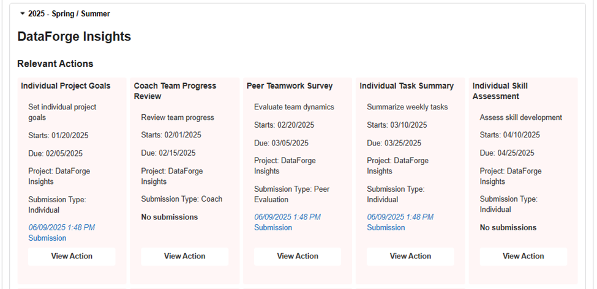

1. In the Milestones, Gantt, and Calendar sections of the dashboard tab, actions can take on a variety of colors to represent their current state of completeness, which are primarily based on submissions and their times. Green is completed, yellow is in progress, red is overdue, purple is holidays/break periods, and gray is future actions (start dates have yet to happen).

2. Sign in as a student in a live semester to view some action color differences and take note of some action names for editing later.
   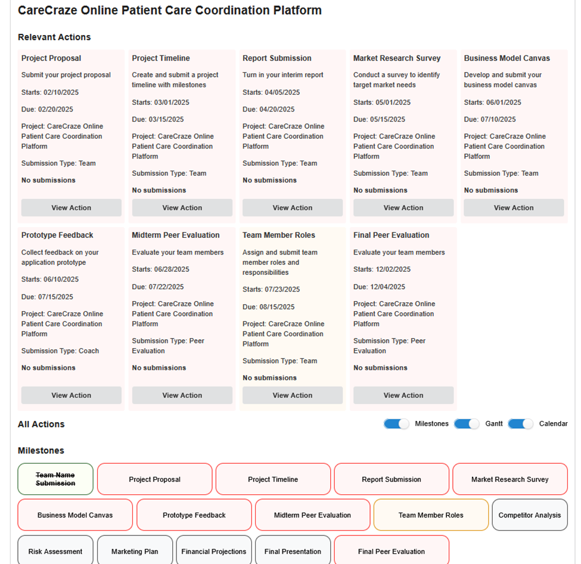

3. For green actions with a strikethrough, actions have to be fully completed to be displayed as such. Complete an action and verify that this state changes correctly.
   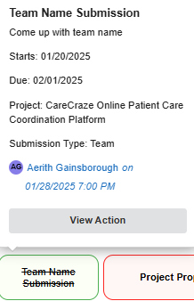

4. Actions that are greyed out are actions that have not been completed and are actions whose start date exists in the future. If no action matches this description, [edit an action](#editing) to start and end at a later date, and it should change to gray accordingly for those who can view it.
   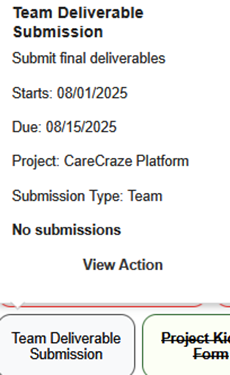

5. Actions with a red background are actions that have not been completed and have due dates that have already been past. If no actions appear to be red, edit an action to start and end at dates in the past, and it should change to red accordingly for those who can view it.
   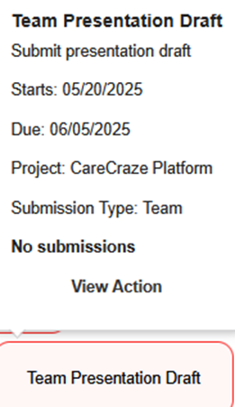

6. Break periods are purple and are only visible on the calendar view if one doesn’t exist, edit an action to a [break period](announcements.md#breaks).
   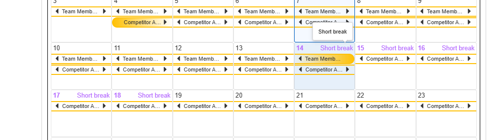

## Completing

### Individual Actions

For this example, we will again be using the mocked data from [resetting the database](authentication.md#resetting-data).

1. [Signed in as a student](authentication.md#validating-student-sign-in), proceed to an individual action submission modal using the “View Action” button. Remember, “Individual” actions are limited to Students, “Coach” actions are limited to Coaches, and “Team” actions can be submitted by any member of the group. For demonstration purposes, we will be using the mock data project “TrendTide Analytics” and its respective Students and coaches. Below is an example action we will initially complete as “Aerith Gainsborough".
   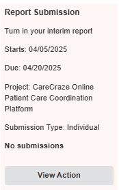

2. We can see a that no previous submission exists on the action as seen on the preview card, so let us add another to verify functionality. Again, we have selected a simple action to complete for general demonstration purposes. Add a corresponding file to the field and press “Submit.”
   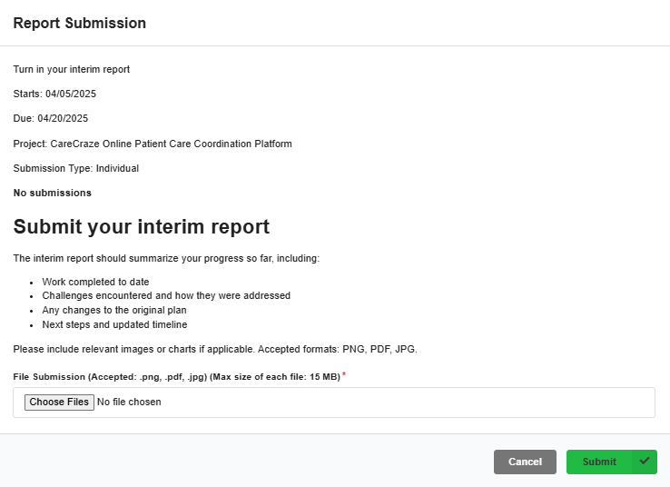

3. Now, verify that the access visibility is correct for the completed actions when signed in as “Aerith Gainsborough". The following is what the expanded submission links should look like
   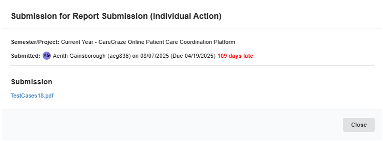
   If we were to sign in as another student within the same project, they would not be able to see the submission, as it is only visible to the user who submitted it and their coaches.
   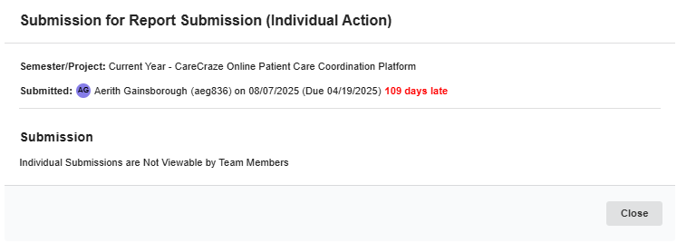

4. Once Student visibility is confirmed, [sign in as a coach](authentication.md#validating-coach-sign-in) (for this specific scenario we will use "Laura Martin") and verify that the Coach for the projects can see all student submissions.
   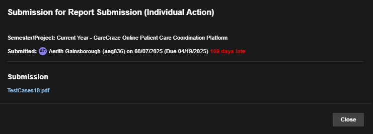

The “Logging” tab also displays the completed actions and follows the same visibility procedures as the dashboard tab. In addition to this, “Individual” actions must be completed by all members of the team in order to be considered done. Once completed, they will no longer be visible in the “Relevant Actions” group, and in the “Milestones” section, the action should now have a green border and display all of the submissions as seen below.
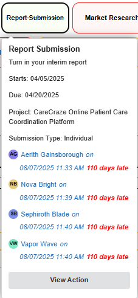

### Team Actions

Functionality is the same process for submission as an “Individual” action, with the primary difference of only requiring one submission to be completed and that every member of the team can see the submission. The following steps will demonstrate this functionality.

1. Verify this by completing a “Team” action with filled-out fields and uploaded resources where necessary.

2. The action should turn green as completed, and the submission should be removed from “Relevant Actions”.
   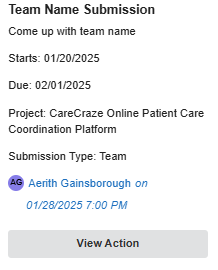
   Additionally, the submission details should be visible to all of the other team members unlike individual actions. Confirm this by clicking on the submission when signed in from a different account.
   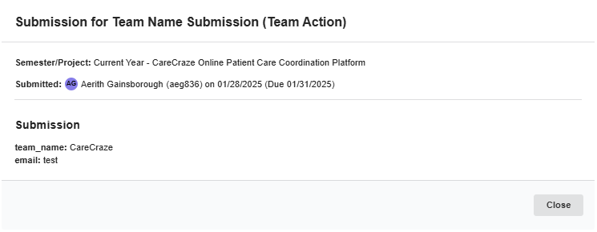
   _Nova Bright_ Viewing the submission of _Aerith Gainsborough_ as a team member.

### Coach Actions

1. Coach actions behave very similarly to the student action types of [individual](#individual-actions) and [team](#team-actions) however as the name suggests they are only completable by coaches. Firstly, verify the visibility check by signing in as a [student](authentication.md#validating-student-sign-in) and finding a project with a coach action. In the relevant actions section space they the submission type for an action should be “Coach”
   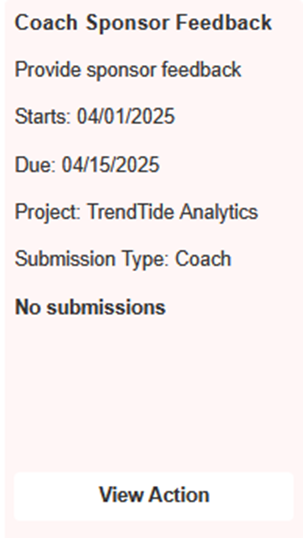

2. Once the view action button has been clicked, the action’s details and submission page should appear with the caveat being that the submission button is replaced with informational text that blocks student submissions of coach actions.
   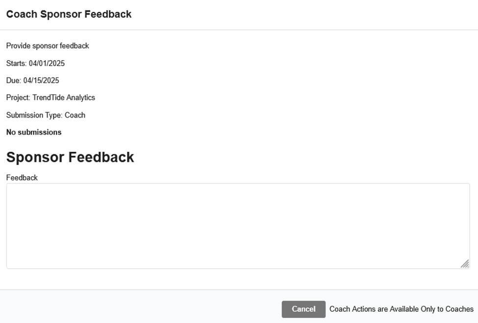

3. If we sign in as a [coach](authentication.md#validating-coach-sign-in), we can see that the submission is available. Fill out the respective action’s fields and press the submit button.
   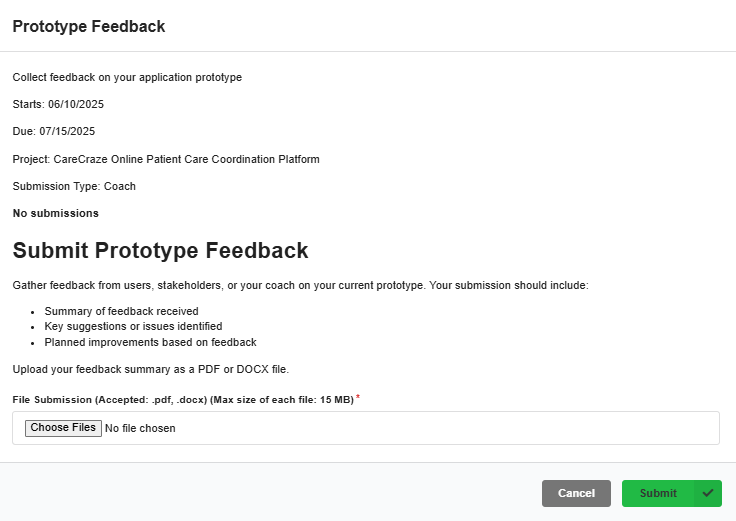

4. Once submitted the action should appear complete in the milestone, calendar, and Gantt views.
   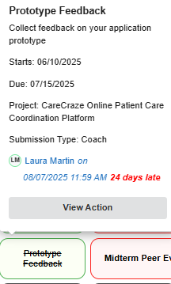
   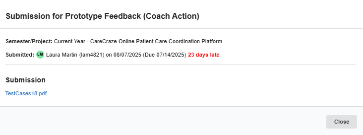

5. Additionally, if we sign back into the same project as a student, the completed action should still be visible but again when looking at the details, only the submission time/[lateness](#late-submissions) and the action’s semester/project should be visible to students.

### Late Submissions

1. As you may have noticed in [individual](#individual-actions) or [team](#team-actions) actions, action submission times are tracked and displayed accordingly on the dashboard tab. Actions generally have a due date, and if a submission is past that due date, the displayed submission time should display the corresponding information. To test this, sign in as a [student](authentication.md#validating-student-sign-in) with at least one overdue action in the dashboard. Overdue actions should appear in red in the milestone view and the relevant actions view.
   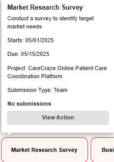

2. Once an overdue action has been identified press the “View Action” button and proceed with the standard action submission process by filling out the fields and submitting the action.

3. After submitting the action, there should be a new submission visible on the action. Pressing on the submission link should bring up the submission’s details, and in those details, we should see a correct lateness calculation.
   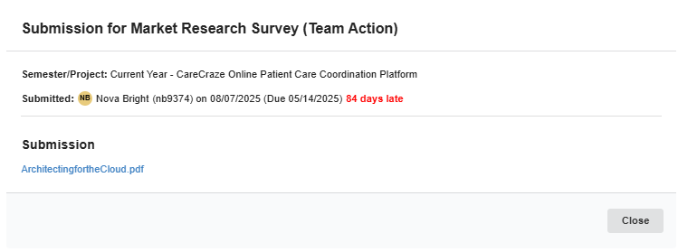
   Keep in mind that the lateness is visible to all but the base visibility of the action remains the same, so if the action is an “Individual” action, only the student who submitted it and their coaches can see it. If it is a “Team” action, all team members can see it.

4. The logging tab of any signed-in user within the same project (or an admin) should also display the late submitted action alongside its lateness within the detailed view. The following images are from a coach signed in perspective.
   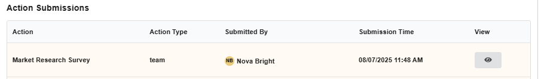
   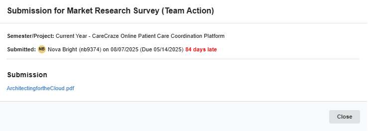

## Creating

## Editing

## Deactivating

## Late Submissions

## Submission Visibility Rules
