# Announcements & Breaks

[TEST CASES](readme.md)

In the portal, announcements and break periods can be made by [admins](authentication.md#validating-admin-sign-in) to remind students and coaches alike about specific events

## Covers

- [Visibility](#visibility)
- [Creating](#creating)
- [Editing](#editing)
- [Deactivating](#deactivating)
- [Breaks](#breaks)

## Creating and Visibility

1. To create an announcement, users must be signed in as an [admin](authentication.md#validating-admin-sign-in).

2. In the admin tab, the “Action and Announcement Editor” should have a “+” button to create both actions and announcements.
   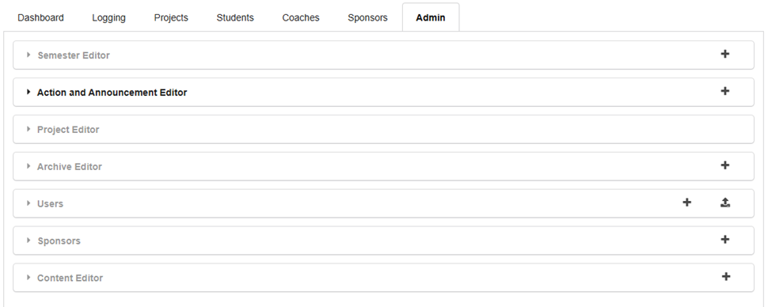

3. In the “Create Action/Announcement” modal that pops up, type in a recognizable action title and select the most recent semester. In the “Action Target” field, make sure to select “Student Announcement” and fill in the remaining fields (the modal should update accordingly whenever an “Action Target” is selected.) for this we are using students.
   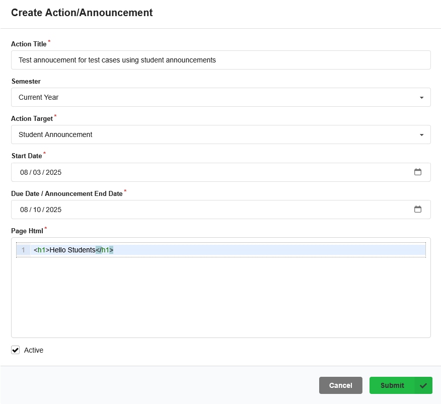

4. Press submit, and after a moment a confirmation message should appear. Additionally as an admin, the announcement should be visible to you regardless of Student/Coach type, and we can easily view them in the dashboard tab under the selected project
   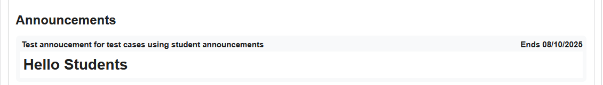

5. Additionally, when signed in as an admin and mocking a student should render the same results.
   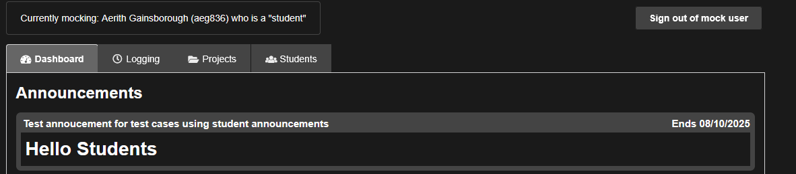

6. Coaches should also be able to see student announcements, verify this by signing in or mock-signing, as a corresponding Coach.
   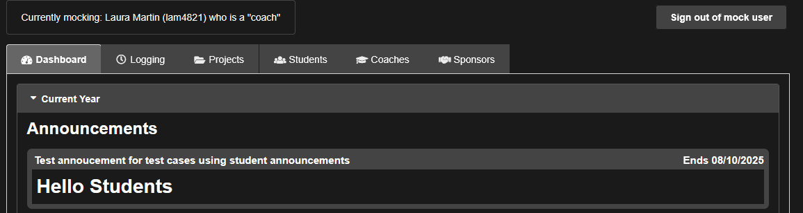

7. Now if we edit the [announcement](#editing), and change the “Action Target” to “Coach Announcement”, we can see that the announcement is no longer visible to students, but is still visible to coaches.

## Editing

1. Announcement attributes like Action Title, Action Target, Semester, Page HTML, etc, can be edited by admin users to appropriately reassign and move actions since they can only be [deactivated](#deactivating) and not deleted. For this test case, ensure there is at least one preexisting announcement and an admin to sign in as.

2. Sign in as an admin, and navigate to the Action and Announcement Editor within the Admin tab. Here, select a preexisting announcement under its respective semester and press the edit button which will bring up the following modal.
   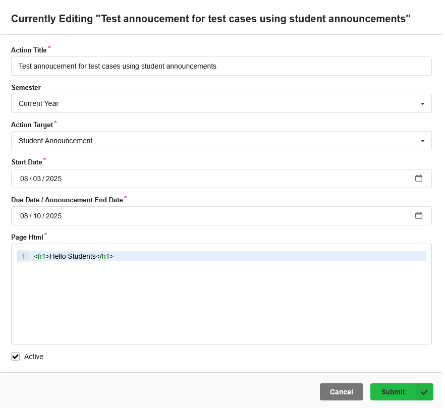

3. For this test case, we will be updating an announcement that has old dates (making it invisible to users) to newer dates so the respective users can see our announcement. Once we have edited the start and end dates to correct values we can press the submit button and receive confirmation that our announcement has been updated with the following popup.12.

4. Additionally, we can double-check that the announcement has been updated by navigating to the respective semester in the dashboard tab.

## Deactivating

1. In this system, deactivating actions act as a soft delete so repetitive events can be deactivated, updated, and then reactivated, and they can act as templates for continued use. Deactivating an announcement makes it invisible to students and coaches and again, can be useful for repetitive events that can be built using templates.

2. In the same modals that create and edit announcements, the active checkbox can be unchecked to deactivate an action
   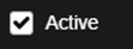
   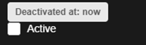

3. Pressing submit will save the deactivation changes and will make the announcement no longer visible in the dashboard tab for any user (it is still visible to admins in the action editor.

4. Additionally, deactivated announcements contain timestamps for when they were deactivated for better visibility. Confirm this by editing the recently deactivated action and scrolling down to the bottom of the modal.
   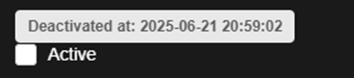

## Breaks

1. In this system, breaks are a form of action that is visible to all types of users in the Gantt and Calendar views. They can be used to mark periods when students/teams are not expected to work on projects and they provide visual breaks in project timelines. An example break in the calendar is shown below.
   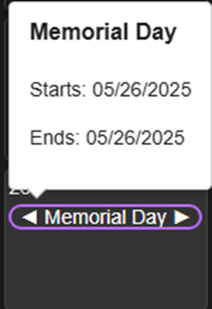

2. To add a break to the system, sign in as an admin, navigate to the admin tab, and press the plus button on the “Action and Announcement Editor”, select “Break Period” in the Action Target drop down and fill out the corresponding fields.
   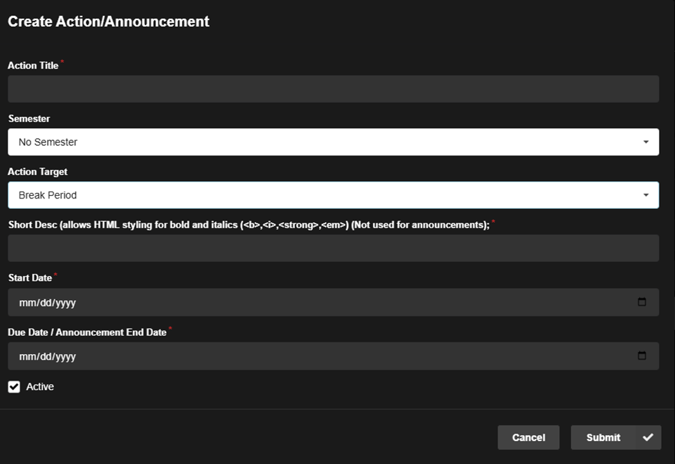

3. Press the submit button and like other actions and announcements, a pop-up will appear after a moment to confirm that the break period is created.
   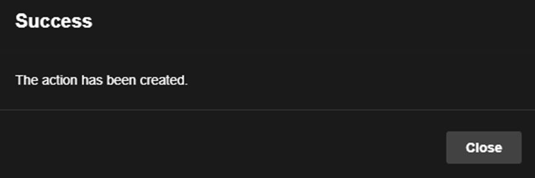

4. Visually confirm the creation by viewing the break period in Gantt and Calendar views, and confirm that no submission button appears when viewing the details of the item in said views.
   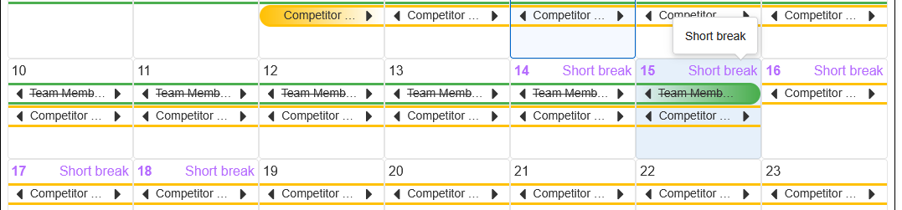
