# Authentication

[TEST CASES](readme.md)

## Covers

- [User Sign In](#user-sign-in)
- [Resetting Data](#resetting-data)
- [User Preferences](#user-preferences)
- [Last Login](#last-login)

## User Sign In

### General Sign In

_Note:_ The look and process of Sign-in in production is different from local dev/sandbox and in the Live instance will be using standard RIT shibboleth logins

1. In the running dev application, press the “Dev Sign in/out” button in the top right of the portal
   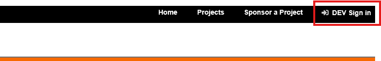

2. In the Developer Menu modal, select the desired user to sign in as in the "Select User" dropdown.
   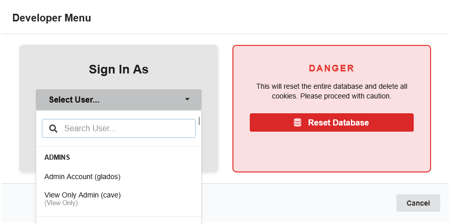
   There is the added functionality to search for specific users but for now we can select any one from the time being.

3. Sign in with the selected user using the “Sign in” button.
4. The new page should correctly match the user selected. We can quickly check this by pressing the profile button on the top right which will display the signed in user’s profile.
   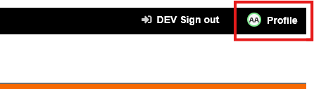
   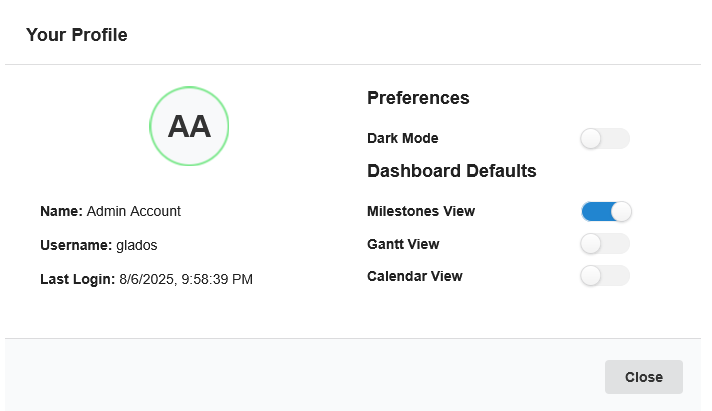

### General Sign Out

1. To sign out, press the “Dev Sign in/out” button in the top right of the portal. Then in the Developer Menu modal, press the “Sign Out” button.
2. OR press the big RIT Logo in the top left of the portal.

### Validating Admin Sign In

1. Following the same procedure outlined in [General Sign In](#general-sign-in), Sign in as an admin user, admin users should be the first to appear in the system within the dev menu "Select User" Dropdown.  
   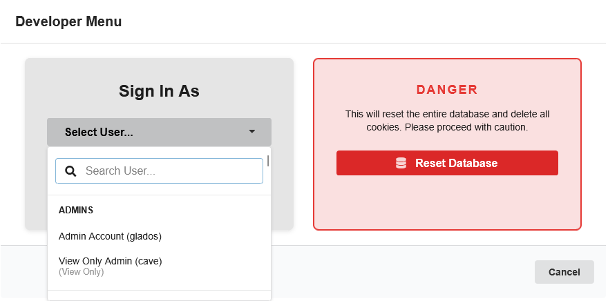

2. If there is no admin user in the drop down, reset the application data to use a predefined set of users using the steps outlined in [Resetting Data](#resetting-data).

3. Once signed in, ensure that the dashboard tab looks similar as follows (specifally the amount of tabs on the navbar and the mock user button in the top right):
   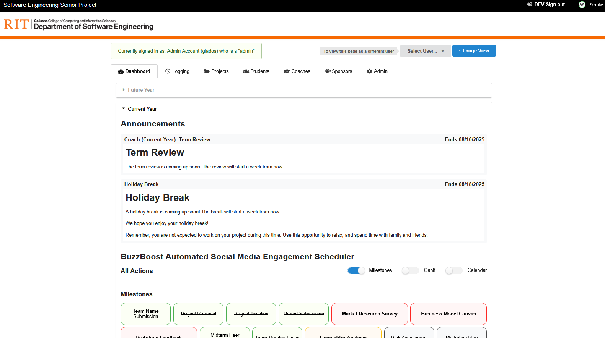
   As an admin, we will have access to every tab in the system, and we should see an additional user mock component at the top of the portal above the nav bar.

### Validating Coach Sign In

_Similarly to admin Sign in, we will be using the mocked data found with resetting the system [Resetting Data](#resetting-data)._

1. Following the same procedure outlined in [General Sign In](#general-sign-in), Sign in as a coach user, coach users should be the second to appear in the system within the dev menu "Select User" Dropdown.
   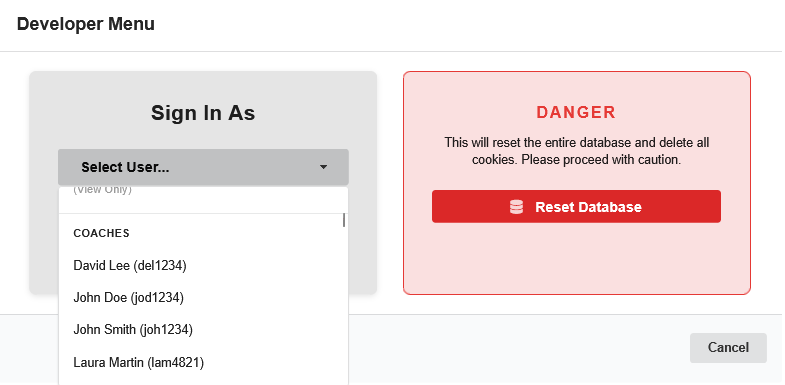

2. For this example we will be utilizing "Rachel Thompson" from the mock data. Rachel is the Coach for the projects “DataForge Insights” and “TrendTide Analytics”. Ensure that when we are signed in as Rachel, we only see Coach workflows for these two projects. Rachel’s dashboard tab should look similar to the following:
   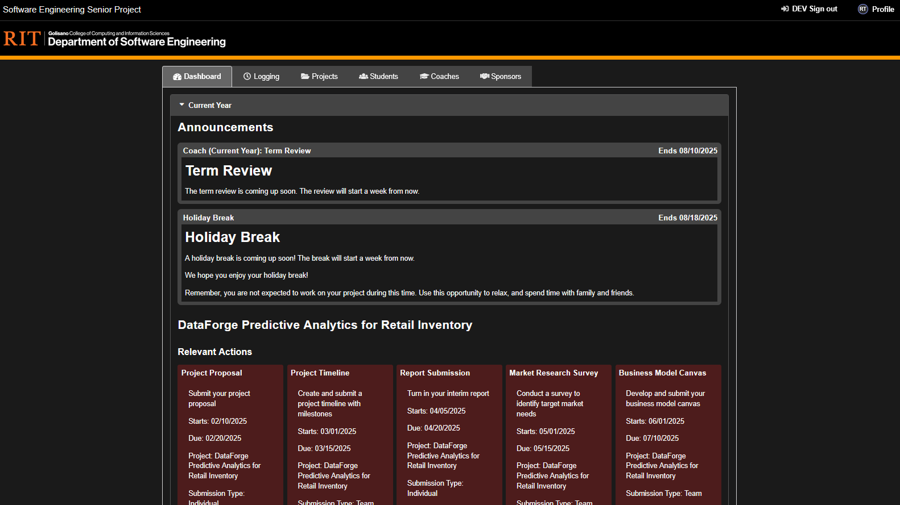

### Validating Student Sign In

1. Following the same procedure outlined in [General Sign In](#general-sign-in), Sign in as a student user, student users should be the third to appear in the system within the dev menu "Select User" Dropdown.
   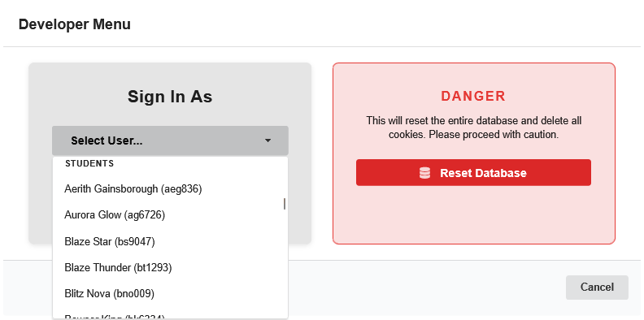

2. For this test case we will be utilizing “Glint Surge”. Glint is a student in the project “DataForge” and is unfortunately a light-mode enjoyer. Glint’s dashboard tab should look similar to the following:
   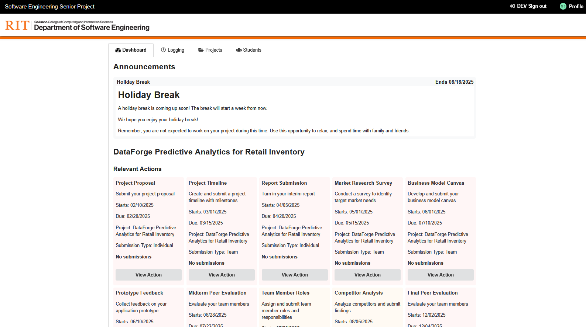

## Resetting Data

1.In the running dev application, press the “Dev Sign in/out” button in the top right of the application

2.In the Developer Menu modal, press the “Reset Database” button.
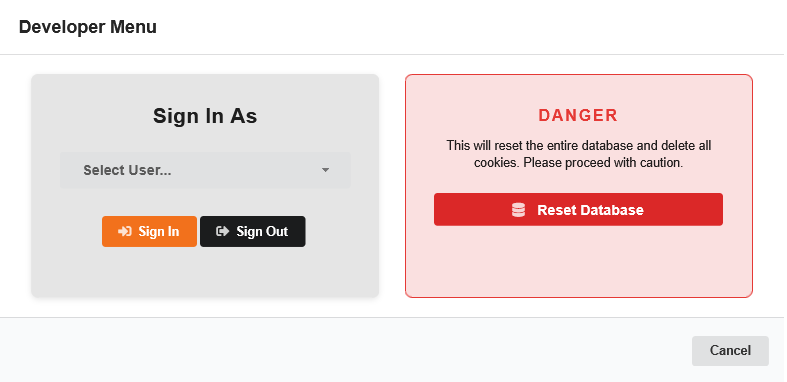

The page will refresh and load a set of mocked data for the application.
3.With this mocked data, the projects of “DataForge Insights” and “TrendTide Analytics” will always load into the most current semester in the mocked dataset. There is a complete set of Students and Coaches across the 12 projects with varying levels of access and project completeness for testing across cases and workflows.

## User Preferences

## Last Login
