# Authentication

[TEST CASES](readme.md)

## Covers

- [User Sign In](#user-sign-in)
- [Resetting Data](#resetting-data)
- [User Preferences](#user-preferences)
- [Last Login](#last-login)

## User Sign In

### General Sign In

_Note:_ The look and process of Sign-in in production is different from local dev/sandbox and in the Live instance will be using standard RIT shibboleth logins

1. In the running dev application, press the “Dev Sign in/out” button in the top right of the portal
   

2. In the Developer Menu modal, select the desired user to sign in as in the "Select User" dropdown.
   
   There is the added functionality to search for specific users but for now we can select any one from the time being.

3. Sign in with the selected user using the “Sign in” button.
4. The new page should correctly match the user selected. We can quickly check this by pressing the profile button on the top right which will display the signed in user’s profile.
   
   

### General Sign Out

1. To sign out, press the “Dev Sign in/out” button in the top right of the portal. Then in the Developer Menu modal, press the “Sign Out” button.
2. OR press the big RIT Logo in the top left of the portal.

### Validating Admin Sign In

1. Following the same procedure outlined in [General Sign In](#general-sign-in), Sign in as an admin user, admin users should be the first to appear in the system within the dev menu "Select User" Dropdown.  
   

2. If there is no admin user in the drop down, reset the application data to use a predefined set of users using the steps outlined in [Resetting Data](#resetting-data).

3. Once signed in, ensure that the dashboard tab looks similar as follows (specifally the amount of tabs on the navbar and the mock user button in the top right):
   
   As an admin, we will have access to every tab in the system, and we should see an additional user mock component at the top of the portal above the nav bar.

### Validating Coach Sign In

_Similarly to admin Sign in, we will be using the mocked data found with resetting the system [Resetting Data](#resetting-data)._

1. Following the same procedure outlined in [General Sign In](#general-sign-in), Sign in as a coach user, coach users should be the second to appear in the system within the dev menu "Select User" Dropdown.
   

2. For this example we will be utilizing "Rachel Thompson" from the mock data. Rachel is the Coach for the projects “DataForge Insights” and “TrendTide Analytics”. Ensure that when we are signed in as Rachel, we only see Coach workflows for these two projects. Rachel’s dashboard tab should look similar to the following:
   

### Validating Student Sign In

1. Following the same procedure outlined in [General Sign In](#general-sign-in), Sign in as a student user, student users should be the third to appear in the system within the dev menu "Select User" Dropdown.
   

2. For this test case we will be utilizing “Glint Surge”. Glint is a student in the project “DataForge” and is unfortunately a light-mode enjoyer. Glint’s dashboard tab should look similar to the following:
   

## Resetting Data

1.In the running dev application, press the “Dev Sign in/out” button in the top right of the application

2.In the Developer Menu modal, press the “Reset Database” button.

The page will refresh and load a set of mocked data for the application.
3.With this mocked data, the projects of “DataForge Insights” and “TrendTide Analytics” will always load into the most current semester in the mocked dataset. There is a complete set of Students and Coaches across the 12 projects with varying levels of access and project completeness for testing across cases and workflows.

## User Preferences

For users' preferences, like dark mode and milestone/gantt/calendar default view toggles, switch buttons can be found by pressing the profile button in the top right corner of the webpage, which will bring up a modal with a similar look and information as seen below.

### Dark Mode

1. Following the same procedure outlined in [above](#user-sign-in), sign in as any user of your choice.

2. Once logged in, click on the “Profile” button in the top right corner of the portal. This will open the user specific modal shown below
   

3. In this modal, click on the button labeled “Dark Mode

4. Doing so will toggle the dark mode state of the site and should be visible across all tabs of the site.
   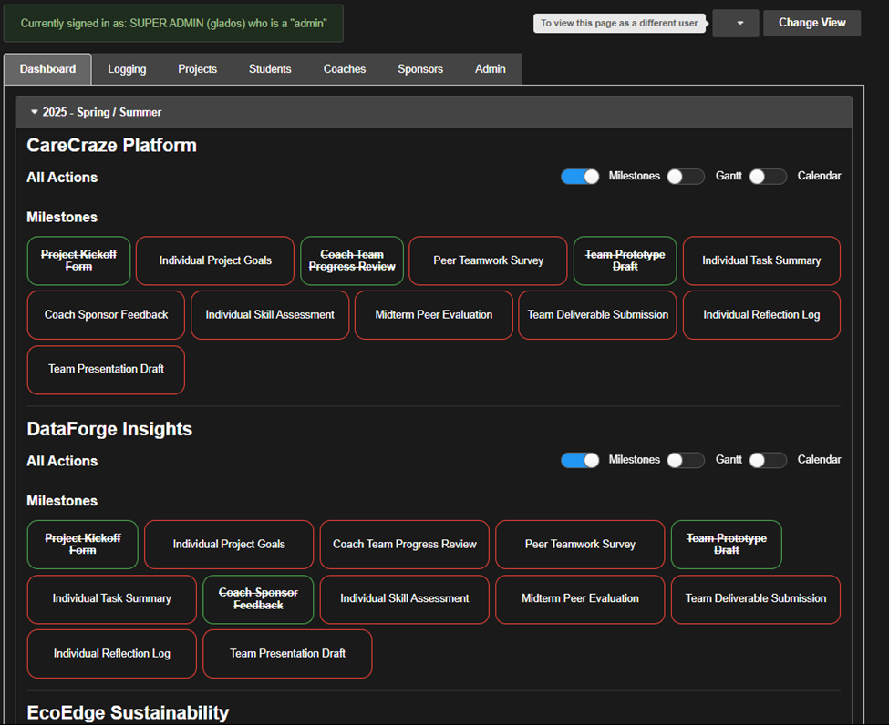

### Dashboard Views

1. The Milestone, Gantt, and Calendar views represent different perspectives for deliverables and events within a semester. They can be toggled on and off per project, and they can also be set to be shown by default with each login.

2. The toggle switches on the all actions bar within a project are project-specific, and they toggle their respective perspectives accordingly.
   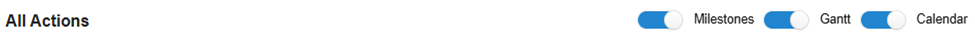
   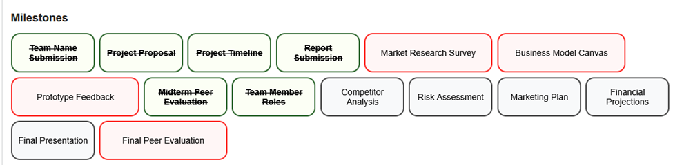
   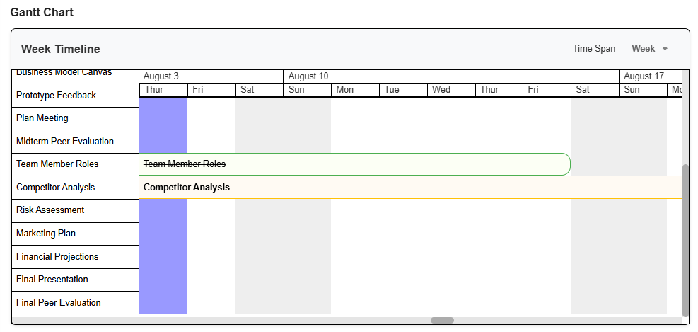
   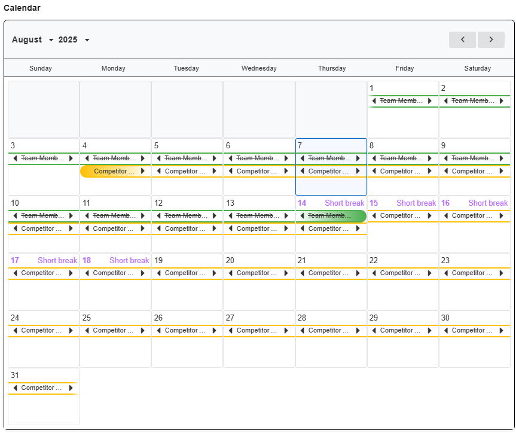

3. Default preferences for these views can be found within the profile menu.
   

4. When pressing these switches, the toggled-on views should be displayed upon the **next sign-in**. To test this, sign in as any user and toggle any of the switches and sign out, and sign in again. In the following images, all switches (besides dark mode) were toggled, and thus all views are present for the respective user.

### Additional Account Information

1. Additional account information can be added and tied to students to help capture a layer of preferences like pronouns, time availability, currency availability, and other variables that have not been implemented into the system.

2. To add or edit additional account information, sign in as a [student](#validating-student-sign-in), press the profile button in the top right corner. There should be an “additional info” field with an edit button.
   

3. Pressing the edit button should display a text box, and here you can add information that could be relevant to any projects. Pressing save will save the changes and they should display automatically before closing the modal.
   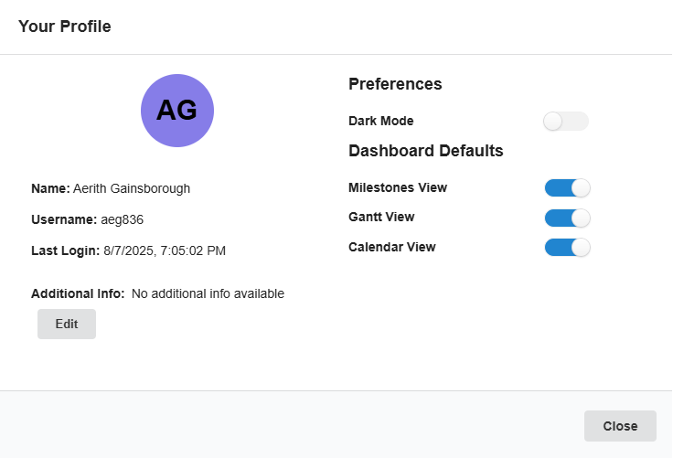
   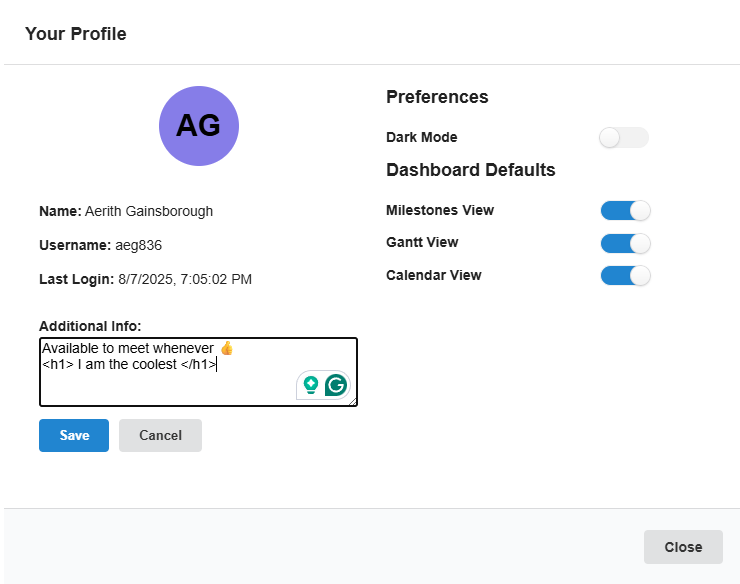
   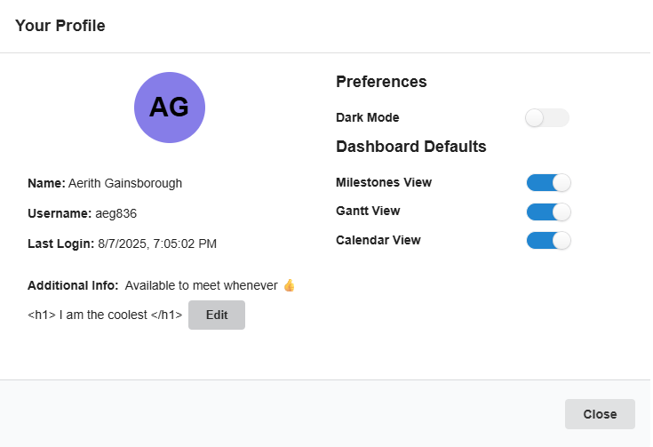

4. Once the modal is closed verify that this can be seen by signing in as another student, or as the coach, within the same project.

5. Navigate to the “Students” tab and press on the name of the corresponding student whose additional information was just edited.

6. This should bring up a modal of the students details which should also display the correct and updated additional information.
   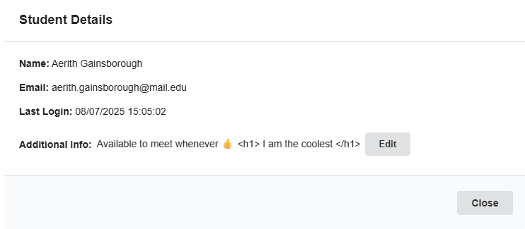

## Last Login

1. Last Login dates and times are stored for each user whenever they sign into the application. From a signed-in user’s perspective, this information can be found within the profile modal under the last login field.
   

2. When signed in as a student, the last login times of other students within the same project should be visible. These times can be seen in both the “My Teams” table within the “Students” tab, or through the individually linked profiles of each user.
   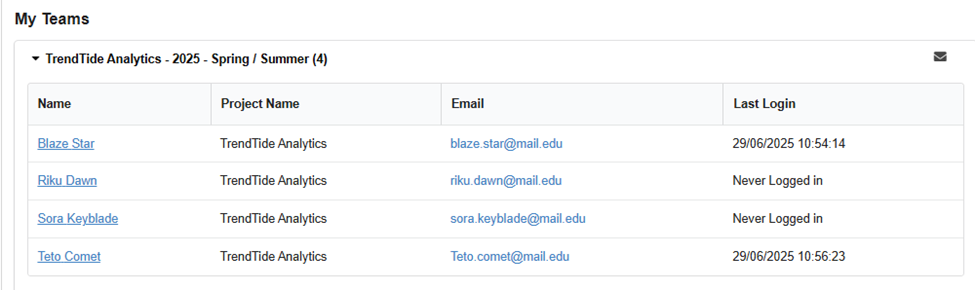
   

3. When [coaches](#validating-coach-sign-in) sign in, last login times of all students within their projects can be seen under the “Students” tab. And again individually linked profile times should be displayed correctly.
   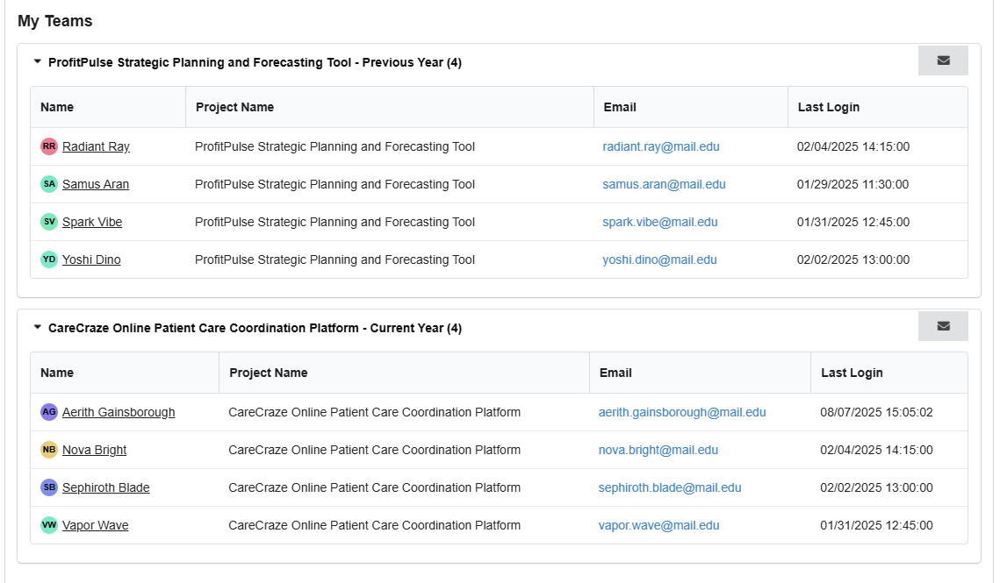

4. From an [admin](#validating-admin-sign-in) sign-in perspective, all student sign-ins can be seen in the “Students” tab.
   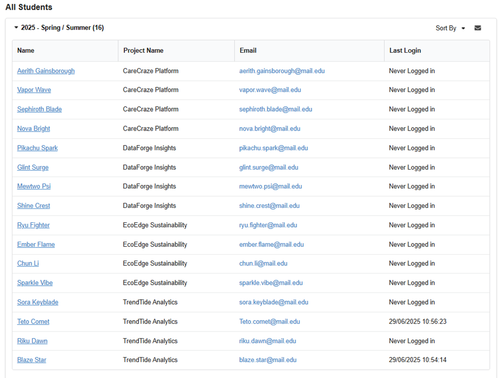

5. Additionally, when signed in as an admin last login times can be found type sorted in the Admin tab. Here you can see all user last login times including admins and coaches (as shown below)
   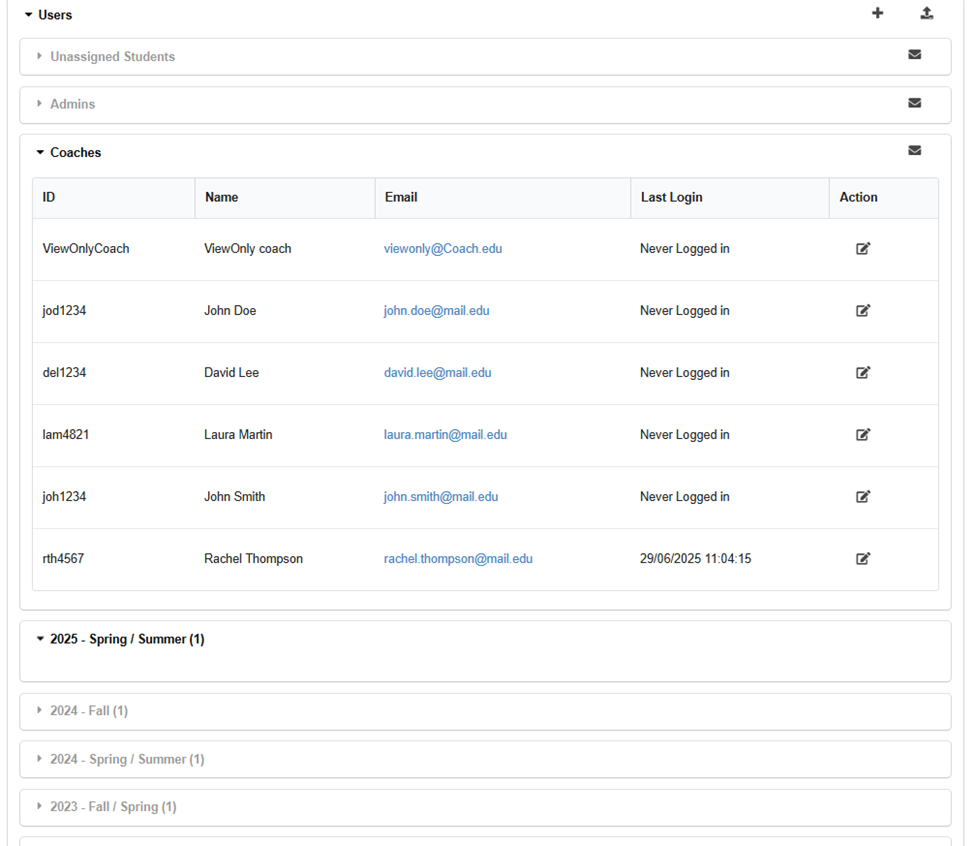
