# Peer Evaluations

[TEST CASES](readme.md)

## Covers

- [Creation](#creation)
- [Student & Coach Processes](#student--coach-processes)

## Creation

1. Alongside the built-in peer evaluation system, there exists an additional question builder within the creation of peer evaluations in the [creating actions](actions.md#creating) modal. This question builder appears in the top right corner of the html segment of the creating an action modal and launches another model as seen below.
   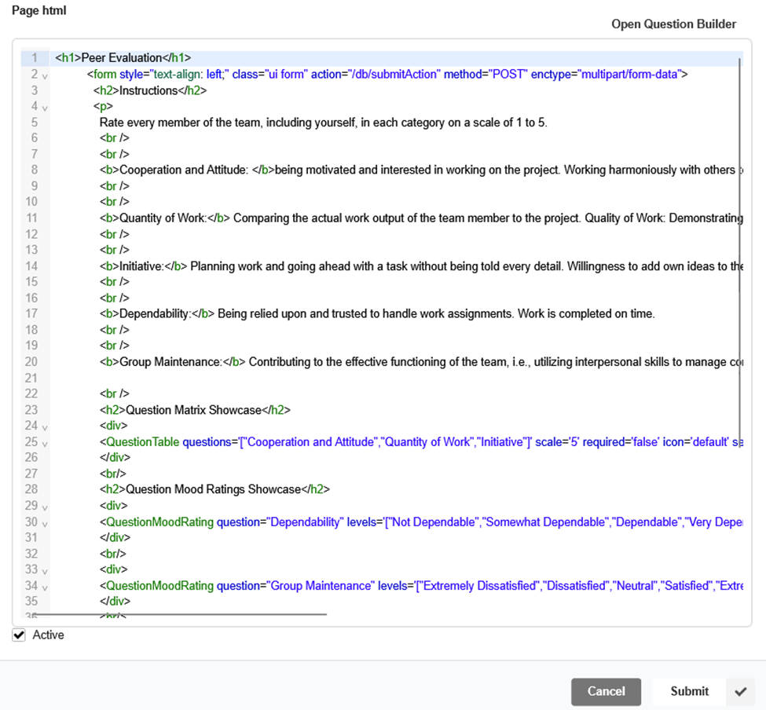
   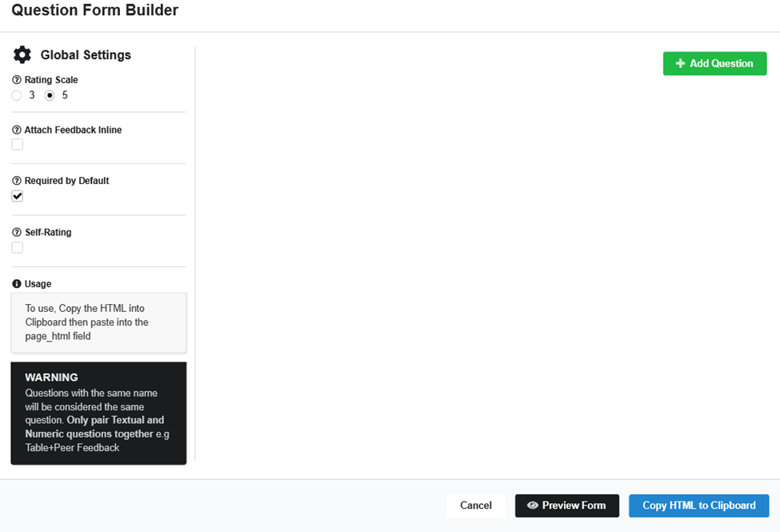

2. On the left side of the builder are global settings for the peer evaluation to follow with helpful tool tips to explain each for now we will just be using the defaults. Pressing the add question button will add a question to the question list with the option of several question types Feedback, Peer Feedback, Table Ratings and Mood Ratings. The image below shows a feedback question and its respective look in the “Preview Form View”
   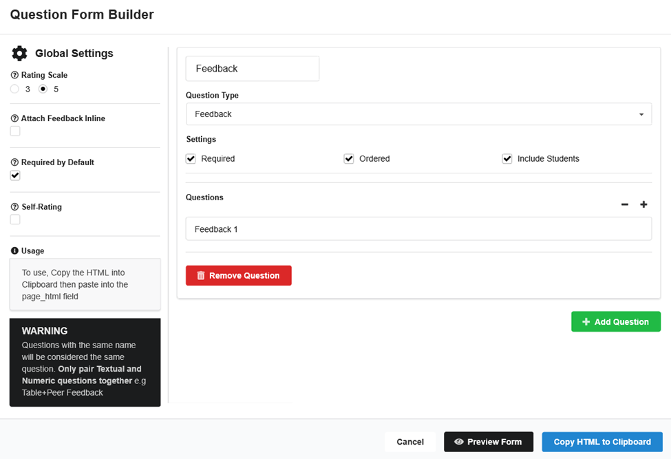
   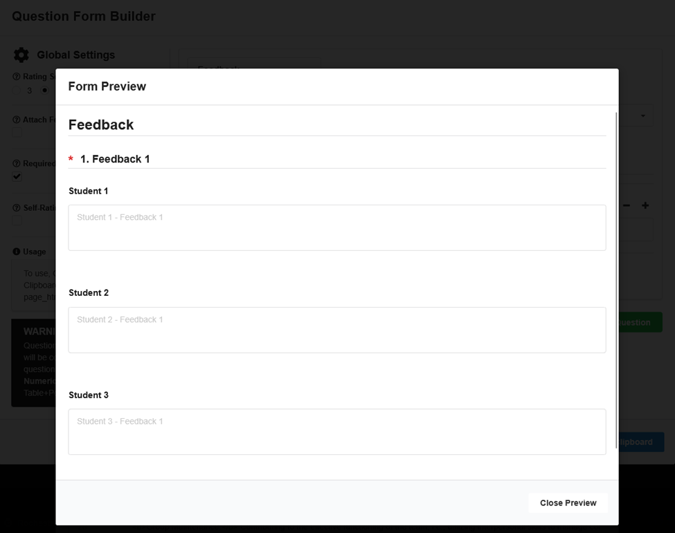

3. Add all four question types with differentiable names and questions for testing purposes and press “Copy HTML to Clipboard” when done

4. Paste it into the Page HTML field, Submit the newly created peer evaluation and after the confirmation popup it should appear in the “Action and Announcement Editor” accordion.
   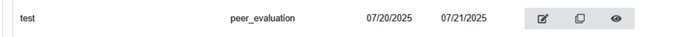

5. Now sign in as a student in the new peer evaluation’s semester and verify that the content matches the input of the editor.

## Student & Coach Processes

Peer evaluation is an in-house student-to-student evaluation system. To fully complete a peer evaluation action, a peer evaluation must be completed by all [students](#for-students) of the team and the [coach submission](#for-coaches) of the peer evaluation must also be submitted.

### For Students

1. Sign in as a [student](authentication.md#validating-student-sign-in) in an ongoing project with a peer evaluation available now (if no peer evaluation fits this criteria, edit the start and end dates of the peer evaluation) and click “View Action” on the peer evaluation. Reference the image below as what they usually look like from a students perspective.
   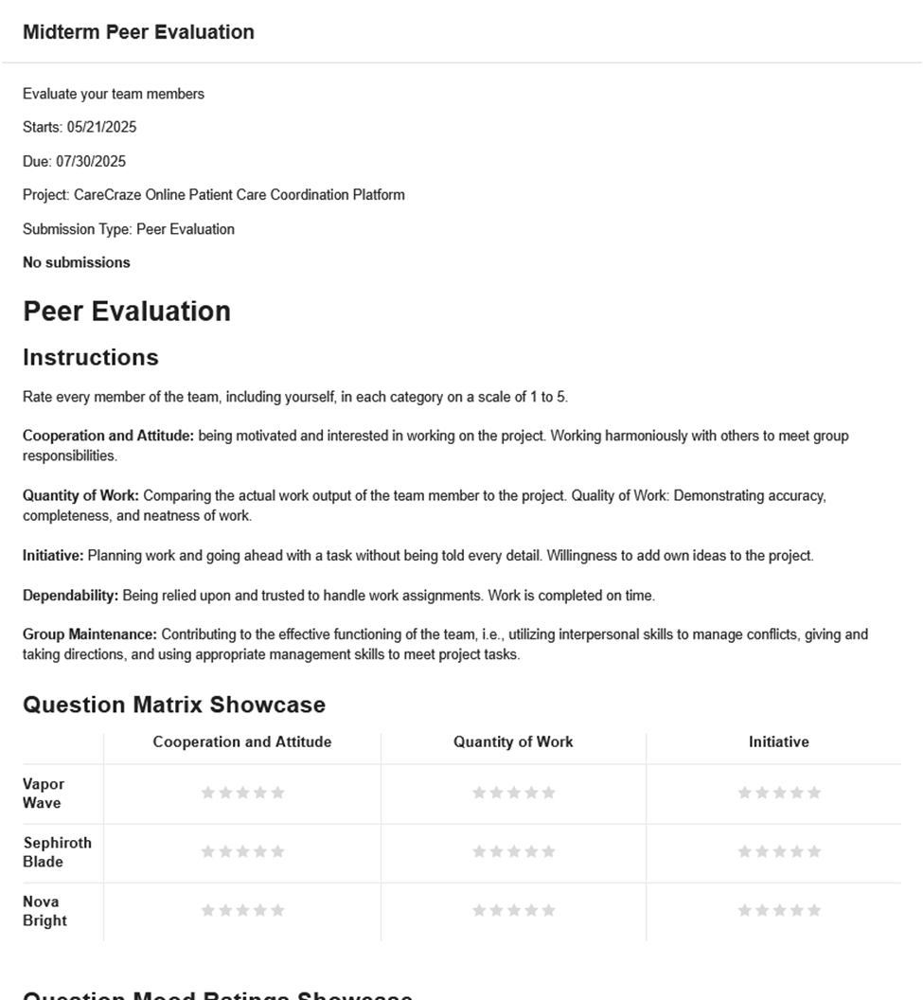

2. Fill out the required fields by pressing the respective contribution rating for each student and filling out each required text box. Note if a required field is left empty a red “!” should appear and or the text box should be highlighted red.
   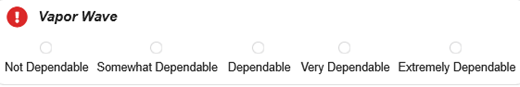
   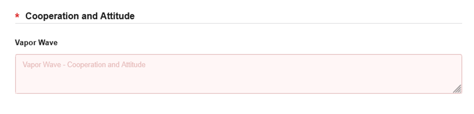

3. After filling out all of the required fields and pressing submit there should be a visible submission link under the peer evaluation action. Pressing this submission link should display the inputted ratings and text.
   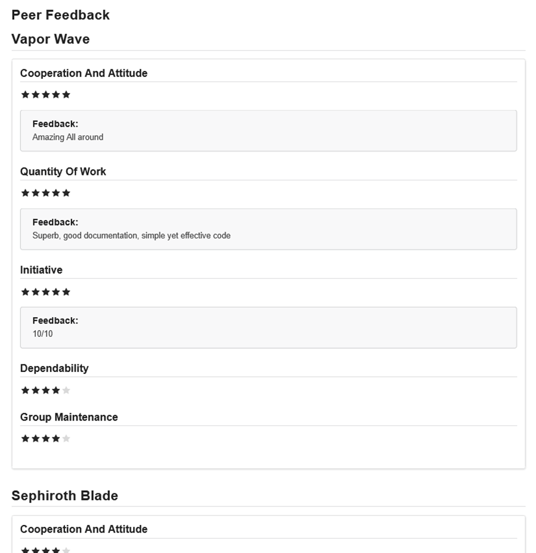

4. Sign in as a different student in the same project and verify that the peer evaluation submission is visible but when pressing the submission link, details of the submission are not displayed ([similar to individual actions](actions.md#individual-actions)).
   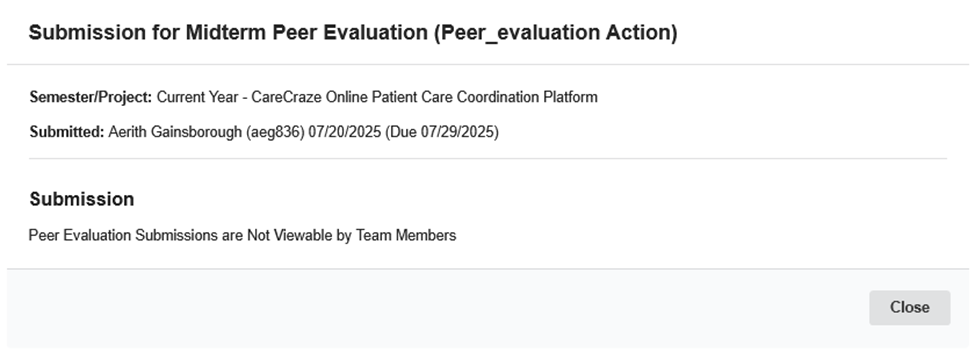

5. Now if we sign in as a coach of the same project we should be able to see the submission link and the actual submission details as well.
   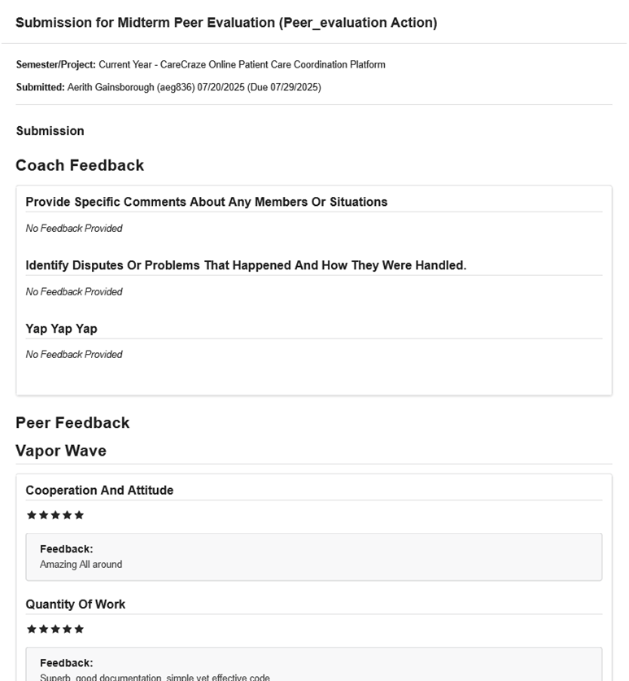

6. Additionally if we press the view action button as the coach we should be able to provide feedback to all of the students who have already submitted the peer evaluation along with actually seeing who had done the peer evaluation.
   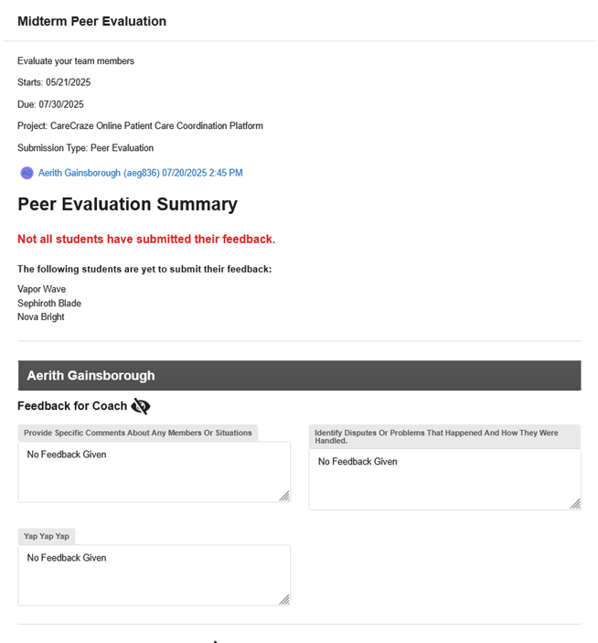

7. From an individuals student’s perspective, all of their work regarding this peer evaluation is completed. Again to fully complete this peer evaluation all other students must submit the evaluation and coaches have their own [component](#for-coaches) that they need to complete.

### For Coaches

1. After all of the [students](#for-students) in a project have completed their work in a peer evaluation, sign in as a coach and press “View Action” on the almost completed peer evaluation.
   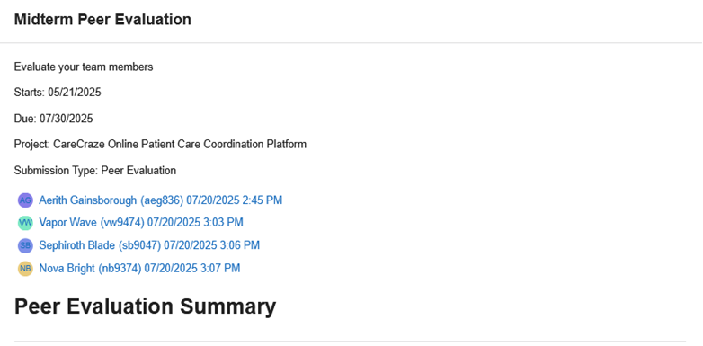

2. In the “Peer Evaluation Summary” section of the peer evaluation, there should be a section for each student that contains the student’s respective inputs for the peer evaluation, their received rankings/inputs from other students, and a “Coach Summarization + Feedback” field.
   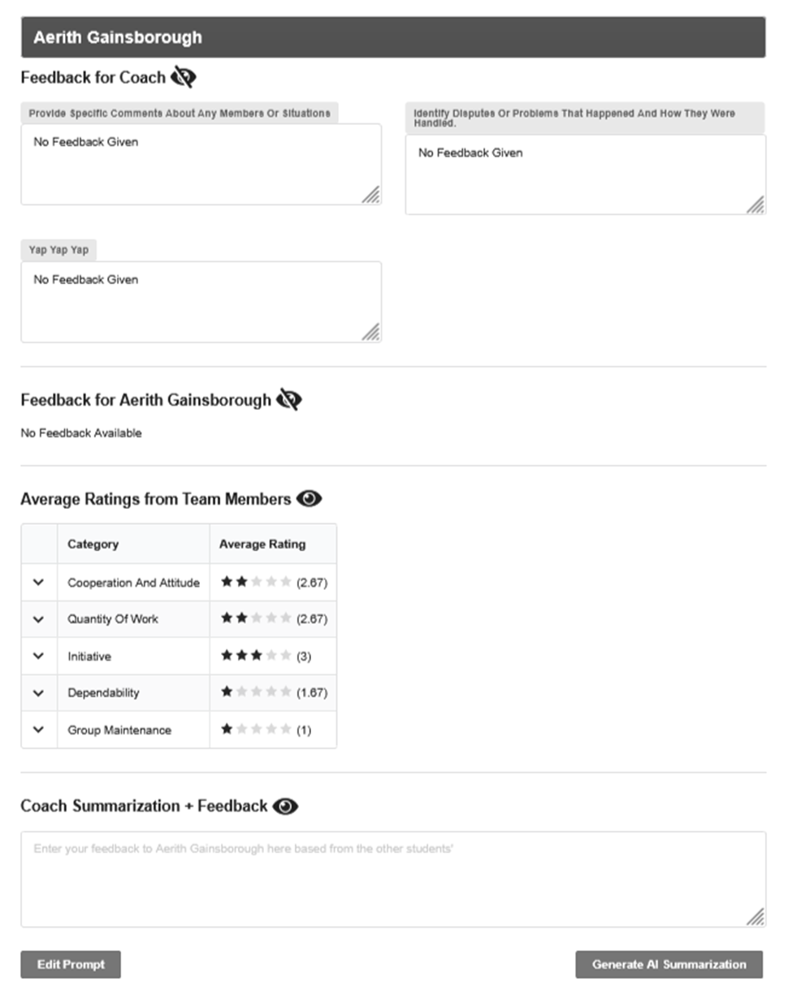

3. The coach feedback field is the only area where coaches should be able to type ([outside of the AI Generation prompt editor](ai.md#ai-coach-feedback-generation)) and this field is where coaches can directly provide feedback to students. Fill out this field for all of the students. Note if a field is left blank an error message should appear when trying to submit.
   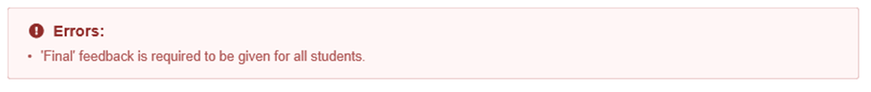

4. Once feedback has been given to all students and the peer evaluation is submitted from the coach’s perspective, the peer evaluation should finally appear as completed in the dashboard tab of all of the project members (i.e. no longer in relevant actions, and green highlighted + crossed out in milestone, gantt, and calendar views).
   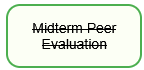

5. To view the feedback as one of the students, sign in as a student, navigate to the “Students” tab and “Peer Evaluations” section, and the Coach entered feedback should can be seen there.
   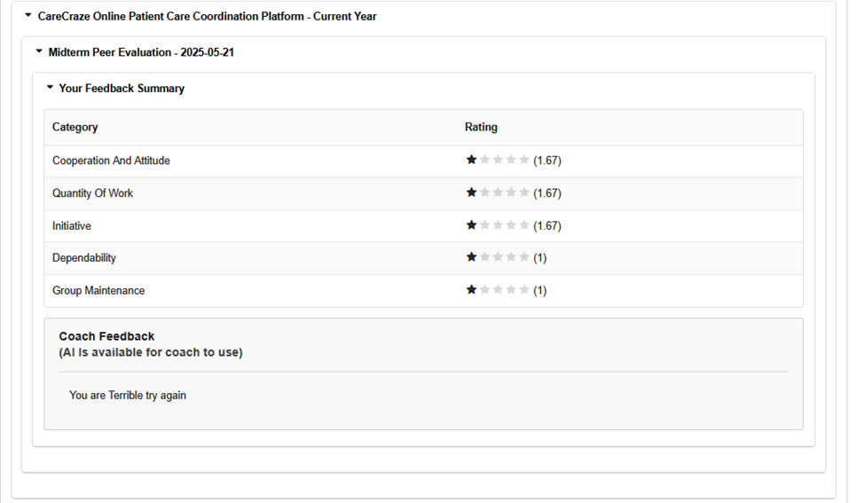

6. In this tab we can also see the peer evaluations of other projects however we can only see the completed peer evaluation’s names and not any of the sensitive data. Additionally if no peer evaluation is completed it should be displayed accordingly.
   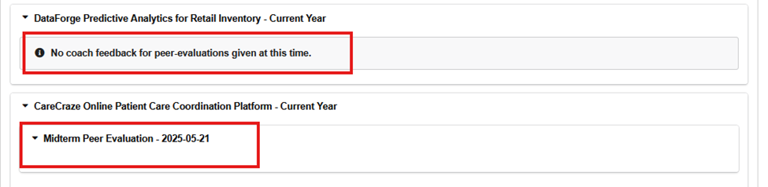
