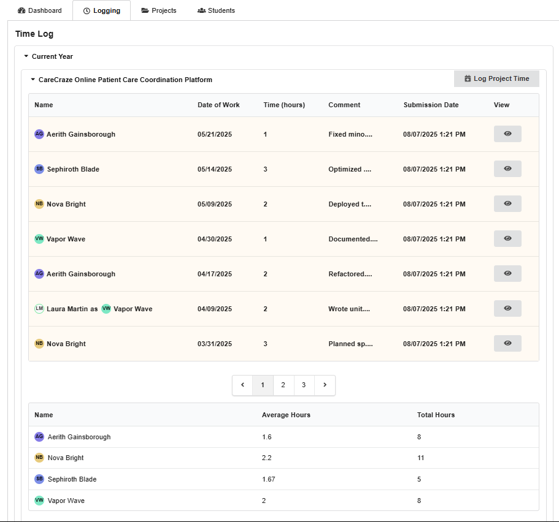
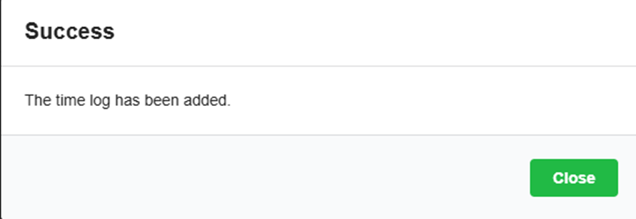
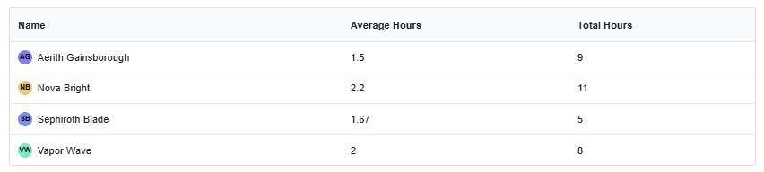
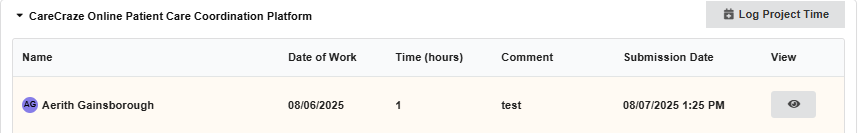
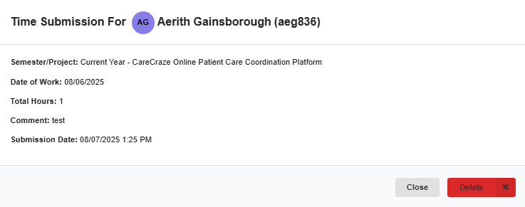
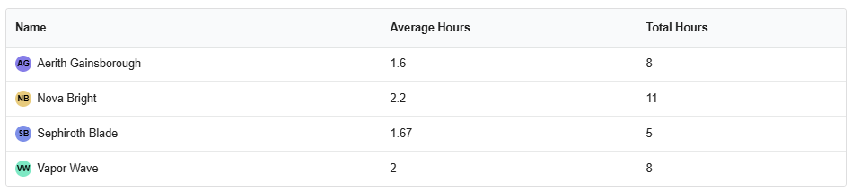
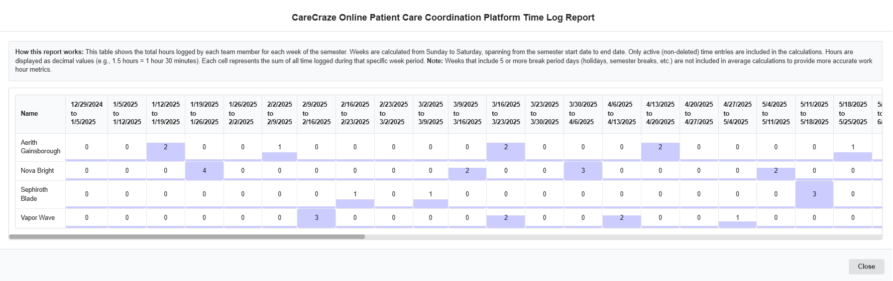
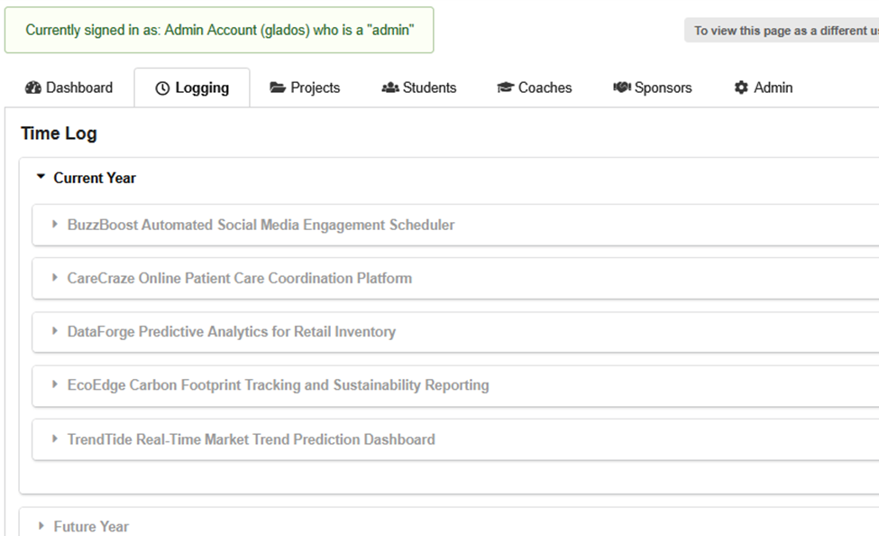
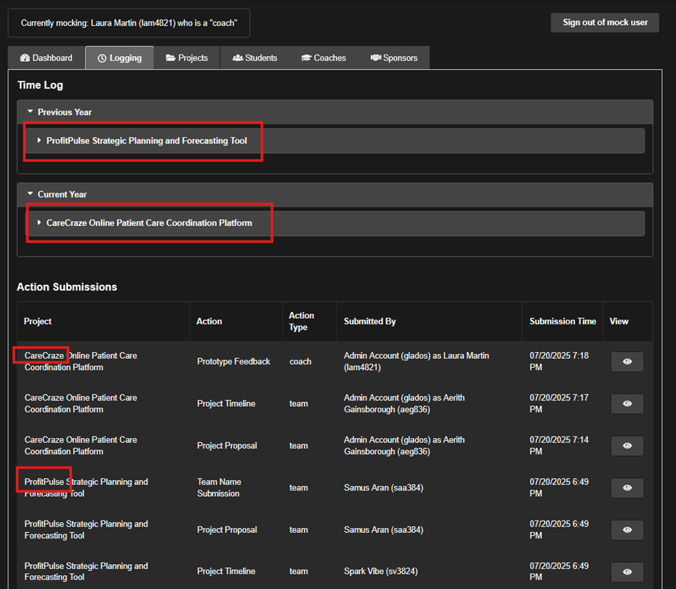
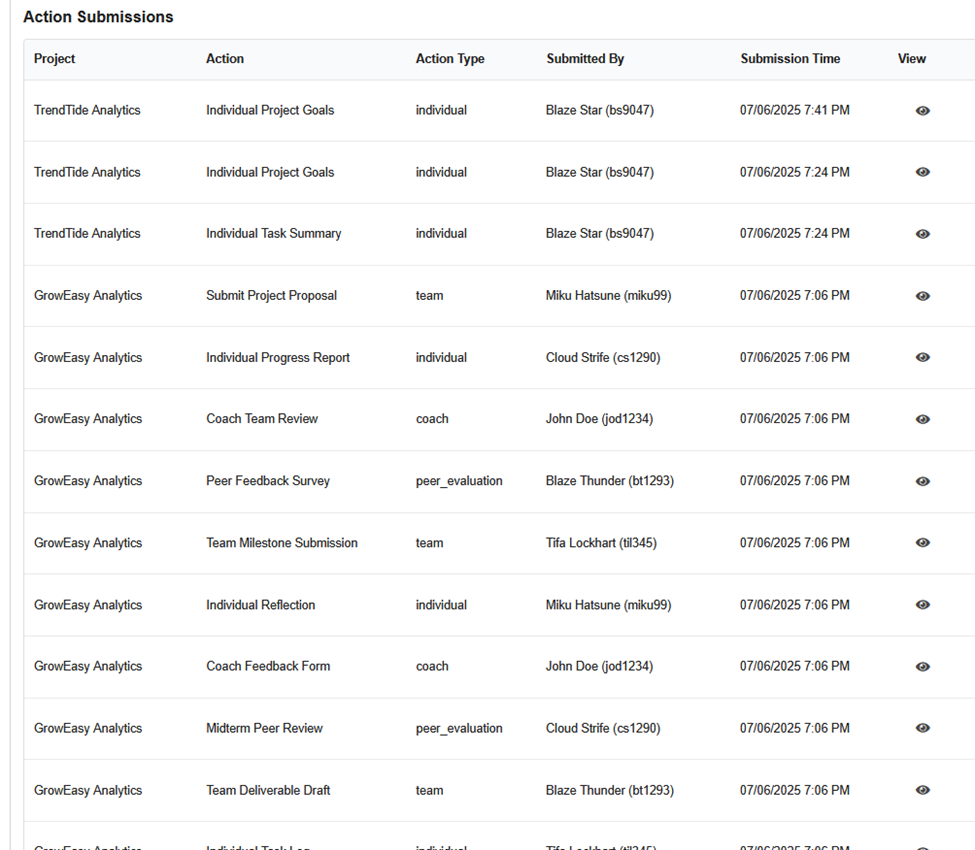

# Logging

[TEST CASES](readme.md)

## Covers

- [Time logs](#time-logs)
- [Action Logs](#action-logs)
- [Sponsor Notes](#sponsor-notes)

## Time logs

### Student Adding to Time Log

1. To keep track of hours worked in senior projects, this system provides functionality that allows students to log their worked hours within the last 14 days. This functionality is within the “Logging” tab of the system. Students can see the logs of their projects, coaches can see the logs of the projects that they are coaching, and admins can see all of the logs for all of the projects. First, sign in as a [student](authentication.md#validating-student-sign-in) and verify that they can only see the time logs of the project that they are in. Below is an example logging tab.
   

2. To create a time log, press the Log Project Time button in the top right corner of the tab
   

3. Proceed to fill out the proceeding time log modal and validate that only times between 1 minute and 10 hours are accepted and that the date of logging is within the last 14 days.

4. A validation pop-up should appear, and the bottom time log report should be correctly updated
   
   

5. The new log should also be visible to other users in the project and should appear slightly bolded and highlighted.
   

### Deleting Time Logs

1. For tampering protection, time logs cannot be edited directly however, they can be deleted. They can only be deleted by the student that makes them and will appear red to all users who can see the time log. Sign in to a [student](authentication.md#validating-student-sign-in) account with preexisting or [newly created](#student-adding-to-time-log) time logs

2. On a time log that was created by the signed in user press the view button (eye) to show the time log's details, and press the delete button.
   

3. The time log should immediately turn red for the signed-in user.
   

4. Additionally, the time log should appear red in the sign-ins of other users of the project like other [students](authentication.md#validating-student-sign-in), the [coach](authentication.md#validating-coach-sign-in) of the project, and [admins](users.md#view-only-admins).

### Time Tracking

1. For every additional [time log](#time-logs) the resultant total hours and average hours should be updated. Confirm this by adding or deleting a large variety of time logs for some students in a specific project of your choosing. Below is an example table, and note that the values should dynamically update.
   

2. Additionally, the Time Log Report should dynamically update and correctly show when time logs were made by students.  
   

### Admin Visibility

1. When signed in as an admin, all time logs across all projects should be visible within the logging tab.  
   

2. When [mock signing](admin.md#mocking-users) in as an admin the page should refresh automatically with and only display the time logs and action submissions of the respective coach’s or student’s projects.
   

## Action Logs

1. All users, except view-only [coaches](users.md#view-only-coaches) and view-only [students](users.md#view-only-students), have access to a log of all action submissions in the “Logging” tab under the Action Submissions view.
   

2. The amount of actions shown to each user is based on their preexisting access levels ie, admins can see everything (as shown above), coaches can see all of their projects, and students can only see their own projects.

3. Similarly to [time logs](#time-logs), these submissions also have visibility locks on their submission details. Students can only see the details of their own submissions and team submissions. Coaches can see all submissions details in their project, and admins can see everything.

## Sponsor Notes
