# Projects

[TEST CASES](readme.md)

## Covers

- [Status](#status)
- [Sponsoring](#sponsoring)
- [Editing](#editing)
- [Featuring](#featuring)
- [Member Assignment](#member-assignment)

## Status

1. Projects can have various statuses in this portal and each status introduces both literal and metaphorical constraints
   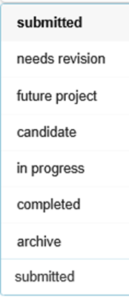

2. After a project has been [submitted by a sponsor](#sponsoring), it will automatically appear in the projects section as a submitted project. Submitted projects are considered under-review projects and their information and details can be edited by administrators
   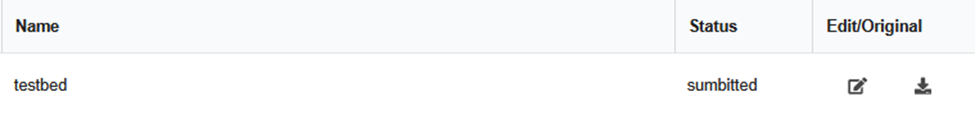
   If any user is assigned to a project during this stage they will not be able to see the project in their “Dashboard” tab but should be able to see information about it in the “Projects” tab

3. A “needs revision” project is functionally the same as “submitted” project however its name more likely indicates a longer period until a status change and will most likely undergo severe changes.
   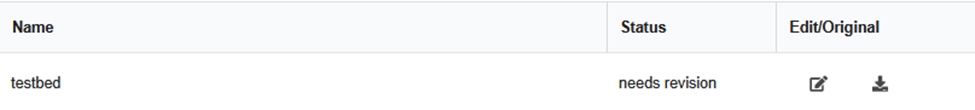

4. A “future project” is again similar in functionality to the previous but it indicates that the project’s details are more solidified and that the project will most likely be a candidate for an upcoming semester. For [view only students](users.md#view-only-students) these future projects will appear in their projects tab.
   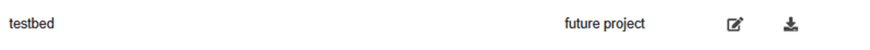

5. A “candidate” project should physically appear green and again details should still be visible and editable but the project is not operational so the project should yet to appear in the dashboard of assigned members.
   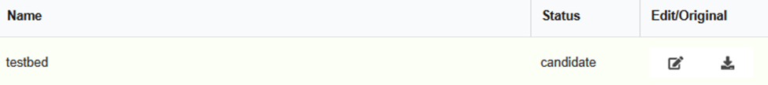

6. An “in progress” project is a live and on going project which finally displays on the “Dashboard” tab of its assigned members. Members can now [complete actions](actions.md#completing) within the project and [log time](logging.md#time-logs) within the project. “In progress” Projects should also appear yellow in project views.
   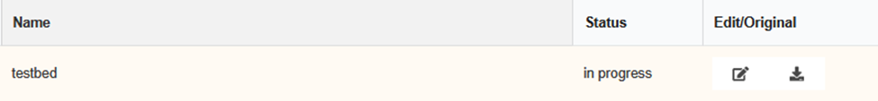

7. “Completed” projects represent finished projects and like the statuses before “in progress”, remove the project from the “Dashboard” of members since implies that all actions are completed (they do not have to be for the status to be changed to completed)
   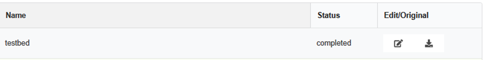

8. A “archive” project is the final form of a project and indicates that the final rendition of a webpage and respective images/videos have been uploaded alongside the project. Like other statuses this is more of tracking state and doesn’t entirely restrict/lockdown the project which are handled independently with archive locking TODO LINK.
   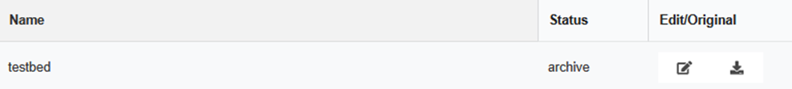

## Sponsoring

1. Sponsoring projects is the main way for projects to be created in this system and is vital for the project lifecycle of this system. Projects can be sponsored by anyone with a well thought out idea and because of such the submission section is accessible on the main signed out homepage via the “Sponsor a Project” button in the top right.
   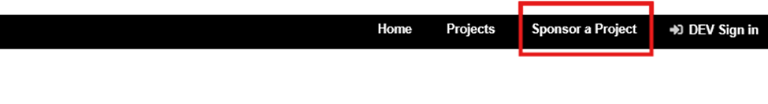

2. Here you will be greeted by a preliminary Q&A section which answers and outlines the basic requirements and common problems. _Note_: because of local development the proposal instructions pdf might be unavailable but should be visible in both the live sandbox and live live server instances.
   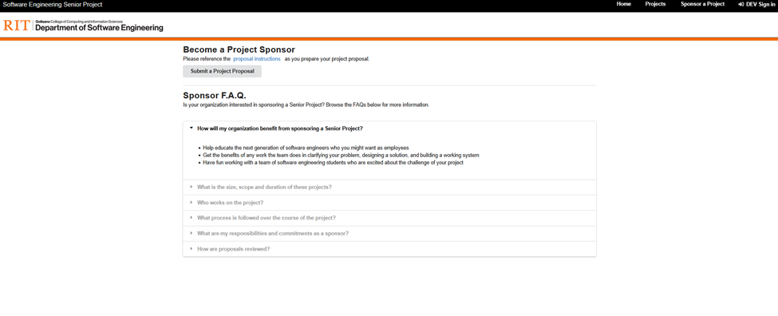

3. Pressing on the “Submit a Project Proposal" button will navigate to the project proposal form.
   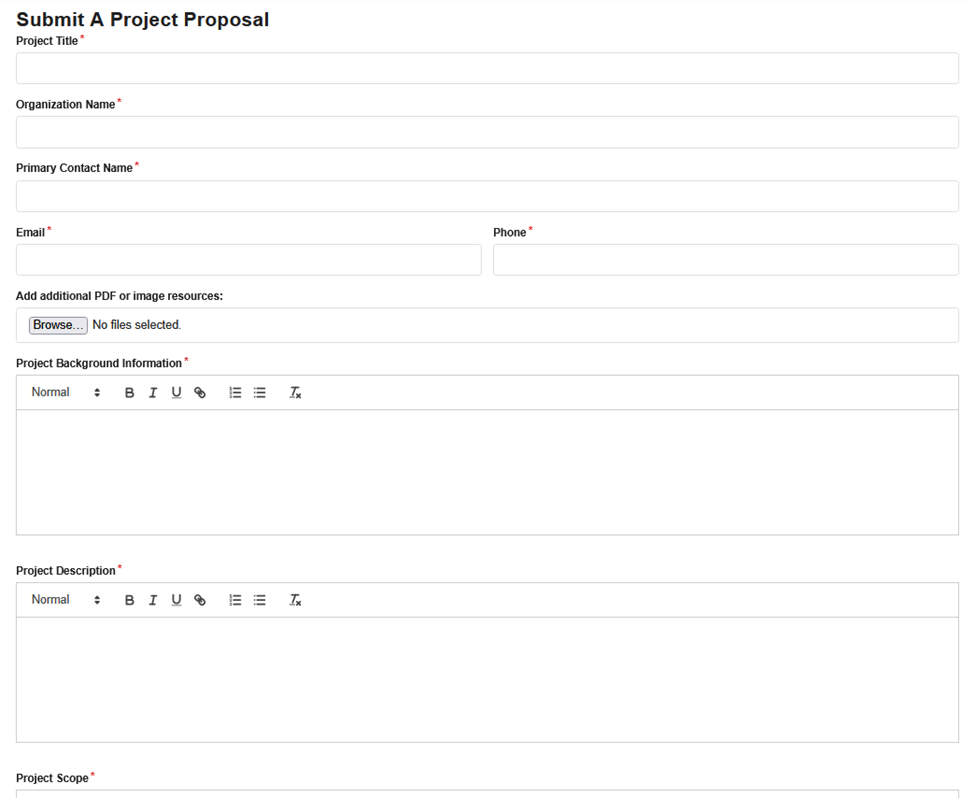

4. If a required field or button is left empty/unchecked the form should prevent submission and navigate to said required field.
   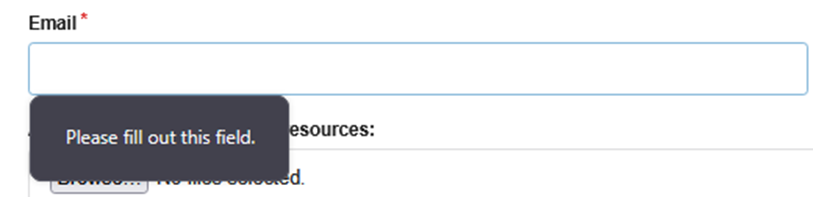
   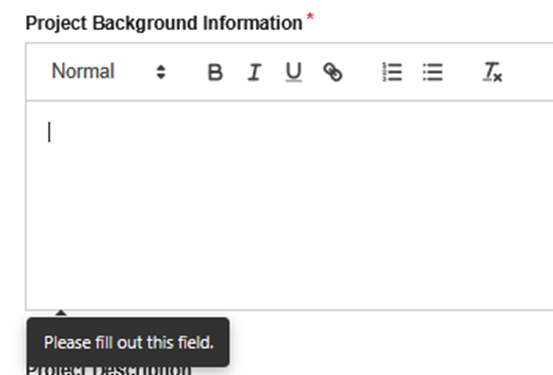
   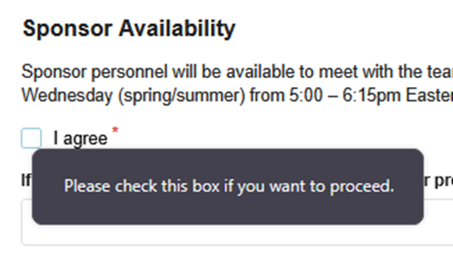

5. The longer required fields like Project Background Information and Project Description will be placed into a pdf and here we can test pasting in complexly structured text like the ones seen in these test cases.
   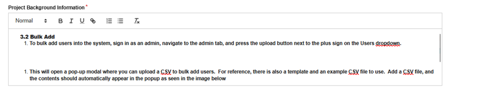

6. After all of the required fields are filled pressing the submit button should display a success popup as seen below.
   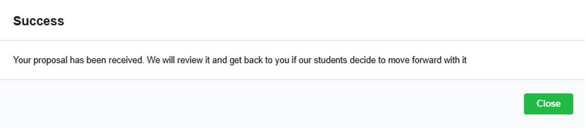

7. Now if we sign into the portal as an [admin](authentication.md#validating-admin-sign-in) we should be able to see the project under the projects tab in the all projects section.
   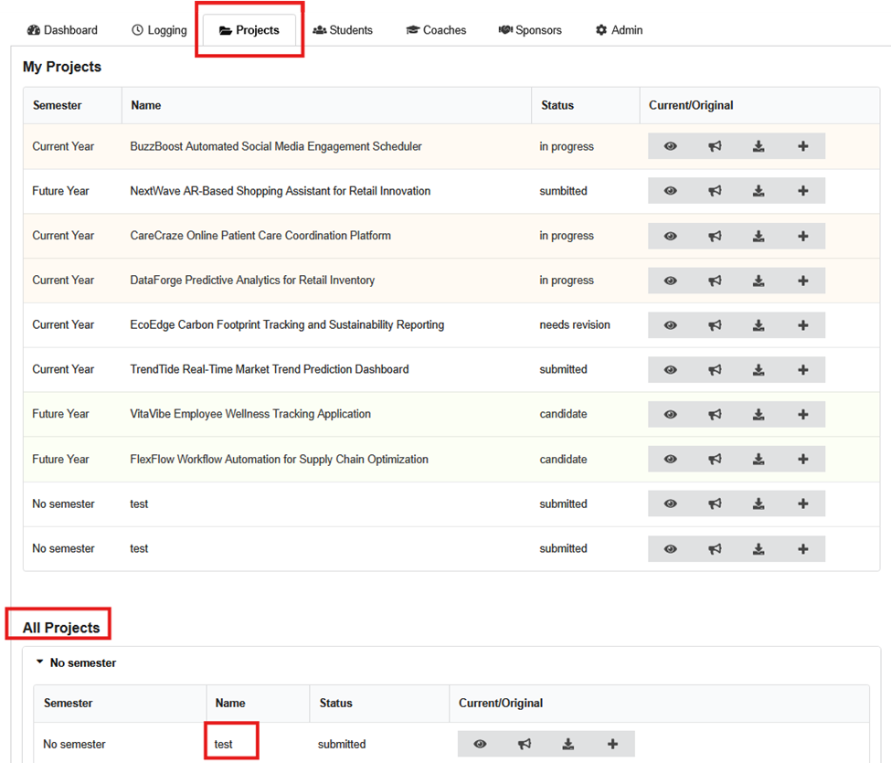

8. Pressing on the download button will open up a pdf of the proposal which should align with the inputs we had just recently created.
   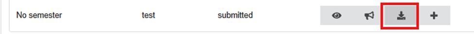
   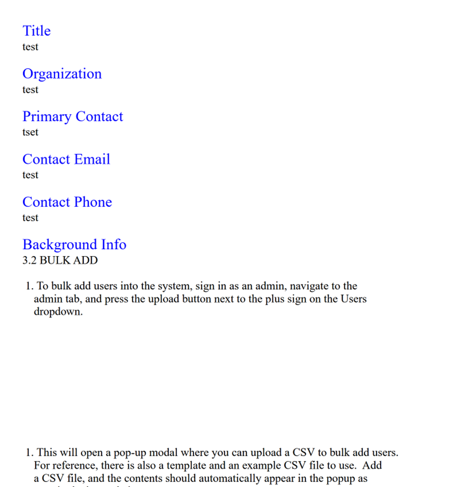

9. Once this is confirmed we can now [edit the project](#editing), [feature it](#featuring), and [assign members to it](#member-assignment).

## Editing

1. Projects can be modified by signed-in [admins](authentication#validating-admin-sign-in) under the “Admin" tab’s Project Editor dropdown.
   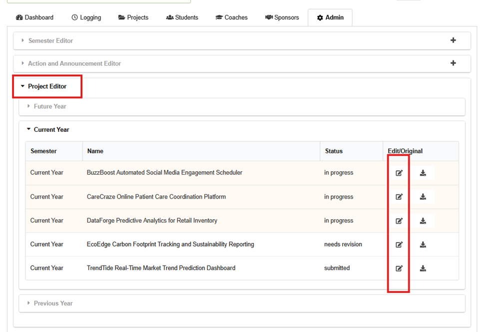

2. Each project should have an edit button that brings up a project editing modal similar to below. Project attributes like display_name, title, coaches, organization, primary contact’s name/email/phone, and other descriptive text fields can be added and edited. Below is an exaple of adding a display name, changing the project title, and adding a coach.
   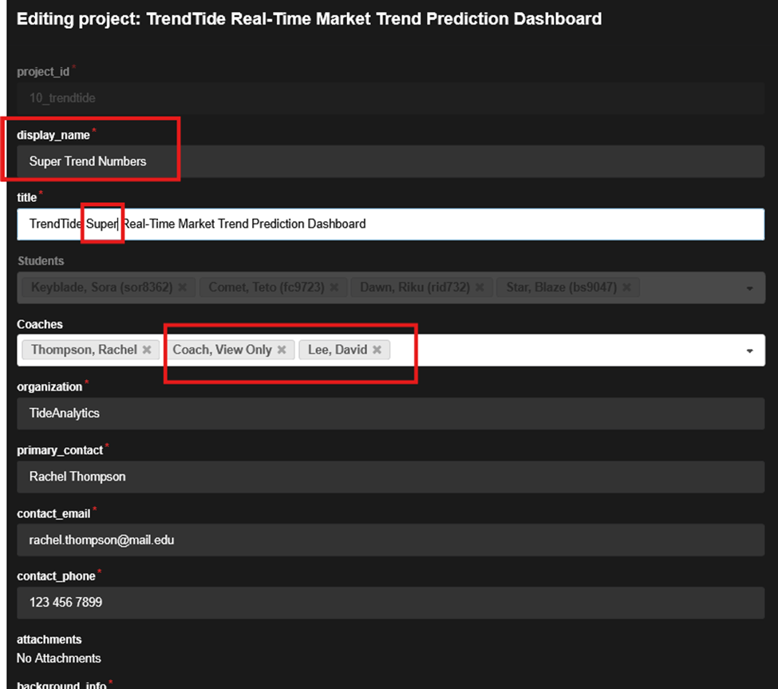

3. Once edits are made and submitted, a successful pop-up should appear to verify that the project information has been updated.
   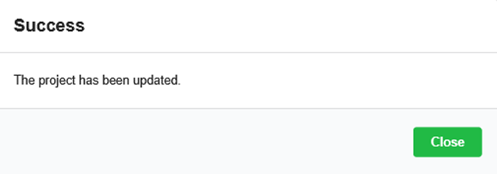

4. Additionally, because we changed the several aspects we should immediately be able to see the newly updated project information in both the quick overview panel and the details view.
   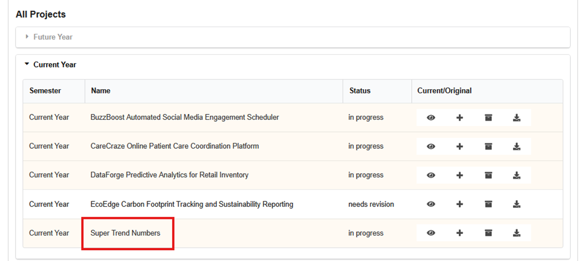
   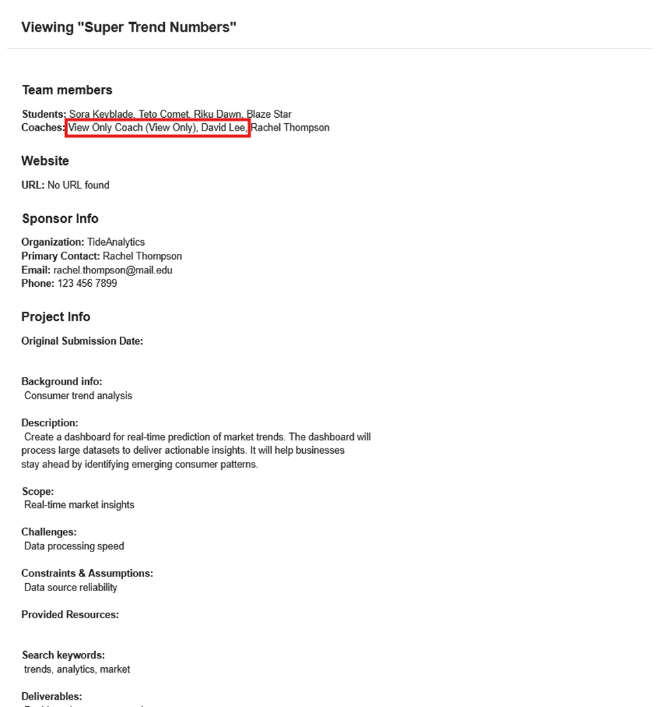

## Featuring

1. Featuring a project is a functionality in the portal that allows for public access to projects to highlight student achievements. To see examples of this in the portal navigate to the home page or the page that is first seen when the application starts up. Note: you will have to sign out to see this page if you were already signed in.

## Member Assignment
