# Sponsors

[TEST CASES](readme.md)

Project Sponsors are external industry representatives responsible for the proposal and are a client of capstone projects. They serve as a primary point of contact for their organization and they do not have their own sign in into the portal. Sponsor information only visible to coaches and administrators.

## Covers

- [Adding](#adding)
- [Editing](#editing)
- [Visibility](#visibility)

## Adding

1. Sponsors can only be added to the system through signed-in [admins](authentication.md#validating-admin-sign-in). To add one, navigate to the “Admin” tab and press the “+” button on the sponsors dropdown.
   

2. This will open a creation modal with fields that need to be filled in. For this example, we will fill the required fields exclusively and then press “Submit” when done.
   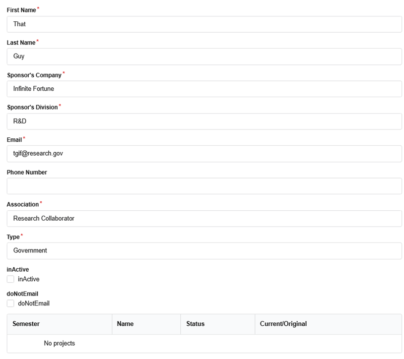

3. A confirmation pop-up should appear and after closing it the sponsor should be visible in the Sponsors dropdown in the Admin tab. Additionally, the sponsor should also be visible in all instances of the Sponsors tab (visible to coaches as well).
   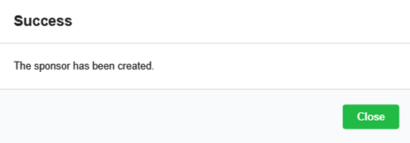
   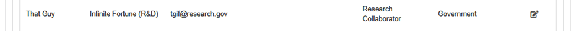

## Editing

1. When necessary, sponsor information can be added and edited by signed-in admins. For this test case, we will utilize the [freshly-created](#adding) sponsor. In the “Sponsors” dropdown in the “Admin” tab, there should be an edit button next to each sponsor to edit their respective details.
   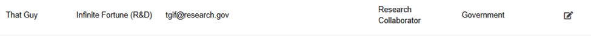

2. After clicking that button, the edit modal should appear and it should look very similar to the creation modal but with a new section of “Sponsor Notes”. Take note of this and edit any field of the sponsor and press submit.
   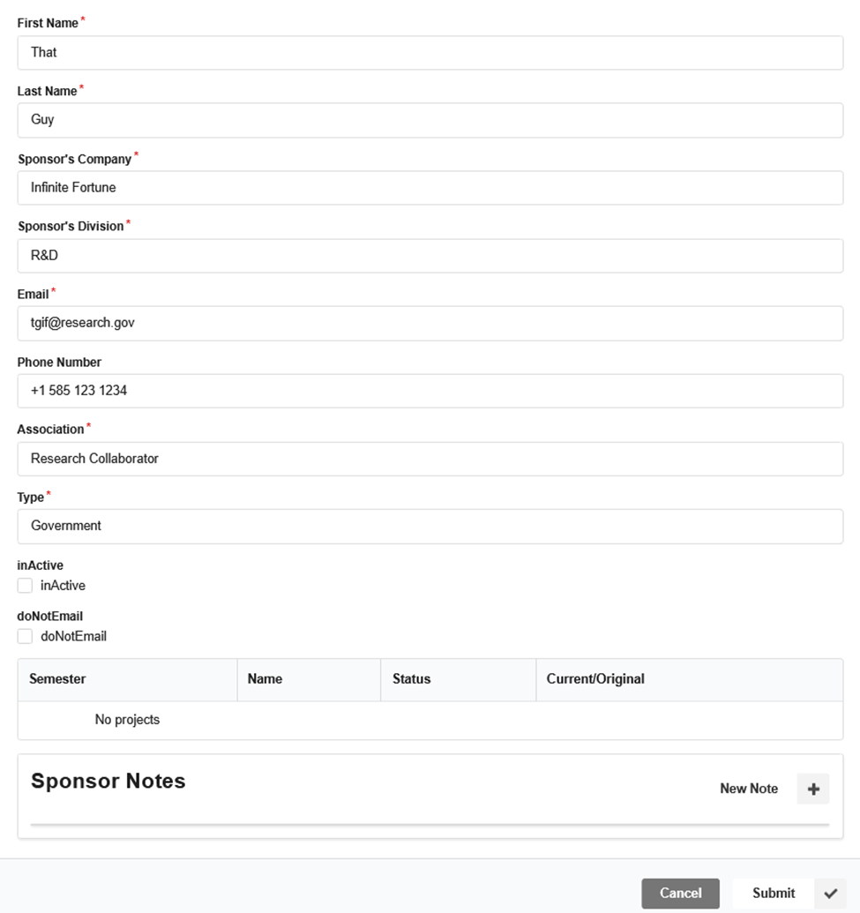

3. After the edit confirmation modal appears, the respective edited information should be correctly displayed.
   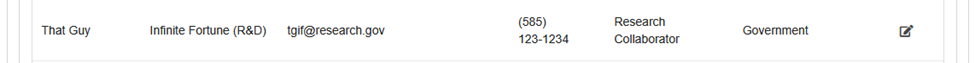

4. Additionally, if we navigate to the edited sponsor’s [“Sponsor Notes”](logging.md#sponsor-notes), we should see a log of the edited fields.
   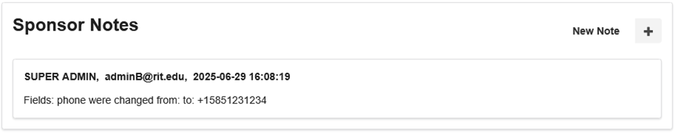

## Visibility

1. Sponsors are only visible to [coaches](authentication.md#validating-coach-sign-in) and [admins](authentication.md#validating-admin-sign-in) however unlike administrators coaches can only view sponsors, see their projects, and add sponsor notes. Verify this by signing in as a coach and navigating to the “Sponsors” tab. There should be no edit button and only a view button which brings up a sponsor’s details.
   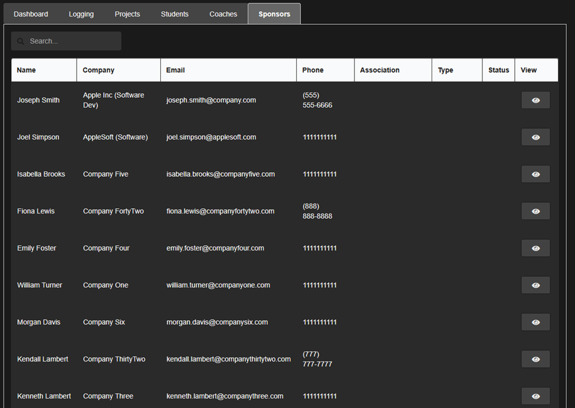
   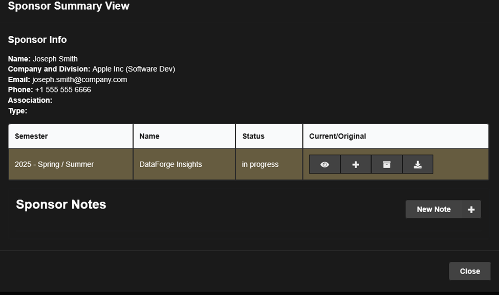

2. When signed in as an admin, the Sponsors tab should functionally work the same as seen from the perspective of coaches, however as seen in adding and editing sponsors, admins have more control over sponsors.
   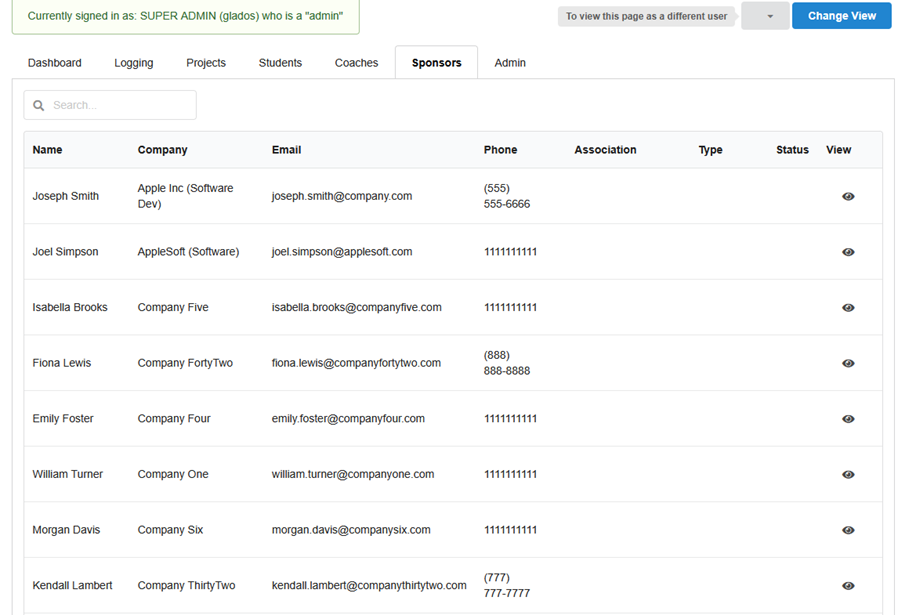
   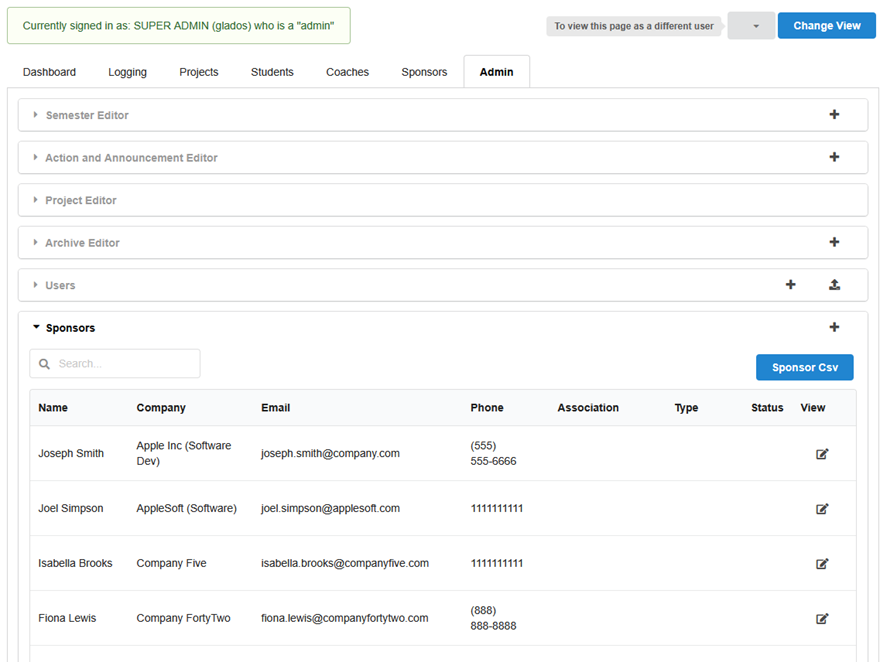
