# User Management

[TEST CASES](readme.md)

## Covers

- [Adding Users](#adding-users)
- [Mail-to-All](#mail-to-all)
- [Editing Users](#editing-users)
- [Reassigning Users](#reassigning-users)
- [Deactivation](#deactivation)
- [View Only Users](#view-only-users)

## Adding Users

### Single Add

1. Sign in as an [Admin](authentication.md#validating-admin-sign-in)

2. Navigate to the “Admin” tab, and within the “Users” accordion press the “+” button
   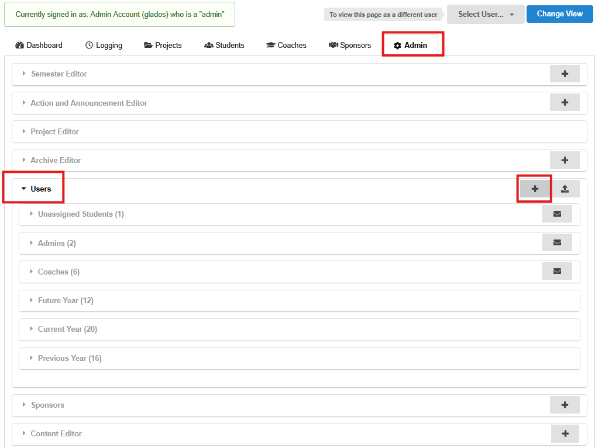

3. Fill out the required fields in the popup modal
   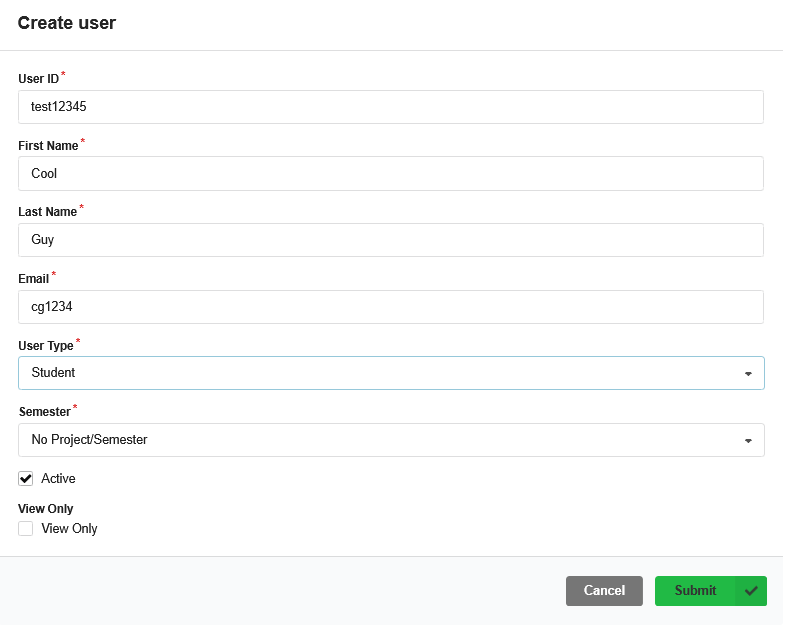

4. For the user types of “Student” and “Coach” add one new user and verify both exist under their relevant sections in the “Users” drop-down. _Note_ With different user types, the Semester fields should be different. For example, a Student should have a Semester field, while a Coach should not.

5. Before moving on, quickly ensure that creating users without all of the required fields results in an “Invalid Submission” pop-up when the “Submit” button is pressed.
   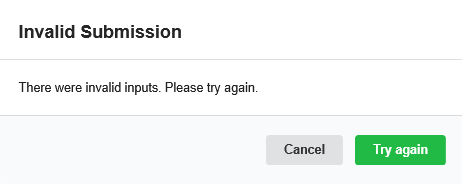

6. Now verify that we can sign in by signing out of an admin and signing in as the new user. Note: Because we did not assign a user to a specific project they will not see anything on their “Dashboard” and “Logging” tab but the “Projects” and “Students” tab should be populated.

### Bulk add

1. To bulk add users into the system, sign in as an [Admin](authentication.md#validating-admin-sign-in), navigate to the admin tab, and press the upload button next to the plus sign on the Users dropdown.
   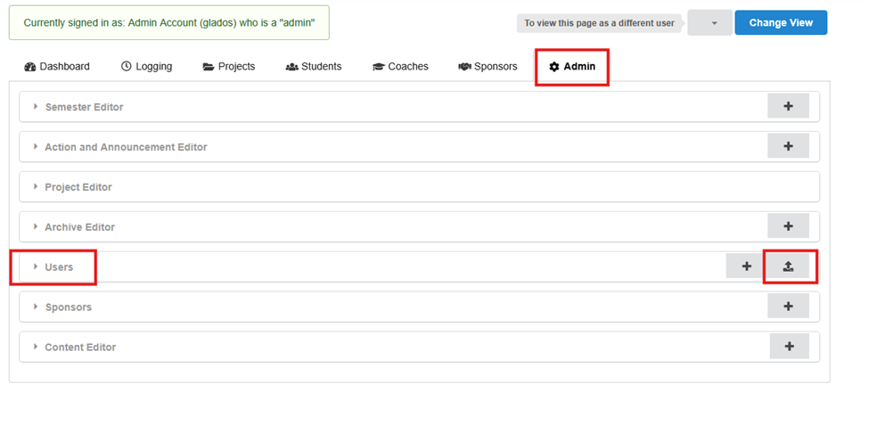

2. This will open a pop-up modal where you can upload a CSV to bulk add users. For reference, there is also a template and an example CSV file to use. Add a CSV file, and the contents should automatically appear in the popup as seen in the image below
   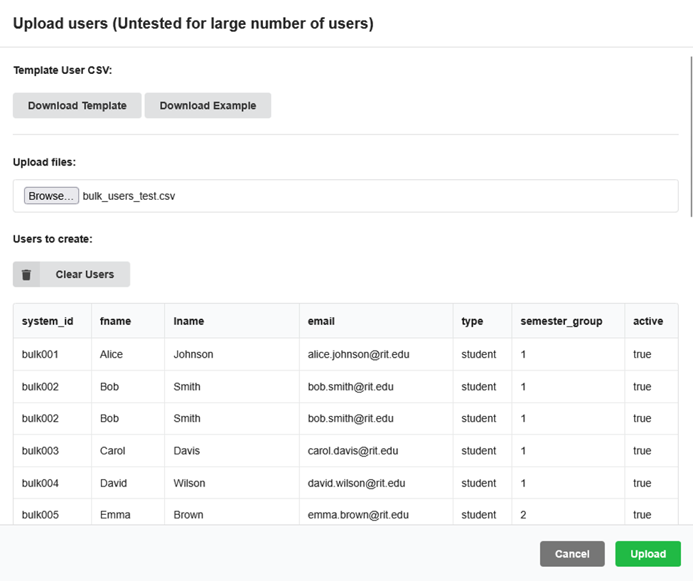

3. Pressing upload will check the csv and only upload the correctly formatted users.

4. If a user is malformed a red highlight will appear on the row of the user and the following error message will appear.
   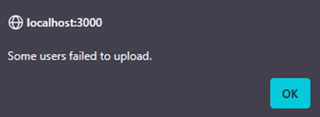
   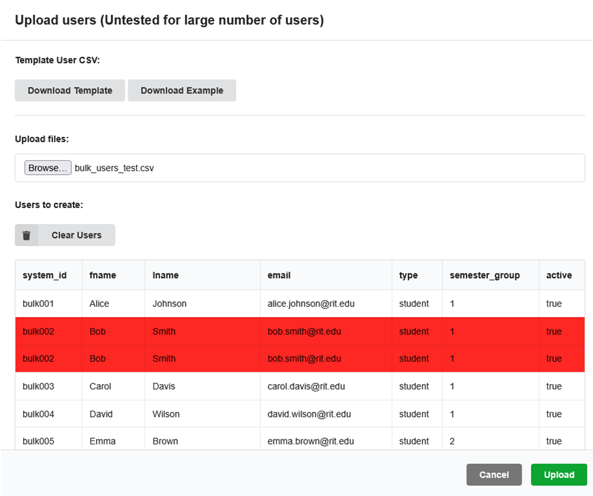

5. To rectify issues with bulk adding, ensure that there are no duplicate users, and ensure that the CSV conforms to the upload standards using the Download Template/Download Example buttons and or by navigating the creation template at `server/www/UserCreationTemplate.csv` or the example at `server/www/UserCreationExample.csv`

## Mail-to-All

1. Within the portal, there are several clickable mail icons available to all users, which allow them to email every user in the drop-down. This test case outlines the general proceedings for this functionality with examples for students, coaches and admins
   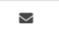

2. First test the mail to all functionality from the admin perspective by signing in as an [admin](authentication.md#validating-admin-sign-in) and navigating to the “Students” tab.

3. Pick any available semester with a sizable amount of students and press the mail button seen on the right side of the semester view.
   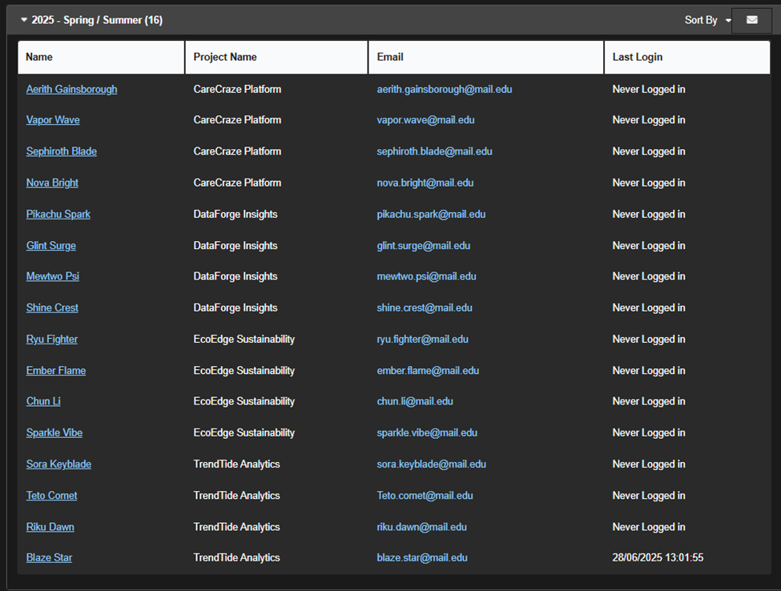

4. Depending on your browser or your default settings, the applications that open may vary, however a new email window should open up with the receiving/to field filled with the same users from the semester.
   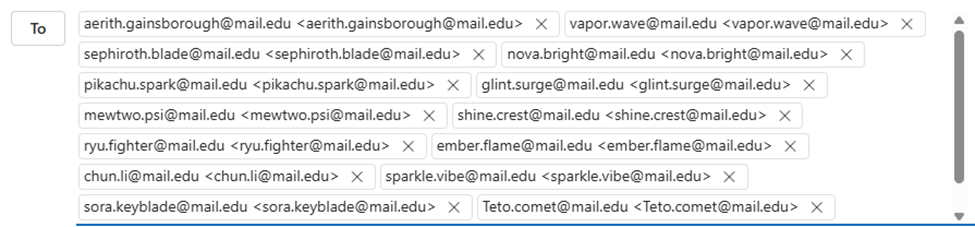

5. Test this with other mail buttons visible to administrators before signing into a coach account. The button exists in the Students tab, Coaches tab, and under the Users dropdown in the Admin tab.

6. Once tested extensively for Admins, follow the same procedure for Coaches. Note that the mail button should only appear in the Coaches and Students section.

7. Finally, test the functionality for Students. They should only have access to the mail all in the students section.

## Editing Users

1. Like other [actions](actions.md), and [projects](projects.md), users cannot be deleted from this portal however administrators still have full edit access on users. To edit a user, sign in as an [Admin](authentication.md#validating-admin-sign-in), navigate to the “Admin” tab, open the “Users” accordion and use the edit button to edit a specific user. In the accordion, coaches and administrators are separated into their own sub accordions while students are separated into their assigned (or unassigned) semesters and projects.
   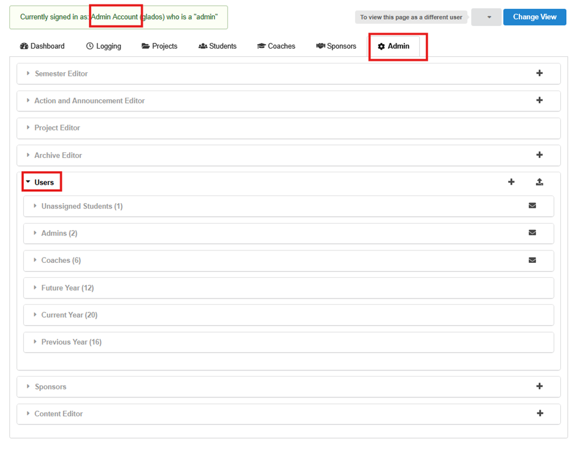
   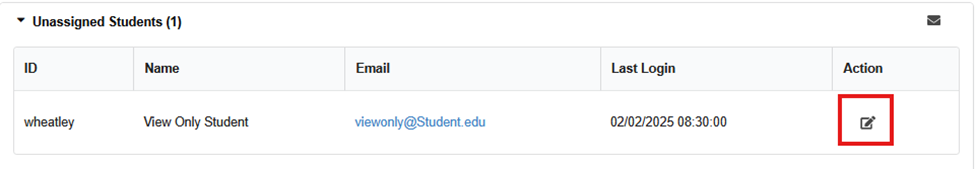

2. Pressing the edit button will open the user editing modal which should be pre-populated with the corresponding user’s information.
   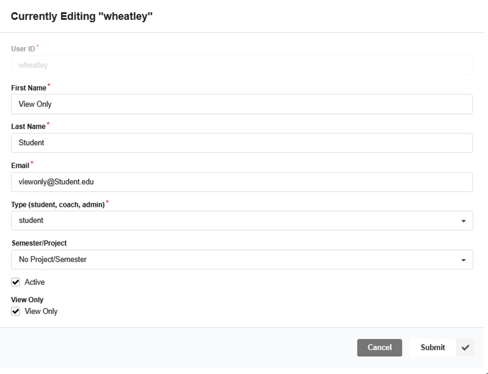

3. Edit any editable fields (note a users ID should be displayed but not editable) and press “Submit” to apply changes.
   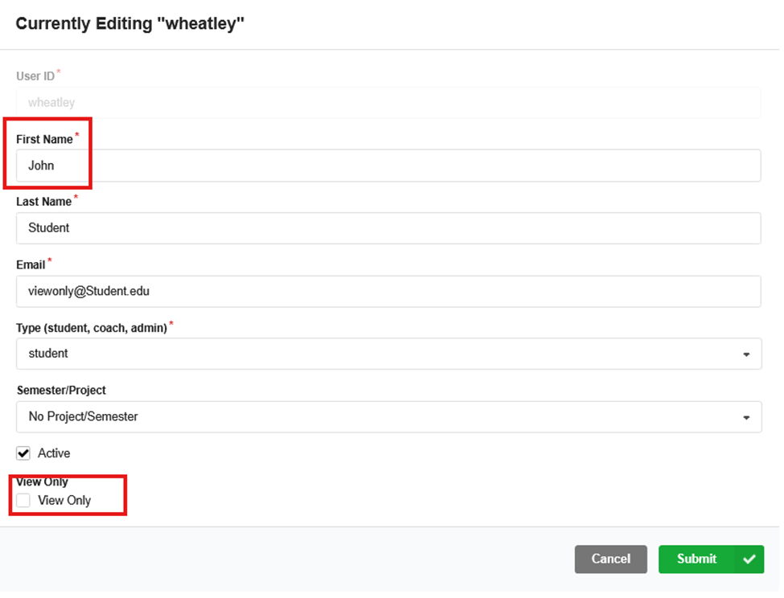

4. Once the success popup has appeared the updated student information should be visible in the Users accordion.  
   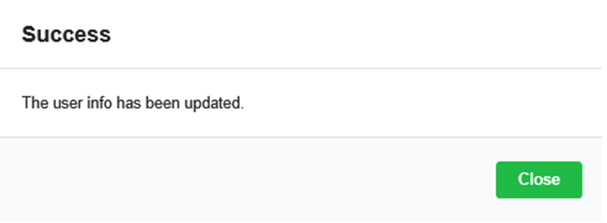
   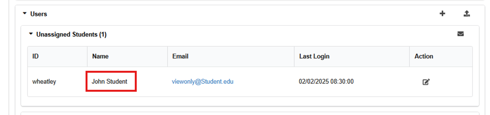

5. [Reassigning Users](#reassigning-users) to a role, [assigning students to a project](projects.md#member-assignment), [user deactivation](#deactivation), and [view only students](#view-only-students) will utilize this modal.

## Reassigning Users

1. As seen in [user creation](#adding-users), users can be assigned a type of student, coach, or admin when first added into the system. If a mistake was made and a user was wrongly assigned a role, admins can rectify the mistake by [editing](#editing-users) the user.

2. In this example we will be taking a wrongly assigned Coach and editing them to be correctly assigned. Following the procedure in [above](#editing-users), identify the user that will be reassigned.
   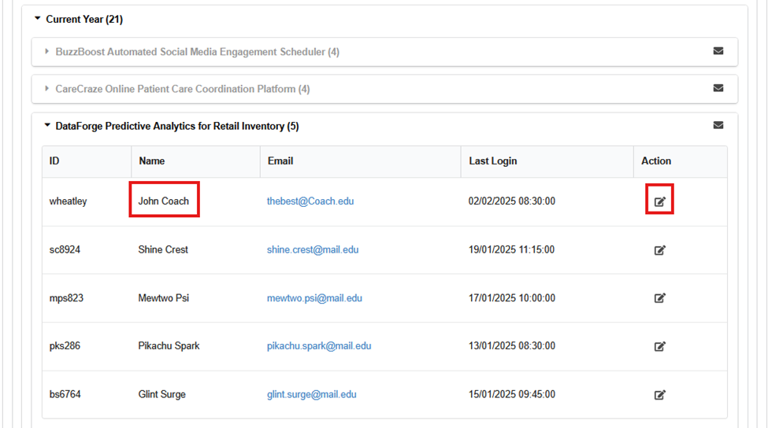

3. In the edit user modal we should see the current assigned type of the user and if we change that field the modal should update accordingly.
   
   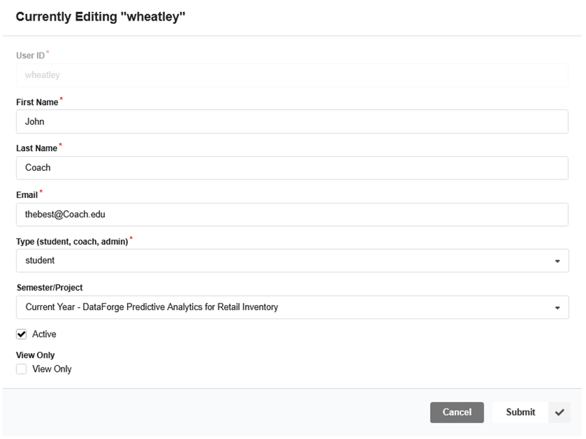

4. Pressing submit will save our changes and the user should now appear in their corresponding section of the Users accordion.
   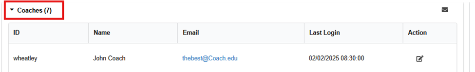

5. _Note_ in this scenario a student was changed to a coach however because of how [member assignment](projects.md#member-assignment) works in projects additional steps must be taken for the coach user to be a coach of their initial project.

## Deactivation

1. In the editing a user modal there is an “Active” checkbox at the bottom to indicate whether or not the user is active.
   

2. Unchecking the active box should introduce an additional timestamp that indicates when the user was deactivated.
   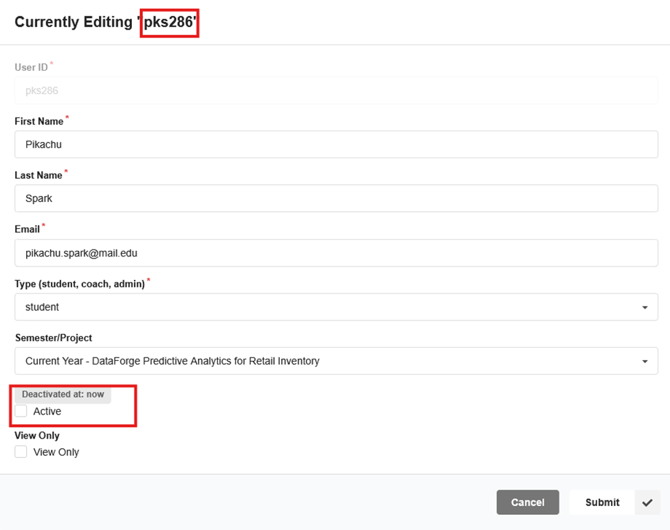

3. Pressing submit will save the change and after the success popup appears the user should no longer be active.

4. A deactivated user’s contributions and ties will still appear throughout the portal and the user will also no longer appear in the [admin mocking](admin.md#mocking-users). The deactivated should still be able to sign in but instead of the portal they should be greeted by an access denied page.
   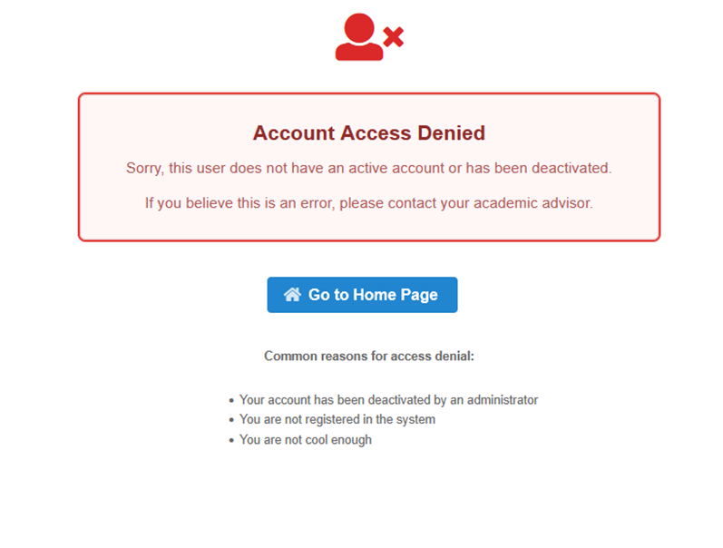

5. To reactivate a user simply recheck the active box.

## View Only Users

1. Users can be changed to have view only privileges at any point of time by admins of the portal. Like [user deactivation](#deactivation), setting a user to view only is done at the bottom of the [edit user](#editing-users) modal and will take effect after pressing Submit.
   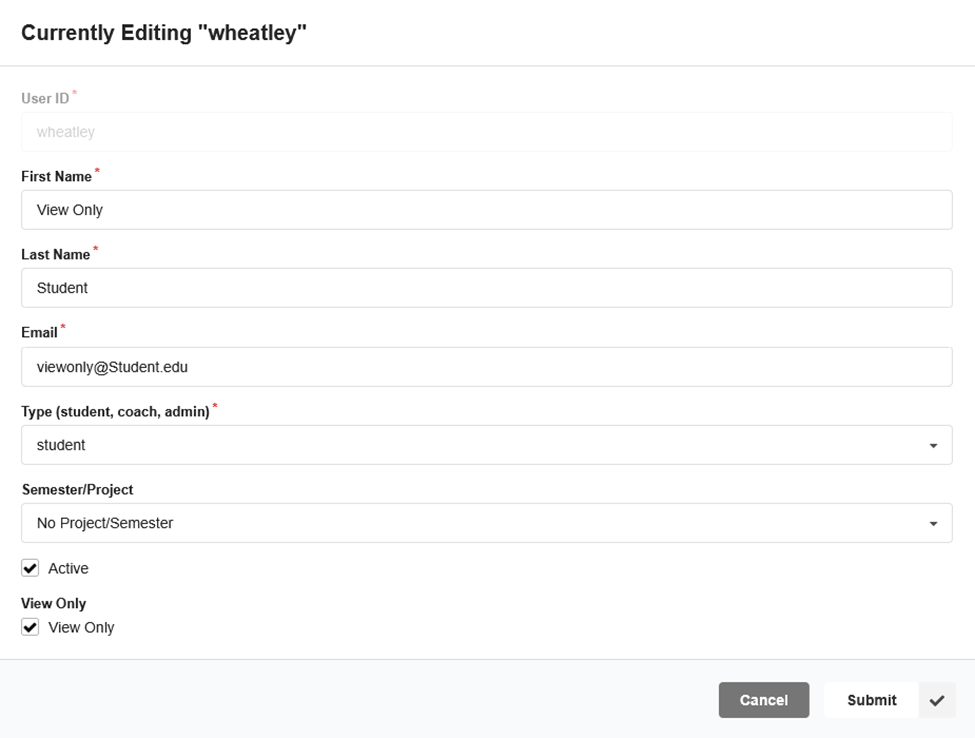

2. Unlike the user active checkbox view only doesn’t create a time stamp for when it's checked and users who are set to view only can still sign into the application and can be mocked by admins.

3. Further examples and information of what view only users can do can be found below.

### View Only Admins

1. In addition to a normal admin role, there is a view-only admin role, which as the title suggests is a user with administrator read access but no write access (a use case would be like a dept chair and or advisors). One aspect of this is the lack of the Admin tab in the main tab selection.
   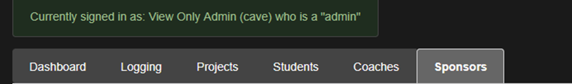

2. View-only admins can still [mock users](admin.md#mocking-users) like coaches and students however, when trying to complete specific actions within a semester as a view-only admin, the submit button is replaced with “view only role” text. Verify this for both coach and student-specific actions.
   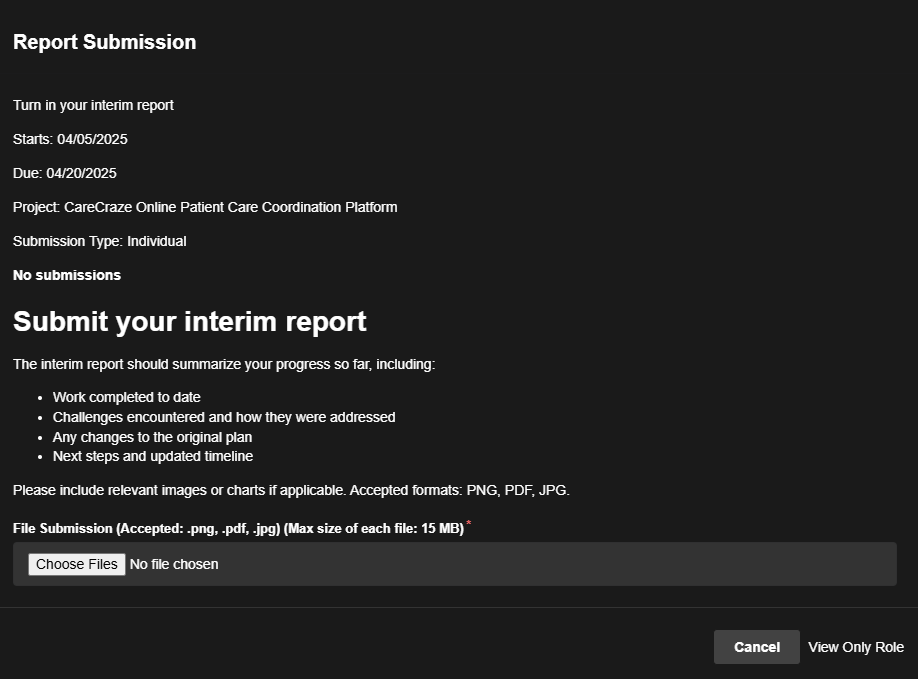

3. View only admins can see all of the sponsors like regular admins and view their respective projects and information, however they cannot add sponsor notes to a sponsor.
   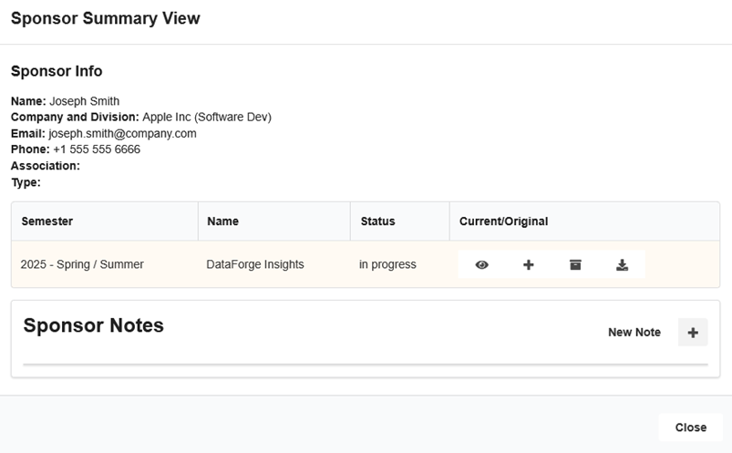

4. View-only admins can still see all students and coaches, and the [mail-to-all](users.md#mail-to-all) button still functions correctly, but again, no fields or attributes can be edited by the admin.
   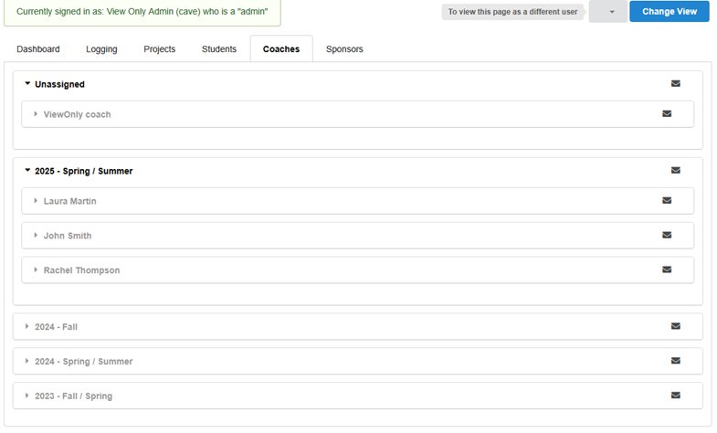
   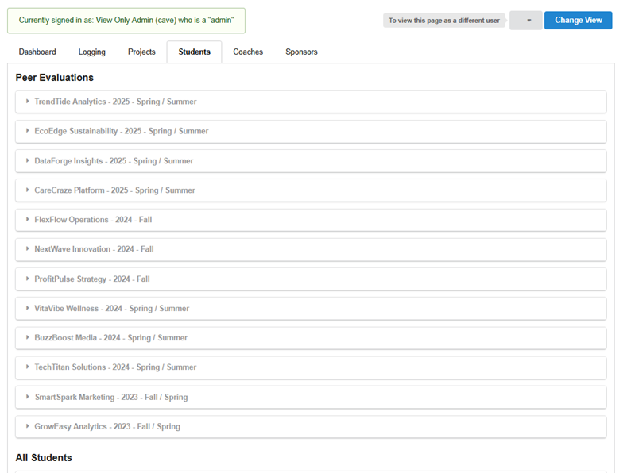

### View Only Coaches

1. View-only coaches are users with coach-level access but with zero post privileges. By default, a new view-only coach cannot see anything on their dashboard because by default, they have not been assigned to any project however they still have access to all of the tabs that coaches normally do.
   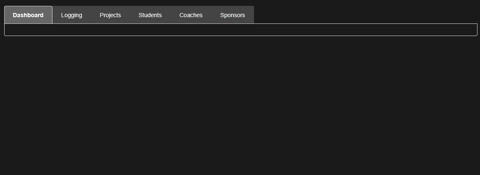

2. The view only coach can see all of the projects and their sponsors however, they cannot add any notes or modify any attributes to the projects or sponsors.

3. Similarly to a view only admin, a view only coach can access the list of all coaches and the “mail-to-all” functionality still works.

4. Assigning a view-only coach to a project will fill out their empty tabs.

5. Once the view only coach is assigned to a project, sign back in as them and verify that the “Dashboard” tab is now filled in with the correct project details.
   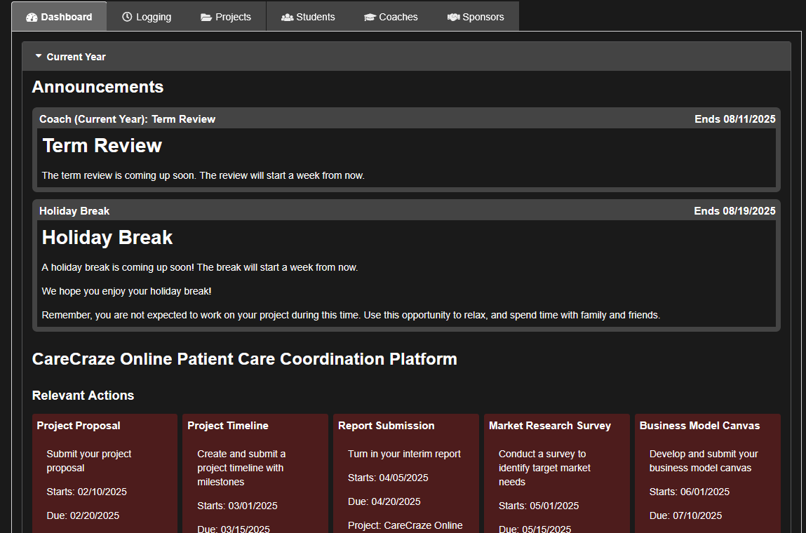

6. In a project, view only coaches have the same visibility access as normal coaches however if we try to submit an action, regardless of type, the submit button will be blocked by a “View Only Role” text.

7. This also applies to sponsor notes as view only coaches can view preexisting notes but the submission of new notes is blocked

### View Only Students

1. Similar to view only coaches and view only admins, view only students are users with student levels of access but cannot make changes or write any information.

2. If a view only student is not assigned to any project they can view all candidate projects in the system under the “Projects” tab.
   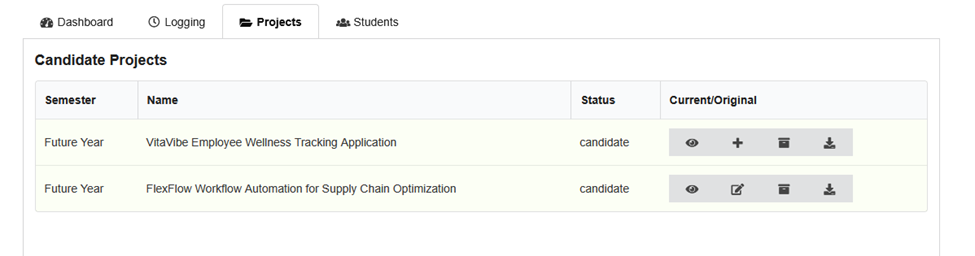

3. If a view only student is assigned to a project they are again blocked from making any submissions to any action or time log via a “View Only Role” text.
