# Administrative Tools

[TEST CASES](readme.md)

## Covers

- [Mocking Users](#mocking-users)
- [Admin Tab](#admin-tab)
- [Creating Semesters](#creating-semesters)
- [Copy Semester Actions](#copy-semester-actions)
- [Editing Semesters](#editing-semesters)
- [Archive Editor](#archive-editor)
- [Content Editor](#content-editor)

## Mocking Users

1. Mock sign in is a functionality within this portal that gives admins the ability to parody student and coach perspectives within the portal. Mocking retains the [preferences of users](authentication.md#user-preferences) and unlike the dev sign in feature for local development, mocking is exactly the same within live deployment.

2. Signed in as an admin, above the signed in navbar of the portal, there will be a mocking component that shows the current user on the left and the user selection dropdown and “Change View” button on the right.
   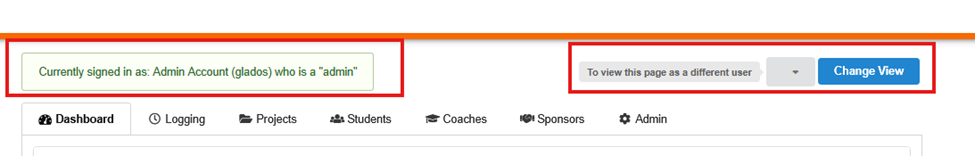

3. In the dropdown select a user and then start mocking as them via the “Change View” button.

4. This should immediately refresh the page and the mocking component will display the currently mock signed in user on the left with their user type and the sign out button on the right. Note if the selected user has different preferences with darkmode they should be immediately apparent.
   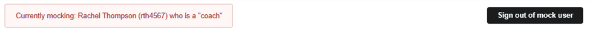

5. With mocking we can still perform the same workflows as a normal student or coach. For example if we mock sign in as a student and view a student action (individual or team) we can still submit files and fields with the added functionality that our submissions will be flagged as mocked submissions.
   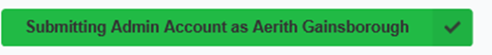

6. We can view this flag after submitting actions by navigating to the “Logging” tab and viewing project specific submissions in “Action Submissions”
   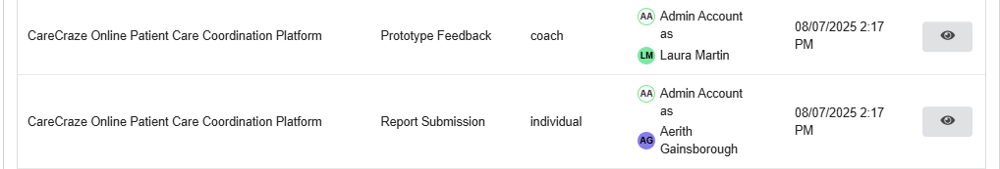

7. In addition to appropriate action submission logging we should also be able to mock [logging project time](logging.md#time-logs). Select a student as a mock user and add a time log. The time log report should correctly update and in the main time log table the log should accurately reflect the mock sign in state of the user.
   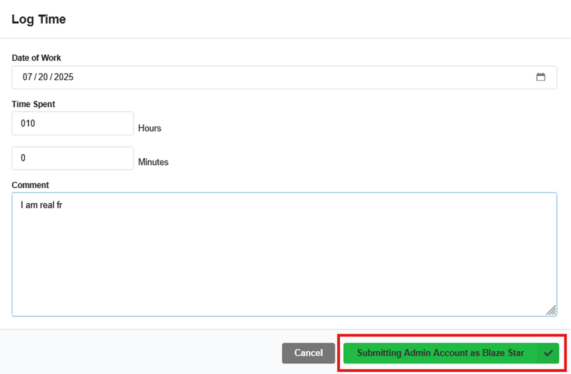
   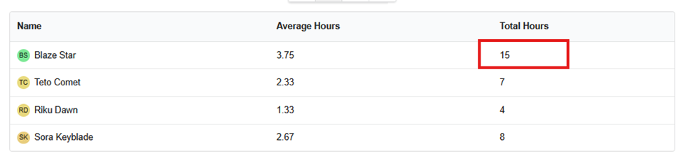

## Admin Tab

1. The “Admin” tab is home to all of the administrative adding and editing of data within this portal. As seen throughout these test cases administrators can add and edit [announcements](announcements.md#creating), edit [projects](projects.md#editing), edit [archives](#archive-editor), add and edit [users](users.md#editing-users), add and edit [sponsors](sponsors.md#editing), and [edit public facing content](#content-editor) throughout the application. All of this is located on the “Admin” Tab across various dropdown menus for each section
   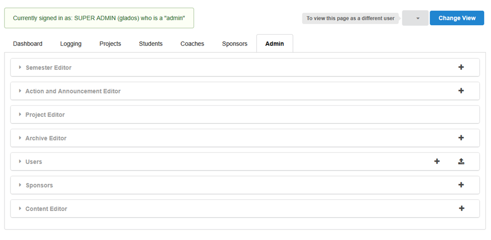

### Creating Semesters

1. Semesters are a key building block for the structure of work within this system as they act as a time bounding period for projects and work to be completed. Only admins can create a semester in the “Admin” tab using the “+” button.
   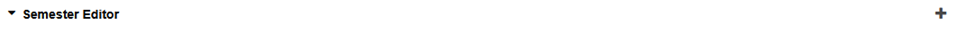

2. In the semester creation modal there are four mandatory fields, Semester Name, Department, and start/end dates. Add in recognizable values for testing. Note: Semesters must have unique names, and the only date requirement is that the end date is the day of or after the start date.
   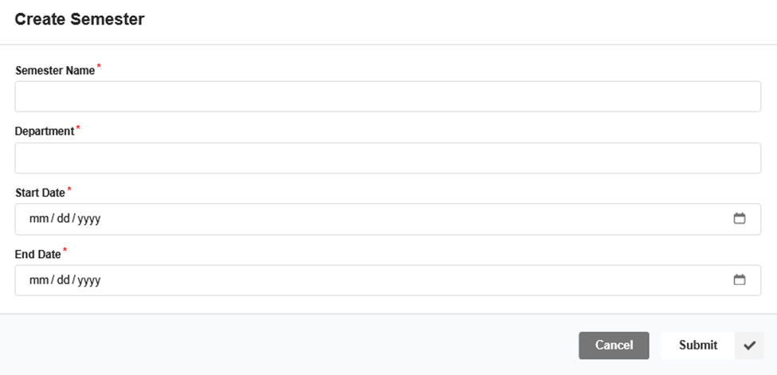

3. After pressing submit and seeing the confirmation window the semester should be visible in the semester list.
   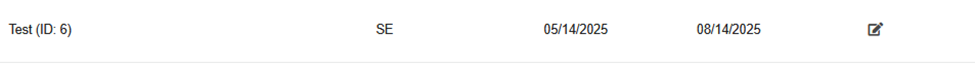

4. To functionally test that this semester can be used for projects, navigate to a semester tied component like [actions](actions.md#creating), and create something within that semester. For this example we will be creating a [student announcement](announcements.md#creating) in the new semester. In the Semester dropdown select your newly created semester and fill out the remaining fields accordingly.
   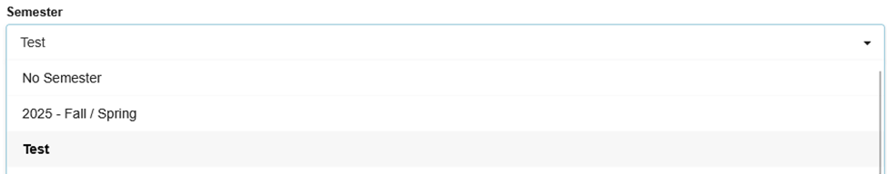

5. After submitting and receiving the confirmation that the semester tied announcement is created we can also visually confirm its existence in the Admin tab under the semester’s “Action and Announcement Editor” dropdown
   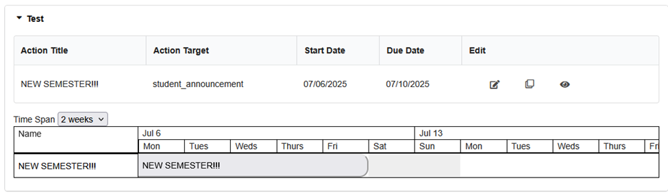

6. Additionally as an admin we should be able to assign [projects to that semester](projects.md#editing) now and further [assign members](projects.md#member-assignment) to said projects.

### Copy Semester Actions

1. The Copy Semester Actions feature allows admins to duplicate actions, announcements, peer evaluations, and break periods from one semester into another with an optional date offset.To access this feature, sign in as an admin, navigate to the "Admin" tab, and press the copy icon button next to the "+" button in the Action / Announcement / Peer Eval / Break Period section.[Copy Semester actions 1](images/copysemesteractions1.png)

2. The Copy Semester Actions modal will open with three fields: Source Semester, Target Semester, and Date Offset (Days). Select a source semester called "previous year" from the dropdown. This will load all actions associated with that semester into the table.[Copy Semester actions 2](images/copysemesteractions2.png)

3. Next select a target semester called "current year" from the Target Semester dropdown. Once both semesters are selected, the Date Offset field will automatically populate with the number of days between the two semester's start dates.[Copy Semester actions 3](images/copysemesteractions3.png)

4. Now increase the offsets days by 5 then deselect prototype feedback checkbox at the left of the actions so that when we copy the actions it won't be there twice.[Copy Semester actions 4](images/copysemesteractions4.png)

5. Then go to the bottom of the modal and press preview, it will show a final confirmation table with each selected action's current start and end dates alongside the calculated new dates. confirm that the offset is increased and the dates are right.[Copy Semester actions 5](images/copysemesteractions5.png)

6. Now press copy actions and the page will modal will automatically close after a short delay and the Action Editor section will immediately refresh to show the newly copied actions under the target semester. Confirm under the Action / Announcement / Peer Eval / Break Period section for the current year that the actions were copied by seeing the date and action from the preview modal like seeing project proposal twice but one of them is the copied action with the diffrent date.[Copy Semester actions 6](images/copysemesteractions6.png)

### Editing Semesters

1. If semester dates change and or an error occurs during the creation of a semester semester dates can be easily changed via the edit button next to each semester
   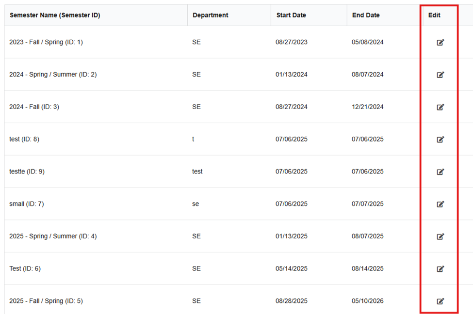

2. Pressing the edit button will open a similar modal to the creating a semester button and it will allow for the editing of the same fields.
   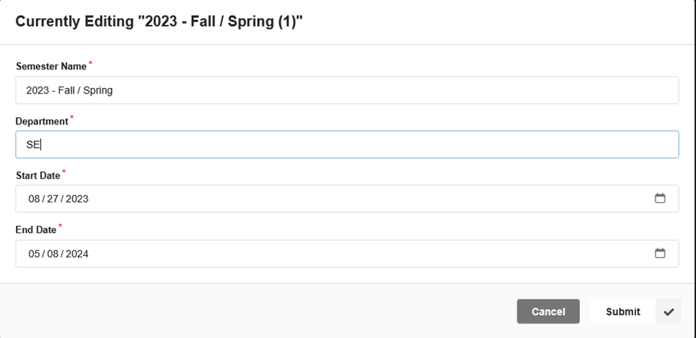

3. For this example we will be changing an older semester to a future semester.  
   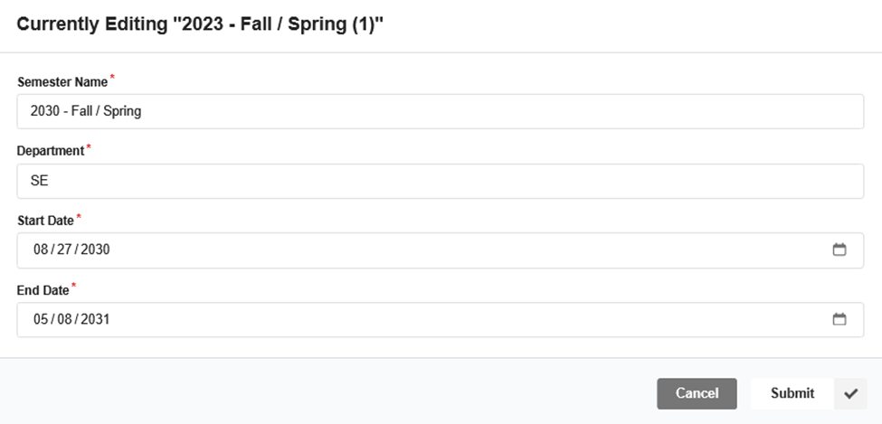

4. After submitting and receiving a confirmation of editing the semester should reflect the changes in the “Semester Editor” dropdown.
   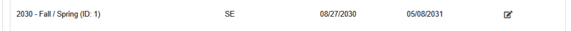

5. Additionally if the edited semester had projects in it they should still be linked with the updated semester. Note: the dates for actions/announcements/break periods will still remain the same and will require manual editing of data.
   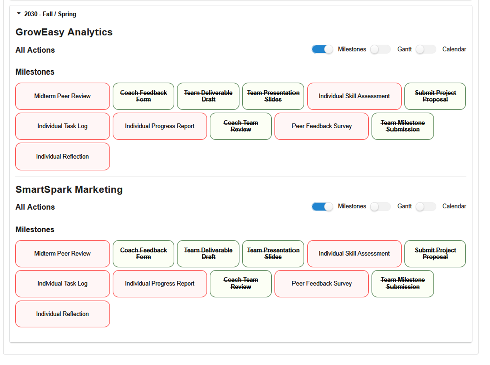

### Archive Editor

1. Archiving projects is an extension of the project [featuring functionality](projects.md#featuring). When a project is featured, i.e. has a webpage, the archive editor can be used to further edit certain details and components of featured projects. Additionally, archives can be made with the archive editor to effectively display the achievements made by students in their projects. Note: in the current state of the portal, admins cannot specify project id within the “+”/create modal and archive must be made beforehand with project features.

2. Signed in as an admin, navigate to the “Admin” tab and expand the “Archive Editor” accordion to view all of the featured/archived projects (Note if this section appears empty, please first feature a project).
   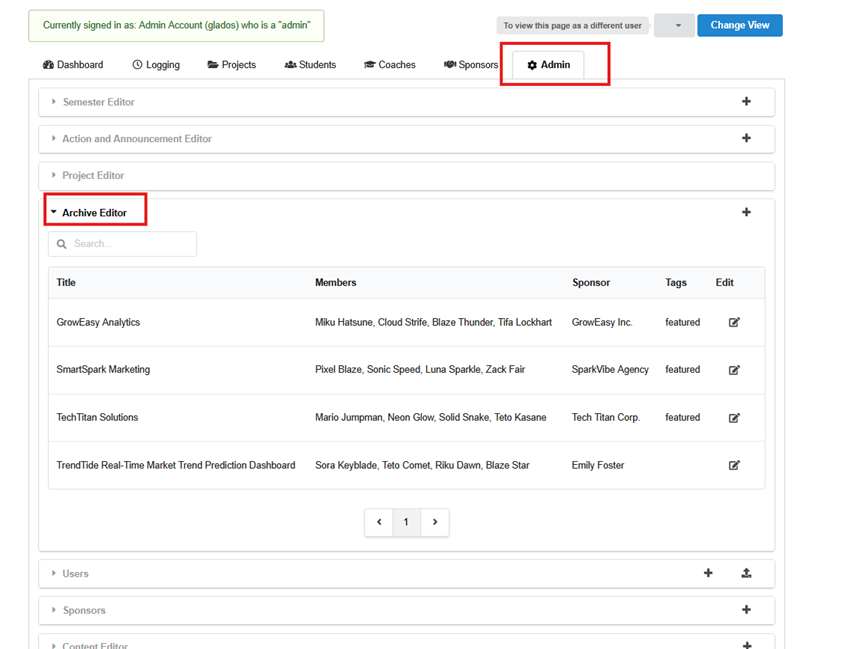

3. Pressing on the edit button on a specific project will open an “Edit Archive” modal that appears similar to the Create/Edit website modals however with a lot more information and more developer utilized editable fields like start/end dates, featured/outstanding/creative award checkboxes, priority, image specific filepaths/names, and department

4. Most of the additional fields are primarily descriptive however they should match up with details of the project like the start and end dates that represent semester dates and should match up with the semester that the project is in.
   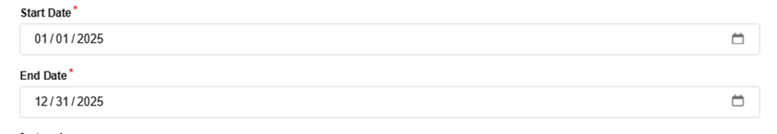

5. At the bottom of the modal there are three additional checkboxes that represent featuring and awards. The “Featured” checkbox ensures that the project is seen on the homepage of the application
   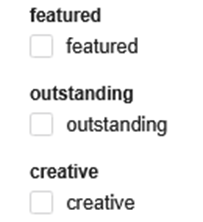
   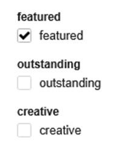
   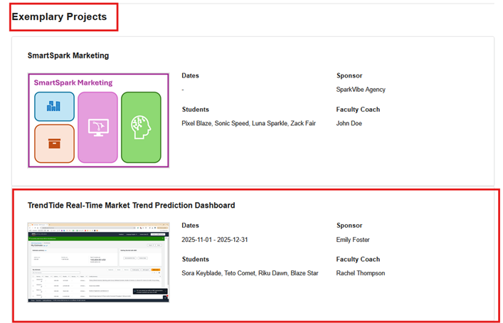

6. “Outstanding” and “creative” represent outstanding and creative projects awards and checking off these boxes will create a respective award icon on the specific project. (Note at the time of creation the icons are the same but hovering over them should display the award type)
   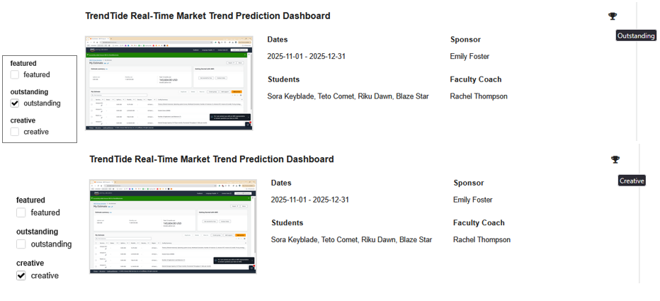

7. The priority field represents the order in which the project appears in the “Exemplary Projects” section (the “featured” checkbox has to be activated for this to work). For example, putting in a value of 1 should make it so that the project always appears first in the “Exemplary Projects” section of the home page.
   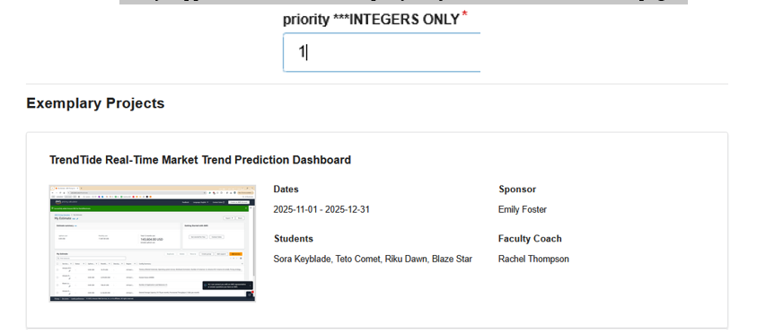

8. At the very bottom of the modal there are “inactive” and “locked” checkboxes.  
   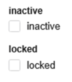
   The inactive checkbox is a visibility toggle and when set to on, the application will no longer publicly display the project (it will still be visible to respective signed in users). Activating the locked checkbox should prevent [students](authentication.md#validating-student-sign-in) from editing the specific project website.
   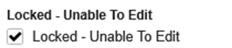
   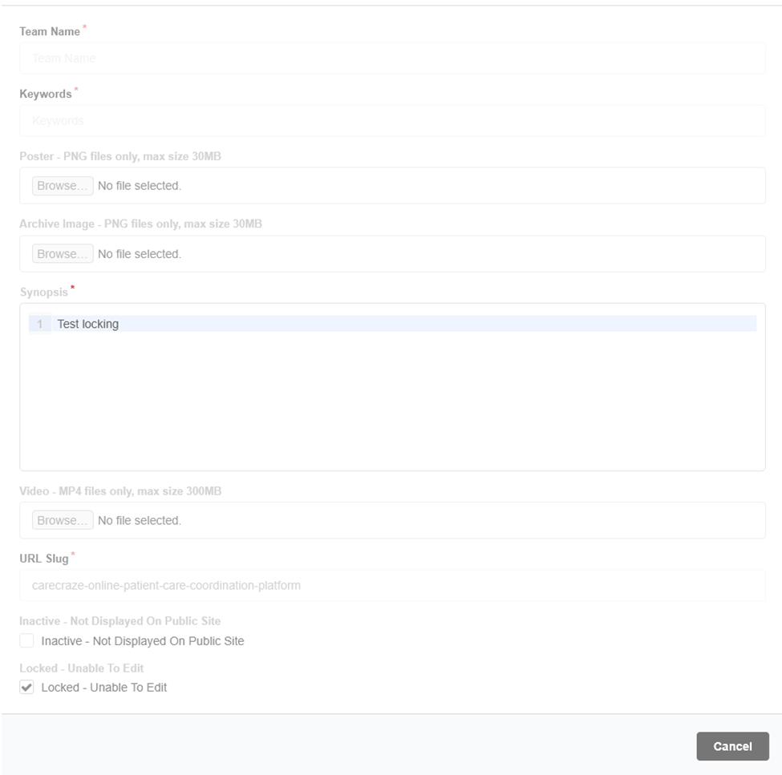

### Content Editor

1. In this portal, only admins can edit public facing html content like the overview on the home page and the project sponsoring page. To do so, sign in as an [Admin](authentication.md#validating-admin-sign-in), navigate to the “Admin” tab and expand the bottom “Content Editor” accordion.

2. Here we can add and view existing media files like mp4, png, pdf, etc, which we can then use for project thumbnails in their [website](projects.md#featuring) and other forward facing components.
   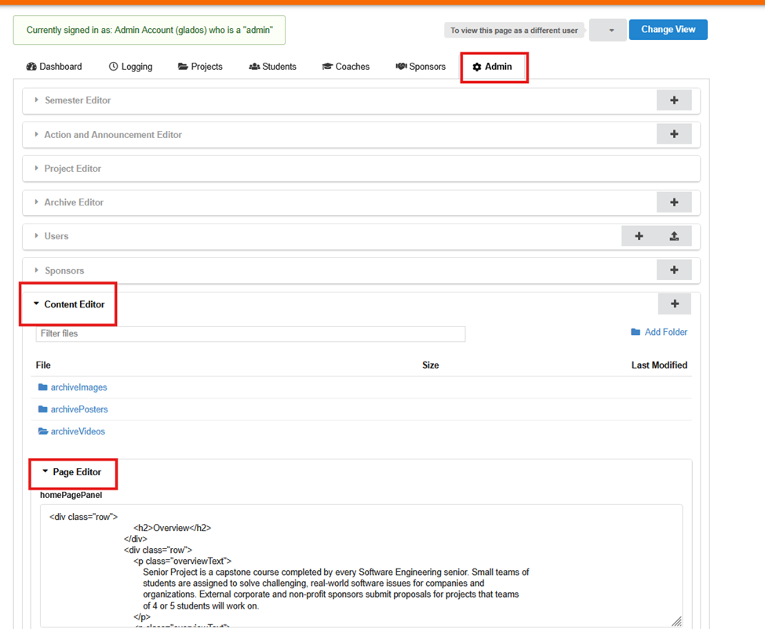

3. In the page editor section we can directly edit the html of the “Overview” section seen on the home page and the “Become a Project Sponsor” in the “Sponsor a Project” tab.  
   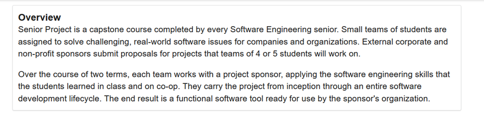
   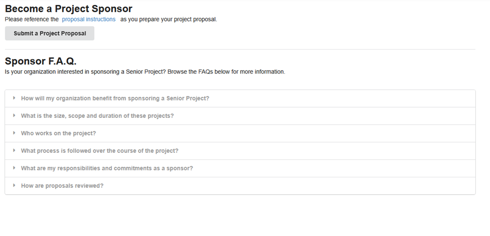

4. To edit the html simply click into the html text and start typing. To save your changes click on the “Update HTML” button.
   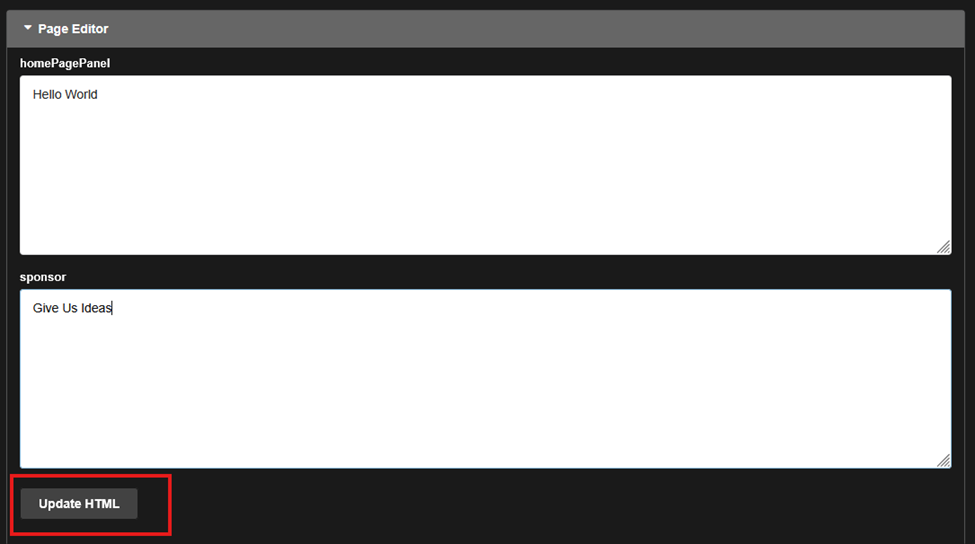

5. Upon successful updating of the HTMLs a little “Success!” should appear just above the “Update HTML” button
   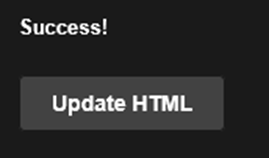

6. To view these changes simply sign out of admin by using the developer sign in menu in the top right or press on the RIT logo in the top left. The UI routing should remain the same and the changes made to the HTML should be visible immediately after refreshing.
   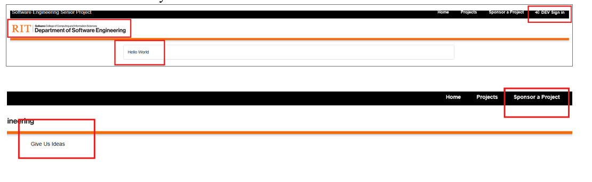

7. In addition to the overview and project sponsor sections, Content Editor includes two other editable sections: "loggedOutFooter" and "loggedInFooter".
   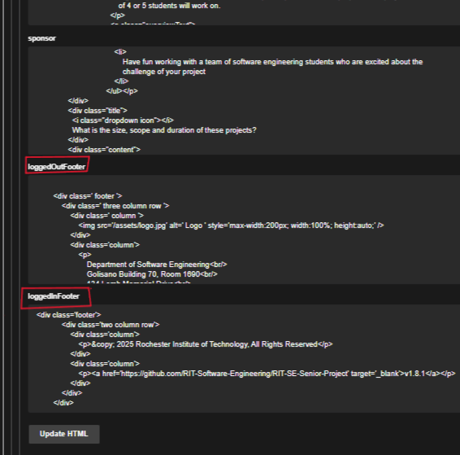

8. Just like with the Overview and Sponsor sections, you can edit the "loggedOutFooter"
   and "loggedInFooter" HTML directly. After making your changes, click "Update HTML"
   and check the footer on the corresponding page (signed in vs. signed out) to confirm
   the updates appear.
