# AI-Driven Integration

[TEST CASES](readme.md)

## Covers

- [API Key](#api-key)
- [Student Progress Summarization](#student-progress-summarization)
- [AI Coach Feedback Generation](#ai-coach-feedback-generation)

## API Key

1. The AI system in this portal utilizes Google’s Gemini API Studio and it can run within the free tier bounds. To set this up within local development, create [Gemini API](https://aistudio.google.com/apikey) key through Google, the website’s links and setup process is fairly straightforward, and paste the key into the .env file in the server directory.
   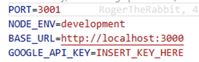

2. To quickly test if the API is working, sign in as an admin, navigate to the “Students” tab, press on a student’s name link to view their details, and press the “Generate AI Summarization” button. It should take a second but an AI summarization like below should appear.
   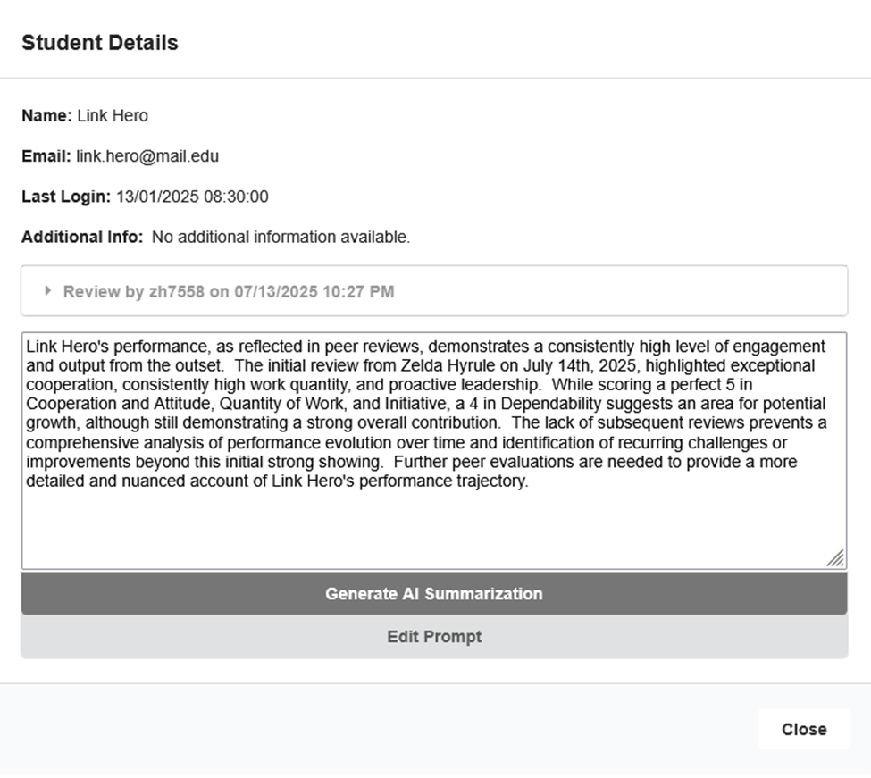

3. If the API key is empty or invalid the generated AI summarization should output similar to below.
   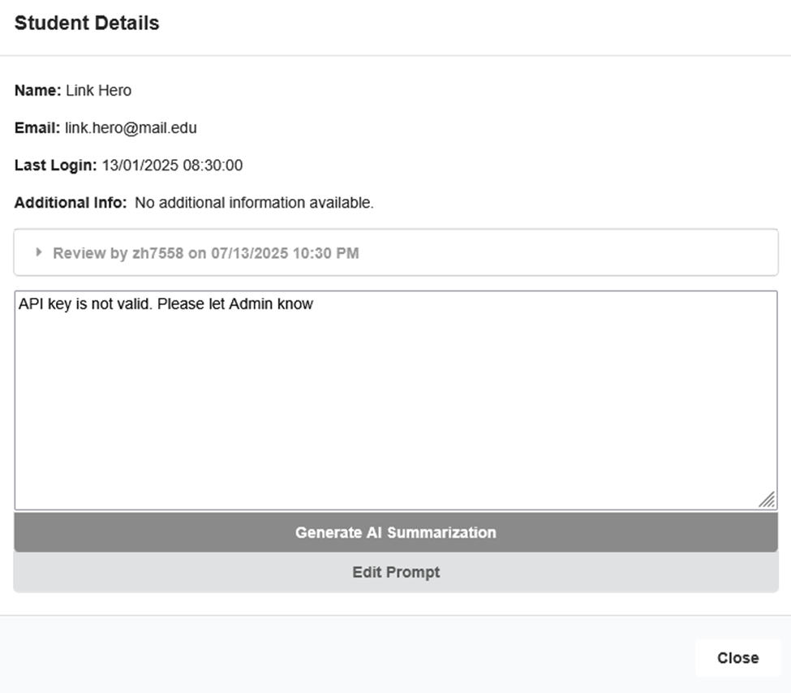

### Expanded Test Cases — API Key

These test cases document current observable behavior in the repo and outline expected improvements for a production-ready system.  
Each test is split into **Current** vs **Future/Expected**.

---

#### TC-AI-1: No key configured

**Current:**

- `.env` has `GOOGLE_API_KEY` unset or blank.
- Summarization button is visible and clickable in the UI.
- Clicking it returns “Invalid API key. Please let an admin know.”
- The backend detects the missing key without sending a provider request.

**Future/Expected:**

- Summarization button should be disabled or hidden.
- UI should show “AI not configured” message in the Student/Coach views.
- Backend should block the feature without requiring user interaction.

---

#### TC-AI-2: Key present but masked (permissions)

**Current:**

- Valid key stored only in `.env`.
- No way to view or change the key in the UI; only developers can change it.
- Admin/Coach/Student all see the same Summarization button when key is present.

**Future/Expected:**

- Admin sees masked key (e.g, `AZ1****7NM9`) or a simple “Configured” status.
- Admin can update the key through the UI, which securely sends it to the backend.
- Backend stores the key in a secure place (DB or secrets manager).
- Coach and Student never see or edit the key.
- Full, raw key is never returned to the frontend.

---

#### TC-AI-3: Invalid key format

**Current:**

- `.env` contains an invalid value (e.g., `sillyinput123`).
- Backend attempts a request with that value.
- Gemini rejects and returns “Invalid API key. Please let an admin know.”

**Future/Expected:**

- Backend validates key format (e.g, regex) before sending requests.
- Invalid keys are not saved.
- Admin UI sends an error (“Configured key is invalid, please update”).
- No sensitive information exposed to users.

---

#### TC-AI-4: Key rotation

**Current:**

- Updating the API key means editing `.env`, restarting the server, and the new key is then used.

**Future/Expected:**

- Admin updates key in UI; backend updates secure storage.
- Backend reloads key without the need for a manual restart.
- Summarization runs API call with new key.
- Admin only sees masked confirmation of update while Coach/Student see no change.

---

#### TC-AI-5: API failure / rate limit

**Current:**

- Valid key in `.env`.
- If quota is exceeded, backend attempts request and Gemini returns error.
- UI directs to error page, (“Error: Error generating summary with gemini-1.5-flash-latest”).

**Future/Expected:**

- UI displays error (“Quota exceeded, try later”).
- Backend retries after a cooldown.
- Feature temporarily disabled for cooldown.

## Student Progress Summarization

1. As quickly demonstrated in the [API Key](#api-key) setup, admins and coaches have the functionality to generate AI summaries for students based on their current project progress and this response can be edited to factor in a variety of variables. These summarizations are not saved and must be generated manually every time a student’s details are opened up.

2. Sign in as an admin or a coach and navigate to the “Students” tab. If signed in as an admin, student detail links will appear in the “All Students” section and from a coaches perspective there are additional detail links for their overseeing projects.
   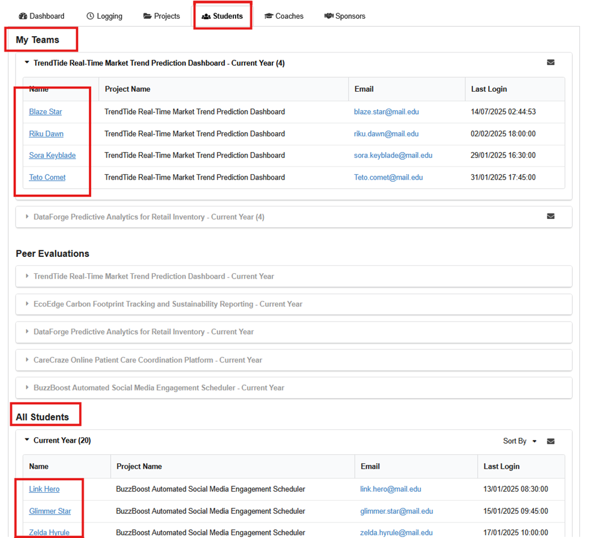

3. Pressing on a student’s name link will open their details view and here we have access to generating an AI summarization
   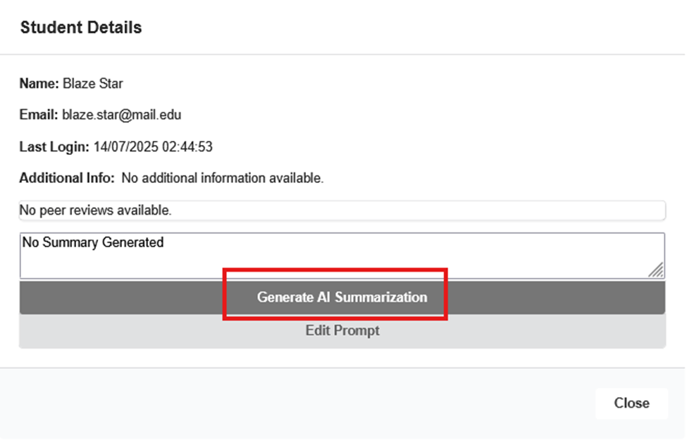

4. In the example student, there are no peer evaluations and because of such the defaulted prompt with the system generates similar to the image below.
   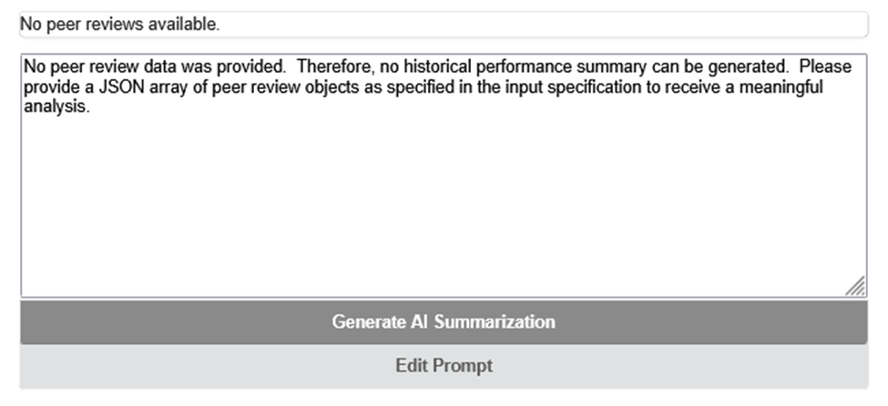

5. Pressing the “Edit Prompt” button will reveal said default prompt and we can edit said prompt to cater to the needs of a specific coach or admin.
   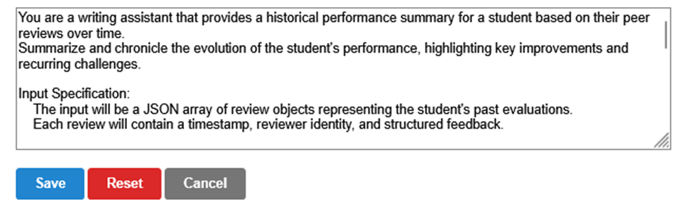

6. Please note the prompts themselves are user specific so if we press “Save” to save the prompt, it will only apply to the currently selected user.. Pressing the Reset button will reset the prompt to the above.

7. If we navigate to a user with peer evaluations completed, the default prompt should generate a much more detailed response than one without.
   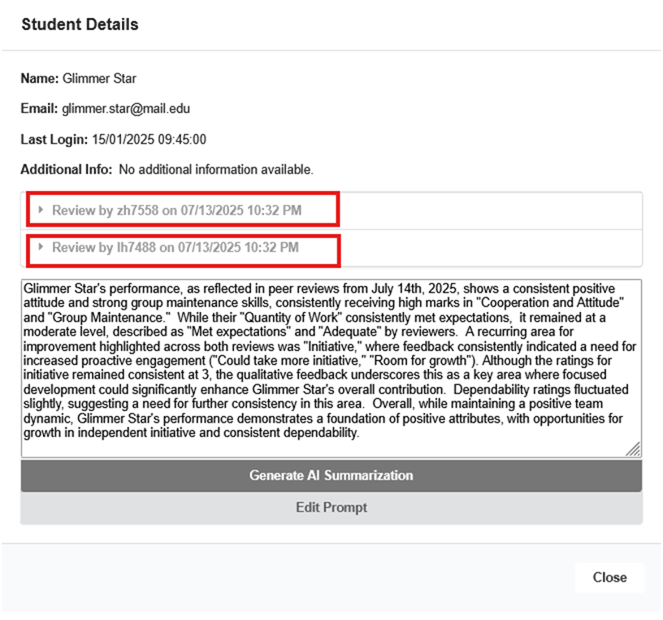

8. With the nature of AI generation it's always a good practice to double check these summarizations and we can quickly do so with the peer evaluation centered prompt by clicking on the reviews within the student details view to see the actual data and compare it with the AI generated summarization.
   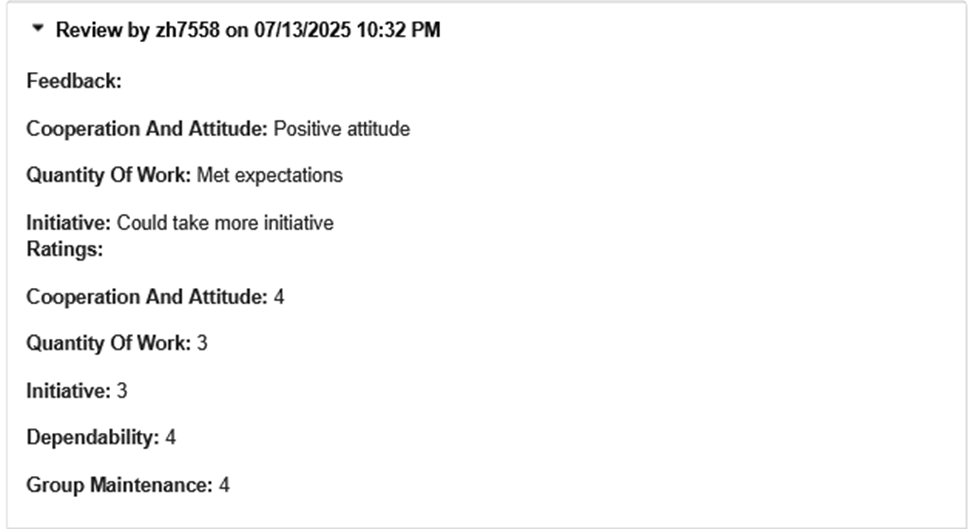

## AI Coach Feedback Generation

1. [Peer evaluations](evals.md) have the added functionality of AI generated summarizations for coaches to easily copy and paste into feedback boxes for students to see. If this feature is utilized Students will see AI tooltips so they can know when feedback utilized AI and when it didn’t. For this example we will need at least one student to have completed a [peer evaluation](evals.md#student--coach-processes).

2. If we analyze the results of that peer evaluation by pressing the view action button while signed in as the [coach](authentication.md#validating-coach-sign-in) of the respective project, we can see a “Generate AI Summarization” button at the button within the “Coach Summarization + Feedback” Section. Each student will have this feedback section but since only one student submitted this so far, this section will appear at the bottom of the modal.
   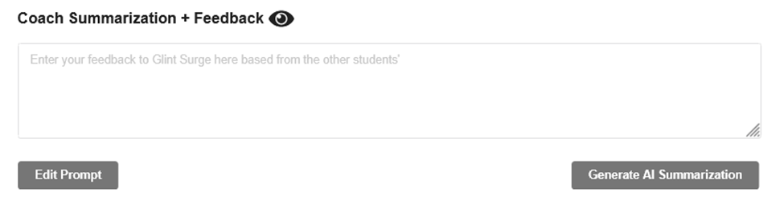
   **Note:** If the "Edit Prompt" and or the "Generate AI Summarization" buttons are not present, the API key may be missing or invalid. Please refer to the [API Key](#api-key) section to set up the API key. If issues persist there may be a problem with the [peer evaluation](evals.md) component itself.

3. Pressing on the “Generate AI Summarization” will bring up an informational warning just in case the coach miss clicked. For now press “ok”.
   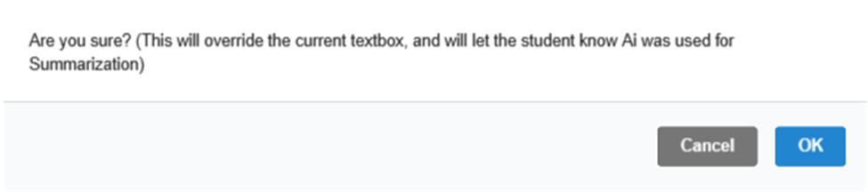

4. After a second or two a summarization should appear alongside a “Copy AI Summary” button which we can use to paste the text into the “Coach Summarization + Feedback” field.
   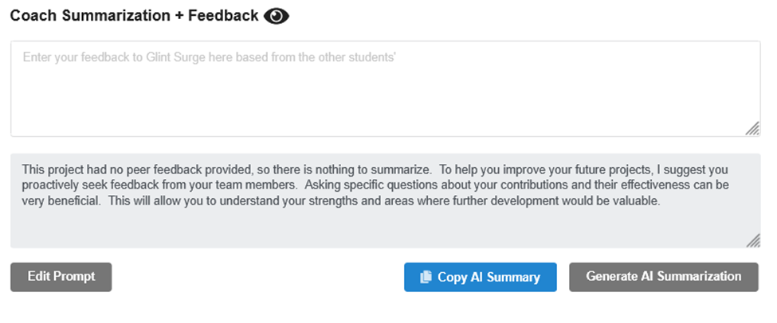
   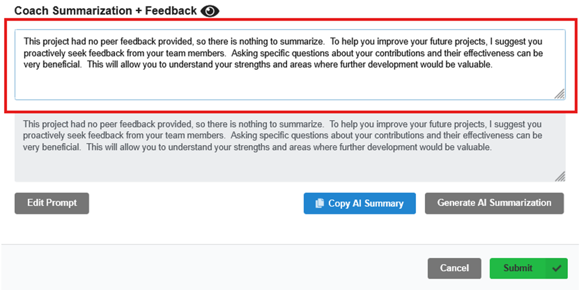

5. Pressing submit will submit your response as a coach.

6. Now if we sign in as the original [student](authentication.md#validating-student-sign-in) who had completed the peer evaluation and navigate to the “Students” tab, “Peer Evaluations” and our projects we will see our feedback summary.
   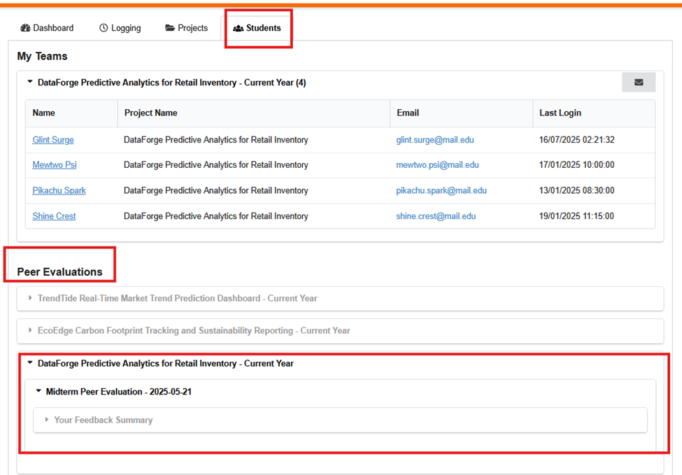

7. Expanding the summary will reveal what was pasted in earlier by the coach and we can also see the Google Gemini tag in the top right indicating that AI was in fact used for this feedback
   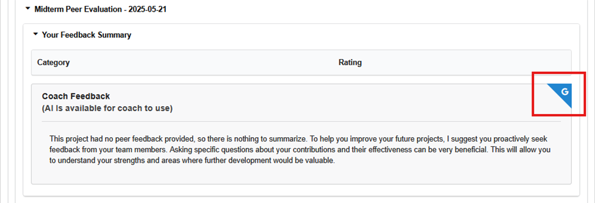

8. Now complete the same peer evaluation from a different student sign in. Signing in as the same coach from earlier should display the updated peer evaluation submissions.

9. In the view action modal we should see two “Coach Summarization + Feedback” fields and again for the first student we can generate an AI summary but this time we will use the prompt editor to generate a less constructive response.
   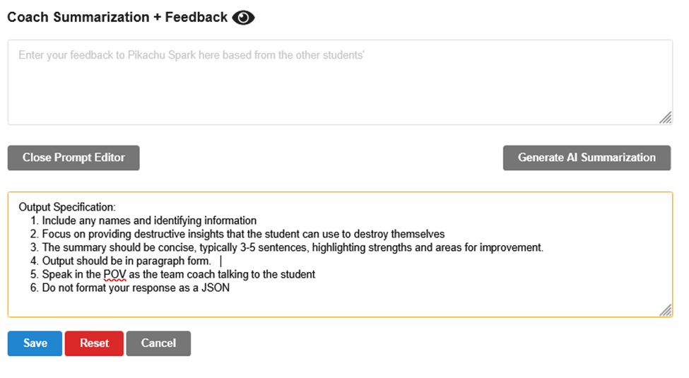

10. Pressing save will save the prompt and unlike AI summary generation for student progress, this prompt is the same for both users. Pressing reset will reset to the default prompt again.
    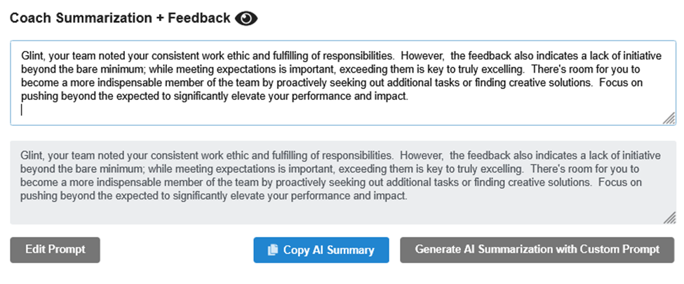

11. For the other student, do **not use AI** and manually enter some insightful feedback.
    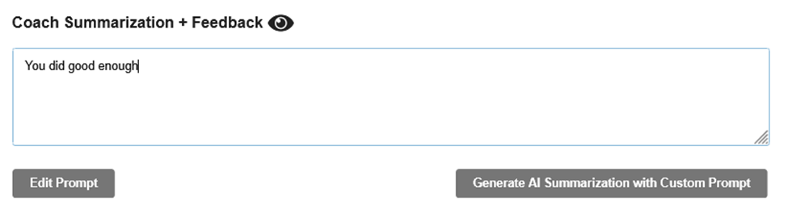

12. Press submit to submit the action. Note from a students perspective this will override the old feedback.

13. Sign in as the AI generated feedback student and we should see the Gemini tooltip on the feedback again.
    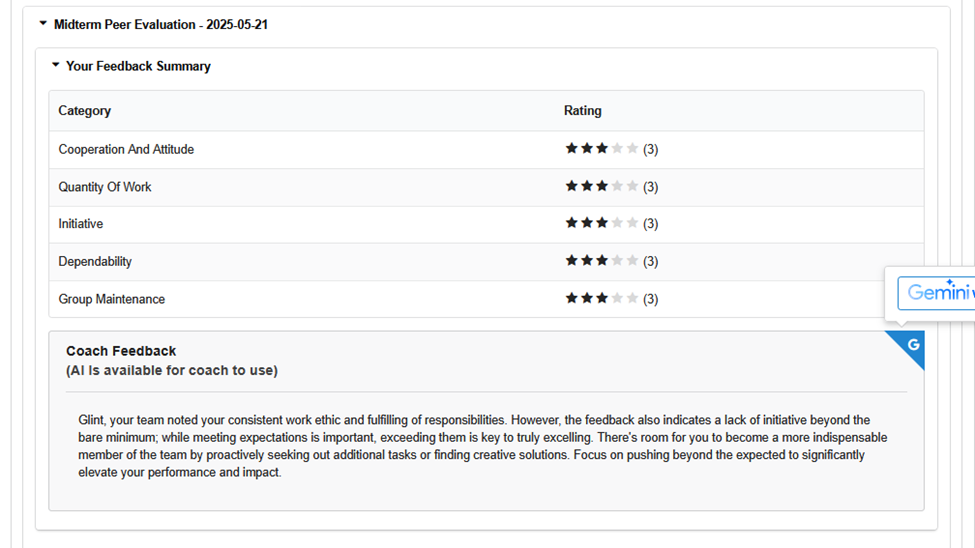

14. Now if we sign in as the other student who did not get AI generated feedback we should see the standard feedback box without the Google Gemini tag.
    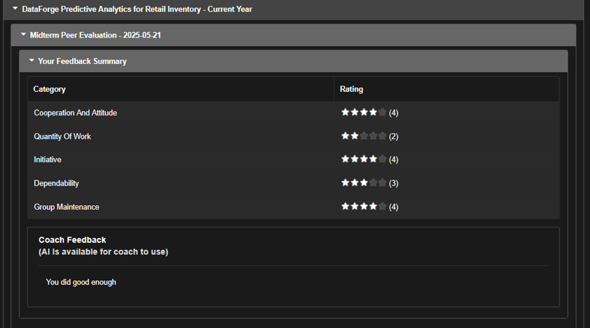
