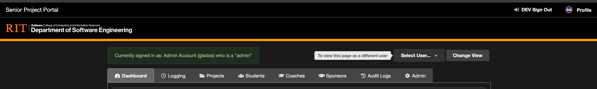
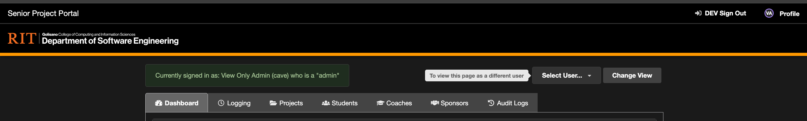
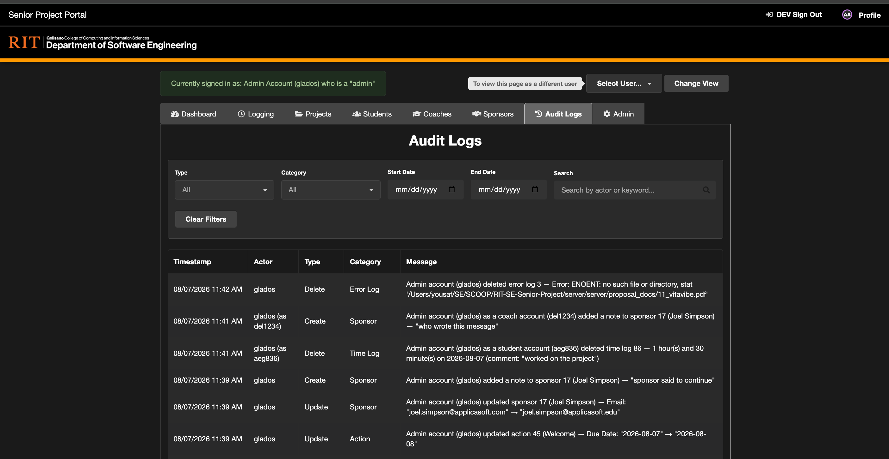
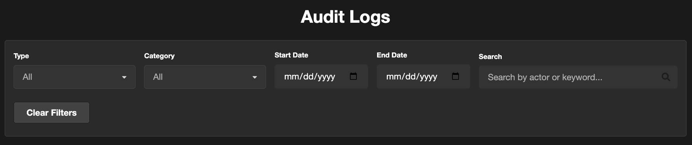
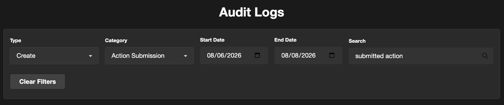
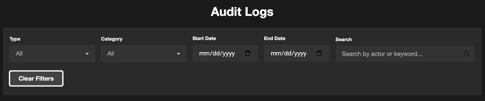
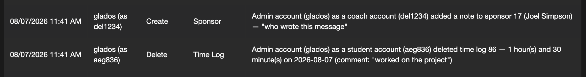
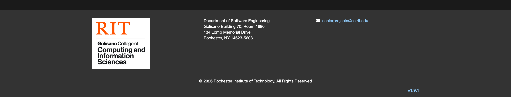

# Auditability System

[TEST CASES](readme.md)

## Covers

- [Audit Tab](#audit-tab)
- [Filtering and Search](#filtering-and-search)
- [Recorded Actions](#recorded-actions)
- [Mocked Actions](#mocked-actions)
- [Error Logs](#error-logs)

## Audit Tab

1. The “Audit Logs” tab is a read-only history of important actions taken throughout the portal - creating, editing, deleting, deactivating, and reactivating semesters, actions, action submissions, projects, archives, users, sponsors, time logs, and error logs. It exists so admins can answer “who changed this, and when” without digging through the database directly.
   

2. Sign in as an [Admin](authentication.md#validating-admin-sign-in). The “Audit Logs” tab sits between the “Sponsors” and “Admin” tabs in the main tab bar.

3. Sign in as a [View Only Admin](users.md#view-only-admins) and confirm the “Audit Logs” tab is still present, even though the “Admin” tab itself is not. Unlike most of the rest of the portal, view only admins have full read access to the audit trail.
   

4. Sign in as a [Coach](authentication.md#validating-coach-sign-in) or [Student](authentication.md#validating-student-sign-in) and confirm no “Audit Logs” tab appears anywhere in the tab bar - the audit trail is admin-only (both full and view only).

5. Within the Audit Logs tab, each row represents one recorded action and shows a Timestamp, Actor, Type (Create/Update/Delete/Deactivate/Reactivate), Category (which kind of record was affected), and a human readable Message describing what happened.
   

## Filtering and Search

1. Above the audit table there is a filter bar with a Type dropdown, a Category dropdown, Start/End Date fields, and a Search box, followed by a “Clear Filters” button.
   

2. Selecting a Type (e.g. “Create”) narrows the table to only that kind of action. Selecting a Category (e.g. “Action Submission”) narrows the table to only that kind of record. The two filters can be combined with the date range and Search too - for example Type “Create”, Category “Action Submission”, a date range, and a Search term together narrow the table down to matching action submissions within that window.
   

3. Setting a Start Date and/or End Date narrows the table to entries recorded within that (inclusive) range.

4. Typing into Search matches against both the actor’s system ID and the message text - for example searching a student’s system ID will surface every entry where they were either the one acting or the one being acted on.

5. Pressing “Clear Filters” resets every filter field back to “All”/empty and returns to the first page of results.
   

6. At the bottom of the table, “Previous” and “Next” buttons page through results. “Previous” is disabled on the first page and “Next” is disabled once fewer than a full page of results comes back, indicating the last page has been reached.

7. If a filter combination has no matches, the table should display “No audit log entries found” instead of an empty table.

## Recorded Actions

1. The audit trail covers every major create/edit/delete/deactivate/reactivate action across the portal. Rather than repeat each workflow here, perform the referenced action and then return to the [Audit Logs tab](#audit-tab) to confirm a new row appears with an accurate Type, Category, and Message.

2. **Semesters** - [creating](admin.md#creating-semesters) and [editing](admin.md#editing-semesters) a semester should each produce a Category “Semester” entry (Create and Update respectively). An edit that only changes one field (e.g. End Date) should show that field’s before/after value in the Message.

3. **Actions** - [creating and editing](actions.md#creating) an action should each produce a Category “Action” entry. [Deactivating an action](actions.md#deactivating) should produce a Type “Deactivate” entry with a clean message and no field diff, even if other fields were changed in the same edit; reactivating it afterward should produce a Type “Reactivate” entry.

4. **Action Submissions** - a student, coach, or admin submitting a response to an action produces a Category “Action Submission” entry referencing both the action’s ID and title.

5. **Projects** - [editing a project](projects.md#editing) should produce a Category “Project” Update entry showing the changed field(s).

6. **Archives** - creating and editing an archive via the [Archive Editor](admin.md#archive-editor) should each produce a Category “Archive” entry. Checking the “inactive” checkbox should produce a Deactivate entry; unchecking it in a later edit should produce a Reactivate entry, both with clean messages (no field diff).

7. **Users** - [adding](users.md#adding-users) and [editing](users.md#editing-users) a user should each produce a Category “User” entry, with the Message noting the account type being created/edited (e.g. “created student account (…)”). [Deactivating/reactivating a user](users.md#deactivation) via the Active checkbox should produce Deactivate/Reactivate entries with clean messages, independent of whether other fields were also changed in the same edit.

8. **Sponsors** - adding and editing a sponsor produces Category “Sponsor” entries; [adding a sponsor note](logging.md#sponsor-notes) produces a Create entry that includes the note text itself in the Message. Field names in the diff should read naturally (e.g. “Last Name”, not “Lname”).

9. **Time Logs** - submitting a [time log](logging.md#time-logs) produces a Create entry showing the duration logged; deleting one produces a Delete entry showing what was deleted (duration, date, and comment if present).

10. **Error Logs** - deleting an [error log](#error-logs) produces a Delete entry that includes the deleted entry’s stack trace text.

## Mocked Actions

1. When an admin is [mocking](admin.md#mocking-users) another user and performs an action while mocked, the audit entry should credit the real admin as the actor while noting who they were acting as - not just log the mocked account.

2. Mock sign in as a Coach and [add a note to a sponsor](logging.md#sponsor-notes). Sign back in as the admin and check the [Audit Logs tab](#audit-tab) - the Message should read along the lines of “Admin account (…) as a coach account (…) added a note to sponsor … (…) — “…”“, and the Actor column should show the real admin’s ID with the mocked account noted alongside it (e.g. “glados (as del1234)”), not the mocked account alone.
   

3. Repeat while mock signed in as a Student - e.g. [deleting a time log entry](logging.md#deleting-time-logs) while mocking a student should produce a Message like “Admin account (…) as a student account (…) deleted time log … — … on … (comment: “…”)”.

4. Perform an action as a real (non-mocking) admin and confirm the Message has no “as a … account” clause - this phrasing should only appear for genuinely mocked actions.

## Error Logs

1. The “Error Logs” page is a separate, admin-only page listing server errors (stack traces) rather than user actions - it is not part of the audit trail table itself, but is reachable from it. While viewing the [Audit Logs tab](#audit-tab), the footer displays an “Error Logs” link.
   

2. Navigate to any other tab (e.g. “Admin”) and check the footer again - it should revert to the normal version number link instead of “Error Logs”. The link only appears while the Audit Logs tab is the active one.
   

3. Both full [Admins](authentication.md#validating-admin-sign-in) and [View Only Admins](users.md#view-only-admins) can view the Error Logs page. Coaches and Students should not see the link and should be redirected away if they navigate to the page directly by URL.

4. Deleting an error log entry from this page should produce a corresponding Delete entry in the [Audit Logs tab](#audit-tab) (see [Recorded Actions](#recorded-actions)) with the deleted stack trace included in the Message.
