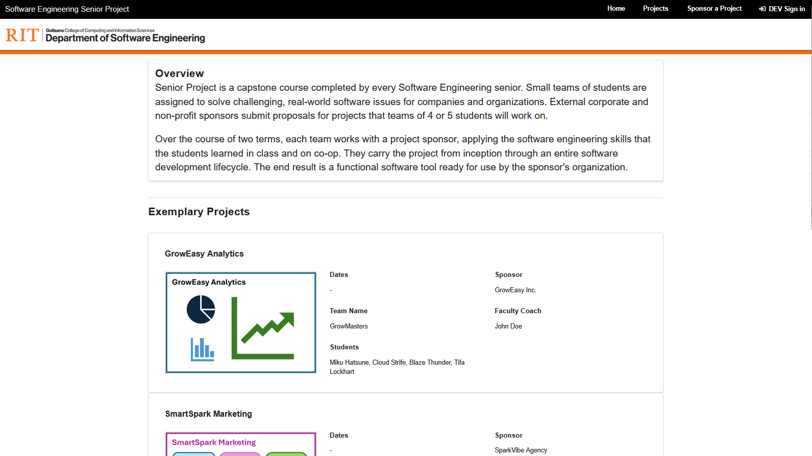
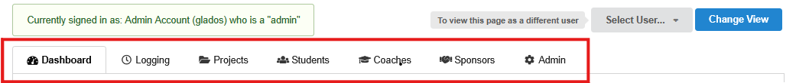
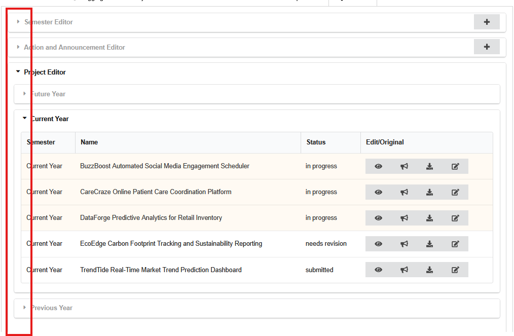

# TEST CASES

This document outlines general test cases and their workflow procedures to ensure correct application functionality.

## Table of Contents

- [Authentication & Profile](authentication.md) - User Sign In, Resetting Data, User Preferences, Last Login, User Profile Circle
- [User Management](users.md) - Adding Users, Mail-to-All, Editing Users, Reassigning Users, Deactivation, View Only Users
- [Projects](projects.md) - Status, Sponsoring, Editing, Featuring, Member Assignment
- [Actions](actions.md) - Types & Colors, Completing, Individual Actions, Team Actions, Coach Actions, Admin Actions, Late Submissions, Creating, Editing, Deactivating
- [Logging](logging.md) - Time logs, Action Logs, Sponsor Notes
- [Administrative Tools](admin.md) - Mocking Users, Admin Tab, Creating Semesters, Editing Semesters, Archive Editor, Content Editor
- [Auditability System](audit.md) - Audit Tab, Filtering and Search, Recorded Actions, Mocked Actions, Error Logs
- [Sponsors](sponsors.md) - Adding, Editing, Visibility
- [Announcements & Breaks](announcements.md) - Visibility, Creating, Editing, Deactivating, Breaks
- [AI-Driven Integration](ai.md) - API Key, Student Progress Summarization, AI Coach Feedback Generation
- [Peer Evaluations](evals.md) - Creation, Student & Coach Processes

## Terminology

Many UI references will be made and the correct/industry standard naming conventions were loosely followed. To alleviate any potential confusion, this terminology section will act as a language key for the specific high-traffic components.

Home Page / Signed Out View

The initial boot page of this application will be referred to as the Home Page and or as the signed-out view.

Tabs

Accordions

Like dropdowns but better, accordions are used frequently in this application, and there are plenty of nested accordions that will be referenced from outside to inside.

ActionsActions are essential for the deliverable tracking and collecting process of projects within this portal. They can capture text inputs, files, peer-to-peer evaluations, and they even encapsulate break periods and holidays. Actions that encapsulate deliverables like text inputs and files are separated by user types: Students get team and individual actions, Coaches get coach actions, and Admins get admin actions. These user specific actions are visible to all members of a project however, the ability to submit and the submission itself are limited to the user type. Additionally Coaches can view all submissions with their respective projects, and Admins can view all submissions.Outside of deliverable encapsulation, there are additional types of actions available like:

    Announcements
    Appear on the dashboard of signed-in users between a specified start and end date.  There are two types Coach and Student Announcements and the specific types are only visible to respective user types.

    Peer Evals
    In house peer-to-peer assessment system where students evaluate each other's contributions, collaboration, and performance on project work which can then be reviewed by coaches who provide personalized feedback back to the students.

    Break Periods
    Encapsulate holidays, three day weekends, semester breaks, etc.  They do not physically limit a student's ability to work/complete actions as they primarily act as a useful feature for when work is not expected of them.

Users
In this portal there are only three user types that can sign in and contribute/view the inner workings of SE Senior Projects

    Students
    The worker bees of projects.  They can only contribute to the current project that they are working on however they can still see all of the other students in their respective semester.

    Coaches
    Manage the Students within their assigned projects.  They can contribute to their own projects and they can view all of the other projects within the portal.  They can again view all students and their own project specific students and they can view and access communication details of other coaches and sponsors.

    Admins
    Administrative entities that have godlike powers over the application.  They can edit any and all semesters, actions, projects, public facing websites, users, and sponsors.
